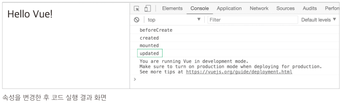
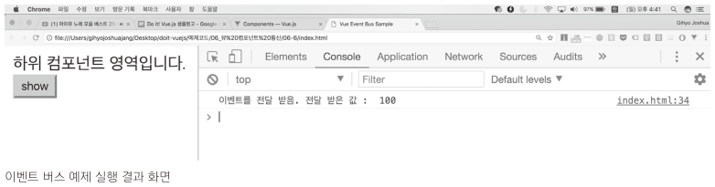
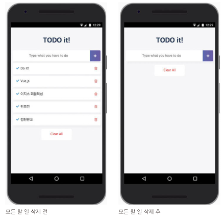
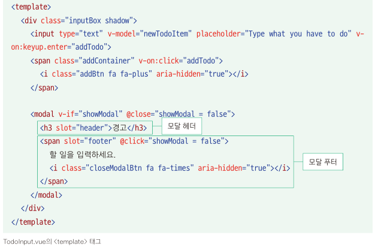
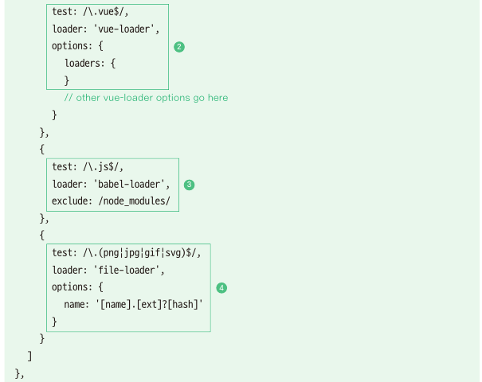

## Vue.js

[toc]

## #.개발환경

* 뷰로 웹 앱을 개발하기 위한 환경 구성

  * 크롬 브라우저

    * 크롬 개발자 도구 사용법
      https://developers.google.com/web/tools/chrome-devtools/?hl=ko

  * 아톰(Atom) 텍스트 에디터

    * UI Theme : 환경설정 Ctrl+, (Cmd+,) -> install -> Themes -> seti-ui 설치

    * Syntax Theme : atom-material-syntax-dark 설치

    * 환경설정 -> Themes -> UI Theme, Syntax Theme 변경

    * 아톰패키지 설치 : Settings -> Install -> Packages -> language-vue 검색 

      Vue component support in Atom : hedefalk 설치 (아톰 종류 후 재시작 자동적용)

  * 노드제이에스(Node.js)

    * 노드제이에스는 서버 사이드 자바스크립트로, 서버 측에서 실행되는 자바스크립트 실행 환경을 의미 한다.

      뷰 CLI로 생성한 프로젝트에서 프로토타이핑을 할 때도 노드제이에스 서버를 사용하기 때문에 필수적인 환경이다.

      (서버사이드 Server-side: 웹 화면과 관계된 서버 로직을 처리하는 영역)

    * 노드제이에스는 윈도우, 맥, 리눅스 등 다양한 플랫폼에서 서버 사이드 자바스크립트 코드를 실행할 수 있는 실행 환경이다.

    * nodejs.org에 접속 후 다운로드 Current 버전보다 안정적인 LTS(Long Term Support) 버전이 호환성에 좋다.

    * 설치 후 Cmd 창에서 "node -v" 명령어 로 설치된 버전 확인.

  * 뷰 개발자 도구(Vue.js devtools, 크롬 확장 플러그인)

    * vue.js devtools 로 검색 후 해당 브라우저에 맞는 플러그인 설치
    
    * 뷰 크롬 익스텐션을 다운로드 하라는 로그 처리 로컬에서는 추가 설정 필요 (file 프로토콜로 접근시)
    
      크롬 브라우저 설정 -> 도구 더 보기 -> 확장 프로그램 -> 세부정보 -> 파일 URL에 대한 액세스 허용
    
    * 사용 방법 : 개발자 도구 에서 Vue 탭을 선택
      
          
      
      

## #.Hello Vue.js 프로젝트 생성

 


* index.html

  ```html
  <html>
    <head>
      <title>Vue Sample</title>
    </head>
    <body>
      <div id="app">
        {{ message }}
      </div>
      <script src = "https://cdn.jsdelivr.net/npm/vue@2.5.2/dist/vue.js"></script>
      <script>
        new Vue({
          el:'#app',
          data : {
            message:'Hello Vue.js!'
          }
        });
      </script>
    </body>
  </html>
  ```


# 1.Vue.js 소개

## 1-1.Vue.js의 특징

### 1-1-1.UI 화면단 라이브러리

* 뷰(Vue.js)는 UI 화면 개발 방법 중 하나인 MVVM 패턴의 뷰 모델(ViewModel)에 해당하는 화면단 라이브러리 입니다.

   

* MVVM 패턴이란 화면을 모델(Model) - 뷰(View) - 뷰 모델(ViewModel)로 구조화하여 개발하는 방식을 의미한다.

  이러한 방식으로 개발하는 이유는 화면의 요소들을 제어하는 코드와 데이터 제어 로직을 분리하여 코드를 더 직관적으로

  이해할 수 있고, 추후 유지 보수가 편해지기 때문이다.


| 용어                        | 설명                                                         |
| --------------------------- | ------------------------------------------------------------ |
| 뷰(View)                    | 사용자에게 보이는 화면                                       |
| 돔(DOM)                     | HTML 문서에 들어가는 요소(태그, 클래스, 속성 등)의 정보를 담고 잇는 데이터 트리 |
| 돔(DOM Listener)            | 돔의 변경 내역에 대해 즉각적으로 반응하여 특정 로직을 수행하는 장치 |
| 모델(Model)                 | 데어터를 담는 용기. 보통은 서버에서 가져온 데이터를 자바스크립트 객체 형태로 저장 |
| 데이터 바인딩(Data Binding) | 뷰(View)에 표시되는 내용과 모델의 데이터를 동기화            |
| 뷰 모델(ViewModel)          | 뷰와 모델의 중간 영역. 돔 리스너와 데이터 바인딩을 제공하는 영역 |


* MVVM 패턴이란?

```
마크업 언어나 GUI 코드를 비지니스 로직 또는 백엔드 로직과 분리하여 개발하는 소프트웨어 디자인 패턴.
"화면 앞단(프런트엔드)의 화면 동작과 관련된 로직과 
 화면 뒷단(백엔드)의 데이터베이스 데이터 처리 로직을 분리하여 더 깔끔하게 코드를 구성한다."
```


### 1-1-2.컴포넌트 기반 프레임워크

* 뷰가 가지는 또 하나의 큰 특징은 바로 컴포넌트(Component)기반 프레임워크 라는 점.

* 화면을 컴포넌트로 구조화한 컴포넌트 간 관계도.

   

  위 그림의 왼쪽 화면은 각영역을 컴포넌트로 지정하여 구분한 것이고, 오른쪽 그림은 왼쪽 화면의 각 컴포넌트 간의 

  관계를 나타낸 것이다.

* 컴포넌트 기반 방식으로 개발하는 이유는 코드를 재사용하기가 쉽고, HTML 코드에서 화면의 구조를 직관적으로 파악할 수 있다.


### 1-1-3.리액트와 앵귤러의 장점을 가진 프레임워크

* 뷰는 앵귤러의 양방향 데이터 바인딩(Two-way Data Binding)과 

  리액트의 단방향 데이터 흐름(One-way Data Flow)의 장점을 모두 결합한 프레임워크 입니다. 

* 양방향 데이터 바인딩이란 화면에 표시되는 값과 프레임워크의 모델 데이터 값이 동기화되어 

  한쪽이 변경되면 다른 한쪽도 자동으로 변경되는 것을 말한다. 

* 단방향 데이터 흐름은 컴포넌트의 단향향 통신을 의미한다. 컴포넌트 간에 데이터를 전달할 때 

  항상 상위 컴포넌트에서 하위 컴포넌트 한 방향으로만 전달하게끔 프레임워크가 구조화되어 있는 게 바로 단방향 데이터 흐름이다.

* 빠른 화면 렌더링(Rendering)을 위해 리액트의 가상 돔(Virtual DOM)렌더링 방식을 적용하여 사용자 인터랙션(user interaction)

  이 많은 요즘의 웹 화면에 적합한 동작 구조를 갖추고 있다. 가상돔을 활용하면 특정 돔 요소를 추가하거나 삭제하는 변경이 일어날 때

  화면 전체를 다시 그리지 않고 프레임워크에서 정의한 방식에 따라 화면을 갱신한다. 따라서 브라우저 입장에서는 성능 부하가 줄어들어

  일반 렌더링 방식보다 더 빠르게 화면을 그릴 수 있다.
  
  


# 2.화면을 개발하기 위한 필수 단위-인스턴스&컴포넌트

## 2-1.뷰 인스턴스

### 2-1-1.뷰 인스턴스의 정의와 속성

* 뷰 인스턴스는 뷰로 화면을 개발하기 위해 필수적으로 생성해야 하는 기본 단위다.

* 뷰 인스턴스 형식.

  ```js
  new Vue({
    ...
  });
  ```

* 뷰 인스턴스 생성.

   

  * 예제) Hello Vue 

  ```js
  <html>
    <head>
      <title>Vue Sample</title>
    </head>
    <body>
      <div id="app">
        {{ message }}
      </div>
      <script src ="https://cdn.jsdelivr.net/npm/vue@2.5.2/dist/vue.js"></script>
      <script>
        new Vue({
          el:'#app',
          data:{
            message:'Hello Vue.js!'
          }
        });
      </script>
    </body>
  </html>
  ```

* 뷰 인스턴스 생성자 

  Vue 생성자는 뷰 라이브러리를 로딩하고 나면 접근 할 수 있다.


### 2-1-2.뷰 인스턴스 옵션 속성

* 뷰 인스턴스 옵션 속성은 인스턴스를 생성할 때 재정의할 data, el, template 등의 속성을 의미 한다.

  예를 들어, Hello Vue 예제에서는 data라는 미리 정의되어 있는 속성을 사용했다. 그 안에 message라는 새로운

  속성을 추가하고 Hello Vue.js! 라는 값을 주었을 뿐. el 속성 역시 미리 정의되어 있으며 뷰로 만든 화면이 그려지는 

  시작점을 의미한다. 뷰 인스턴스로 화면을 렌더링 할 때 화면이 그려질 위치의 돔 요소를 지정해 주어야 한다.

   

  여기서 #app 값은 화면의 돔 요소 중 app 라는 아이디를 가진 요소를 의미한다. 여기서 사용한 # 선택자는 CSS 선택자 규칙과 같다.

  (참고:CSS선택자 중 # 선택자는 해당 아이디를 가진 돔 요소를 검색할 때 사용한다. 

  ​     그리고 선택자는 해당 클래스를 가진 돔 요소를 검색할 때 사용한다.)

  이 외에도 template, methods, created 등 미리 정의되어 있는 속성을 사용할 수 있다.

  | 속성     | 설명                                                         |
  | -------- | ------------------------------------------------------------ |
  | template | 화면에 표시할 HTML, CSS 등의 마크업 요소를 정의하는 속성, 뷰의 데이터 및 기타 속성<br />들도 함께 화면에 그릴 수 있다. |
  | methods  | 화면 로직 제어와 관계된 메서드를 정의하는 속성, 마우스 클릭 이벤트 처리와 같이 화면의<br />전반적인 이벤트와 화면 동작과 관련된 로직을 추가할 수 있다. |
  | created  | 뷰 인스턴스가 생성되자마자 실행할 로직을 정의할 수 있는 속성 |


### 2-1-3.뷰 인스턴스의 유효 범위

* 뷰 인스턴스를 생성하면 HTML의 특정 범위 안에서만 옵션 속성들이 적용되어 나타난다. 

  이를 인스턴스의 유효범위 라고 한다. 인스턴스의 유효 범위는 el속성과 밀접한 관계가 있다.

  화면에 인스턴스 옵션 속성을 적용하는 과정은 다음과 같다.

   

  ```js
  new Vue({
    el : '#app',
  data : {
      message : 'Hello Vue.js!'
    }
  });
  ```

  인스턴스 옵션 속성 el과 data를 인스턴스에 정의하고 new Vue()로 인스턴스를 생성한다.

  그리고 브라우저에서 위 샘플코드를 실행하면 아래와 같이 el 속성에 지정한 화면요소(돔)에 인스턴스가 부착된다.

   

  el 속성에 인스턴스가 부착되고 나면 인스턴스에 정의한 옵션 객체의 내용(data속성)이 el 속성에 지정한 화면요소와

  그 이하 레벨의 화면 요소에 적용되어 값이 치환된다.

   

  data 속성의 message 값 Hello Vue.js! 가 {{ message }}와 치환된다.

  

* 인스턴스의 유효 범위 확인

  ```js
  <div id="app">
    
  </div>
  {{ message }}
  ```

  위 코드를 실행하면 결과는 아래 와 같다.

   

  message 속성의 값이 Hello Vue.js! 로 바뀌지 않고 그대로 출력되는 이유는 인스턴스의 유효 범위 때문이다.

   

  

  현재 코드에서 인스턴스의 유효 범위는 el 속성으로 지정한 <div =id="app"> 태그 아래에 오는 요소들로 제한된다.

  '&lt;div>'태그 바깥에 있는 {{ message }} 는 뷰에서 인식하지 못하기 때문에 Hello Vue.js!로 바뀌지 않고 {{ message }}

  그대로 출력된다.


### 2-1-4.뷰 인스턴스 라이프 사이클

* 인스턴스의 상태에 따라 호출할 수 있는 속성들을 라이프 사이클(life cycle) 속성이라고 한다.

* 각 라이프 사이클 속성에서 실행되는 커스텀 로직을 라이프 사이클 훅(hook) 이라고 한다.

* 라이프 사이클 속성에는 created, beforeCreate, beforeMount, mounted 등 인스턴스의 생성, 변경, 소멸과 

  관련되어 총 8개가 있다.

   

  

  위 그림은 인스턴스가 생성되고 나서 화면에 부착된 후 소멸되기 까지의 전체적인 흐름을 나타낸 뷰 인스턴스 라이프 사이클 

  다이어 그램 이다. 뷰 인스턴스 라이프 사이클은 크게 4단계 로 이루어 진다.

    1.단계 : 인스턴스의 생성

    2.단계 : 생성된 인스턴스를 화면에 부착

    3.단계 : 화면에 부착된 인스턴스의 내용이 갱신

    4.단계 : 인스턴스가 제거되는 소멸

  2단계 부착 -> 3단계 갱신 구간은 데이터가 변경되는 경우에만 거치게 된다. 

  그리고 각 단계 사이에 라이프 사이클 속성 created, mounted, updated 등이 실행된다.

  

* beforeCreate

  인스턴스가 생성되고 나서 가장 처음으로 실행되는 라이프 사이클 단계다.

  data 속성과 methods 속성이 아직 인스턴스에 정의되어 있지 않고, 돔과 같은 화면 요소에도 

  접근할 수 없다.

  

* created

  beforeCreate 라이프 사이클 단계 다음에 실행되는 단계다.

  data 속성과 methods 속성이 정의 되었기 때문에 this.data 또는 this.fetchData()와 같은 로직들을 이용하여

  Data 속성과 methods 속성에 정의된 값에 접근하여 로직을 실행 할 수 있다. 다만, 아직 인스턴스가 화면 요소에

  부착되기 전이기 때문에 template 속성에 정의된 돔 요소로 접근할 수 없다.

  그리고 data 속성과 methods 속성에 접근할 수 있는 가장 첫 라이프 사이클 단계이자 컴포넌트가 생성되고 나서 

  실행되는 단계이기 때문에 서버에 데이터를 요청해서 받아오는 로직을 수행하기 좋다.

  

* beforeMount

  created 단계 이후 template 속성에 지정한 마크업 속성을 render() 함수로 변환한 후 el 속성에 지정한 화면

  화면 요소(돔)에 인스턴스를 부착하기 전에 호출되는 단계. render() 함수가 호출되기 직전의 로직을 추가하기 좋다. 
  ```js
  참고:render()는 자바스크립트로 화면의 돔을 그리는 함수.
  ```
  
* mounted

  el 속성에서 지정한 화면 요소에 인스턴스가 부착되고 나면 호출되는 단계로, template 속성에 정의한 화면 요소

  (돔)에 접근할 수 있어 화면 요소를 제어하는 로직을 수행하기 좋은 단계다. 다만, 돔에 인스턴스가 부착되자마자

  바로 호출되기 때문에 하위 컴포넌트나 외부 라이브러리에 의해 추가된 화면 요소들이 최종 HTML 코드로 변환

  되는 시점과 다를 수 있다. 

  ```js
  참고:변환되는 시점이 다를 경우 $nextTick() API를 활용하여 HTML 코드로 최종 파싱(변환) 될 때까지 
  기다린 후 돔 제어 로직을 추가하자.
  ```

  

* beforeUpdate

  el 속성에서 지정한 화면 요소에 인스턴스가 부착되고 나면 인스턴스에 정의한 속성들이 화면에 치환된다.

  치환된 값은 뷰의 반응성(Reactivity)을 제공하기 위해 $watch속성으로 감사한다. 이를 데이터 관찰이라 한다.

  ```js
  뷰의 반응성
  => 뷰의 특징 중 하나로, 코드의 변화에 따라 화면이 반사적으로 반응하여 빠르게 화면을 갱신하는 것을 의미
  ```

  또한 beforeUpdate는 관찰하고 있는 데이터가 변경되면 가상 돔으로 화면을 다시 그리기 전에 호출되는 단계이

  며, 변경 예정인 새 데이터에 접근할 수 있어 변경 예정 데이터의 값과 관련된 로직을 미리 넣을 수 있다.

  여기에 변경하는 로직을 넣더라도 화면이 다시 그려지지는 않는다.

  

* update

  데이터가 변경되고 나서 가상 돔으로 다시 화면을 그리고 나면 실행되는 단계.

  이 단계에서 데이터 값을 변경하면 무한 루프에 빠질 수 있기 때문에 값을 변경하려면 computed, watch와 

  같은 속성을 사용해야 한다. 따라서 데이터 값을 갱신하는 로직은 가급적이면 beforeUpdate에 추가하고,

  updated에서는 변경 데이터의 화면 요서(돔)와 관련된 로직을 추가하는 것이 좋다.

  ```js
  mounted 단계와 마찬가지로 주입된 요소의 최종 변환 시점이 다를 수 있다 
  $nextTick()을 사용하여 변환이 완료될 때까지 기다렸다가 로직을 추가하자.
  ```

  

* beforeDestroy

  뷰 인스턴스가 파괴되기 직전에 호출되는 단계. 아직 인스턴스에 접근할 수 있으며, 

  뷰 인스턴스의 데이터를 삭제하기 좋은 단계.

  

* destroyed

  뷰 인스턴스가 파괴되고 나서 호출되는 단계. 

  뷰 인스턴스에 정의한 모든 속성이 제거되고 하위에 선언한 인스턴스들 또한 모두 파괴된다.

  

* 01_라이프 사이클 실습 예제.html

  ```html
  <html>
    <head>
      <title>Vue Instance Lifecycle</title>
    </head>
    <body>
      <div id="app">
        {{ message }}
      </div>
  
      <script src="https://cdn.jsdelivr.net/npm/vue@2.5.2/dist/vue.js"></script>
      <script>
        new Vue({
          el: '#app',
          data:{
            message:'Hello Vue.js!'
          },
          beforeCreate:function(){
            console.log("beforeCreate");
          },
          created:function(){
            console.log("created");
          },
          mounted:function(){
          	console.log("mounted");
          },
          updated:function(){
          	console.log("updated");
          }
        });
      </script>
    </body>
  </html>
  ```

* 실행결과

   

  도해의 흐름대로 beforeCreate, created, mounted가 표시되는 것을 확인할 수 있다.

  

* 02_message값을 변경한 라이프 사이클 실습 예제.html

  ```html
  <html>
    <head>
      <title>Vue Instance Lifecycle</title>
    </head>
    <body>
      <div id="app">
        {{ message }}
      </div>
  
      <script src="https://cdn.jsdelivr.net/npm/vue@2.5.2/dist/vue.js"></script>
      <script>
        new Vue({
          el: '#app',
          data:{
            message:'Hello Vue.js!'
          },
          beforeCreate:function(){
            console.log("beforeCreate");
          },
          created:function(){
            console.log("created");
          },
          mounted:function(){
          	console.log("mounted");
            this.message = '헬로우 뷰!';
          },
          updated:function(){
          	console.log("updated");
          }
        });
      </script>
    </body>
  </html>
  ```

* 실행결과

   

* mounted 단계에서 화면에 표시되는 message값이 갱신 되었고, 이에 따라 updated 로그가 출력 되었다.

  여기서 중요한 것은 인스턴스의 데이터가 갱신되면서 라이프 사이클 단계가 beforeUpdate, updated 단계로 

  진입했다는 점 이다. 이처럼 각 인스턴스 라이프 사이클에 맞춰 원하는 로직을 추가하여 원하는 시점에 실행할 수 있다.


## 2-2.뷰 컴포넌트

### 2-2-1.컴포넌트란 ?

* 컴포넌트(Component)란 조합하여 화면을 구성할 수 있는 블록(화면의 특정 영역)을 의미 한다.

  컴포넌트를 활용하면 화면을 빠르게 구조화하여 일괄적인 패턴으로 개발 할 수 있다.

  화면 영역을 컴포넌트로 쪼개서 재활용할 수 있는 형태로 관리하면 나중에 코드를 다시 사용하기가 훨씬 편리하다.

  또한 모든 사람들이 정해진 방식대로 컴포넌트를 등록하거나 사용하게 되므로 남이 작성한 코드를 직관적으로 이해할 수 있다. 

  뷰에서는 웹 화면을 구성할 때 흔히 사용하는 내비게이션 바(navigation bar), 테이블(table), 리스트(list), 인풋 

  박스(input box) 등과 같은 화면 구성 요소들을 잘게 쪼개어 컴포넌트로 관리 한다.

   

  위의 왼쪽 그림은 화면 전체를 Header, Content, Footer로 분할했고, Content 영역을 Aside, List 영역으로 분할했다.

  이는 화면 전체를 3개의 컴포넌트로 분할한 후 분할된 1개의 컴포넌트에서 다시 2개의 하위 컴포넌트로 분할한 것이다.

  오른쪽 그림은 각 컴포넌트 간의 관계를 나타낸다. 이러한 컴포넌트 간의 관계는 뷰에서 화면을 구성하는 데 매우 중요한 역할을

  하며 웹 페이지 화면을 설계할 때도 이와 같은 골격을 유지하면서 설계를 해야 한다. 

  컴포넌트 간의 관계는 자료구조의 트리 모양과 유사하다.

  

### 2-2-2.컴포넌트 등록하기

* 컴포넌트를 등록하는 방법은 전역과 지역 두 가지가 있다. 

  지역 컴포넌트는 특정 인스턴스에서만 유효한 범위를 갖고, 전역 컴포넌트는 여러 인스턴스에서 공통으로 사용할 수 있다.

* 전역 컴포넌트 등록

  전역 컴포넌트는 뷰 라이브러리를 로딩하고 나면 접근 가능한 Vue 변수를 이용해서 등록한다.

  전역 컴포넌트를 모든 인스턴스에 등록하려면 Vue 생성자에서 .component()를 호출하여 수행하면 된다.

  ```js
  Vue.component('컴포넌트 이름',{
    // 컴포넌트 내용
  });
  ```

  컴포넌트 이름은 template 속성에서 사용할 HTML 사용자 정의 태그(custom tag) 이름을 의미 한다.

  태그 이름의 명명 규칙은 HTML 사용자 정의 태그 스펙에서 강제하는 '모두 소문자'와 '케밥 기법'을 따르지 않아도 된다.

  그리고 컴포넌트 태그가 실제 화면의 HTML 요소로 변환될 때 표시될 속성들을 컴포넌트 내용에 작성한다.

  컴포넌트 내용에는 template, data, methods 등 인스턴스 옵션 속성을 정의할 수 있다.

  

* 03_전역 컴포넌트 등록 예제.html

  ```html
  <html>
    <head>
    	<title>Vue Component Registration</title>
  	</head>
  	<body>
      <div id="app">
        <button>컴포넌트 등록</button>
  	    <my-component></my-component> <!--전역컴포넌트 표시-->
  	  </div>
  
      <script src="https://cdn.jsdelivr.net/npm/vue@2.5.2/dist/vue.js"></script>
      <script>
        Vue.component('my-component',{
          template:'<div>전역 컴포넌트가 등록되었습니다!</div>'		<!--전역 컴포넌트 등록-->
  	  });
          
        new Vue({
          el:'#app'
        });
      </script>
    </body>
  </html>
  ```

* 실행결과

   

  이 코드가 실행되어 화면에 나타나기까지의 과정을 살펴보면 다음과 같다.

   

  이 그림을 보면 인스턴스가 생성되고, 인스턴스 내용이 화면요소로 변환될 때 컴포넌트 태그도 함께 변환된다.

  따라서 컴포넌트 태그에 정의한 컴포넌트 내용은 사용자가 볼 수 있는 형태의 화면요소로 최종 변환 된다.

  전역 컴포넌트를 등록하려면 HTML에서 사용할 태그 이름을 컴포넌트 이름으로 작성하고, 중괄호{} 안에는

  HTML 태그가 실제로 화면에서 그려질 때 표시될 내용(컴포넌트 내용)을 작성해야 한다. 

  위 예제에서는 컴포넌트의 이름을 my-component로 지정했고, 컴포넌트 내용으로는 template 속성을 정의하고

  '전역 컴포넌트가 등록되었습니다!' 라는 <div> 태그를 작성했다.

  

  따라서 이 컴포넌트를 아래와 같이 HTML에 추가하면 최종적으로 컴포넌트가 등록된다.

  ```html
  <my-component></my-component>
  ```

  그리고 등록된 my-component 컴포넌트는 실제로 화면에 아래와 같이 그려진다.

  ```html
  <div>전역 컴포넌트가 등록되었습니다!</div>
  ```

  결론적으로 인스턴스가 생성된 후 화면에 그려질 때 실제 HTML 코드 모양은 다음과 같다.

   

* 지역 컴포넌트 등록

  지역 컴포넌트 등록은 전역 컴포넌트 등록과는 다르게 인스턴스에 components 속성을 추가하고 

  등록 할 컴포넌트 이름과 내용을 정의한다.

  ```js
  new Vue({
    components:{
      '컴포넌트 이름':컴포넌트 내용
    }
  });
  ```

  컴포넌트 이름은 전역 컴포넌트와 마찬가지로 HTML에 등록할 사용자 정의 태그를 의미하고, 

  컴포넌트 내용은 컴포넌트 태그가 실제 화면 요소로 변환될 때의 내용을 의미한다.

  

* 04_지역 컴포넌트 등록 예제.html

  ```html
  <html>
    <head>
      <title>Vue Component Registration</title>
    </head>
    <body>
      <div id="app">
        <button>컴포넌트 등록</button>
        <my-local-component></my-local-component>
      </div>
  
      <script src="https://cdn.jsdelivr.net/npm/vue@2.5.2/dist/vue.js"></script>
      <script>
        var cmp = {
          // 컴포넌트 내용
          template: '<div>지역 컴포넌트가 등록되었습니다!</div>'
        };
  
        new Vue({
          el: '#app',
          components: {
            'my-local-component': cmp
          }
        });
      </script>
    </body>
  </html>
  ```

  변수 cmp에는 화면에 나타낼 컴포넌트의 내용을 정의하고, 뷰 인스턴스에 components 속성을 추가하고 

  컴포넌트 이름에는 my-local-component를, 컴포넌트 내용에는 미리 정의한 cmp변수를 지정한다.

  그리고 HTML에 &lt;my-local-component>태그를 추가하여 컴포넌트를 화면에 나타낸다.

   

* 실행결과

   

### 2-2-3.지역 컴포넌트와 전역 컴포넌의 차이

* 인트턴스의 유효범위

  전역 컴포넌트는 인스턴스를 새로 생성할 때마다 인스턴스에 components속성으로 등록할 필요 없이 한 번 등록하면 

  어느 인스턴스에서든지 사용할 수 있다. 반대로 지역 컴포넌트는 새 인스턴스를 생성할 때 마다 등록해 줘야 한다.

  

* 05_인스턴스 유효 범위와 지역 전역 컴포넌트 관계 확인 예제.html

  ```html
  <html>
    <head>
    <title>Vue Local and Global Components</title>
    </head>
  <body>
      <div id="app">
      <h3>첫 번째 인스턴스 영역</h3>
        <my-global-component></my-global-component>
        <my-local-component></my-local-component>
      </div>
      <hr>
      <div id="app2">
        <h3>두 번째 인스턴스 영역</h3>
        <my-global-component></my-global-component>
        <my-local-component></my-local-component>
      </div>
  
      <script src="https://cdn.jsdelivr.net/npm/vue@2.5.2/dist/vue.js"></script>
      <script>
        // 전역 컴포넌트 등록
        Vue.component('my-global-component', {
          template: '<div>전역 컴포넌트 입니다.</div>'
        });
  
        // 지역 컴포넌트 내용
        var cmp = {
          template: '<div>지역 컴포넌트 입니다.</div>'
        };
  	  
        // 첫 번째 인스턴스
        new Vue({
          el: '#app',
          // 지역 컴포넌트 등록
          components: {
          'my-local-component': cmp
          }
        });
  
        // 두 번째 인스턴스
        new Vue({
          el: '#app2'
        });
    </script>
    </body>
  </html>
  ```

*  실행결과

   

  전역 컴포넌트와 지역 컴포넌트의 유효 범위가 다르기 때문에  첫 번째 인스턴스 영역에는 전역/지역 컴포넌트가 

  모두 정상적으로 나타났지만 두 번째 인스턴스 영역에는 전역 컴포넌트만 나타났다. 

  전역 컴포넌트는 인스턴스를 새로 생성할 때마다 인스턴스에 components 속성으로 등록할 필요없이 한번 등록하면

  어느 인스턴스에서든지 사용할 수 있다. 반대로 지역 컴포넌트는 새 인스턴스를 생성할 때 마다 등록해 줘야 한다.

  

  첫 번째 인스턴스의 유효 범위는 첫 번째 인스턴스 영역으로 제한되기 때문에 &lt;div id='app'> 에 지역 컴포넌트를 

  등록했어도 두 번째 인스턴스 영역인 &lt;div id='app2'>의 범위 안에서는 지역 컴포넌트가 인식되지 않아 아래와 같은 결과를 나타낸다.
  
   
  
  &lt;my-local-component> 태그는 두 번째 인스턴스의 유효 범위 안에 있더라도 이 컴포넌트가 등록된 첫 번째 유효범위를 벗어나기 때문에 
  
  브라우저에서는 HTML 사용자 정의 태그로 인식하고, 뷰에서는 해당 컴포넌트를 제대로 등록했는지 물어보는 오류를 표시한다.
  
  두 번째 인스턴스 영역에도 지역 컴포넌트를 나타나게 하려면 인스턴스를 생성할 때 등록해 주면 된다. 
  
  두 번째 인스턴스 생성 부분을 아래처럼 수정.
  
  ```js
  // 두 번째 인스턴스
  new Vue({
    el: '#app2',
    // 지역 컴포넌트 등록
    components: {
      'my-local-component': cmp
    }
  });


* 수정 후 실행결과

   

  

## 2-3.뷰 컴포넌트 통신

### 2-3-1.컴포넌트 간 통신과 유효 범위

* 앵귤러 1이나 백본(Backbone.js)과 같은 초창기 자바스크립트 프레임워크에서는 한 화면을 1개의 뷰(View)로 간주 했다.

  따라서 한 화면의 데이터를 해당 화면 영역 어디서든지 호출할 수 있었다. 하지만 뷰(Vue.js)의 경우 컴포넌트로 화면을 구성

  하므로 같은 웹 페이지라도 데이터를 공유할 수 없다. 그 이유는 컴포넌트 마다 자체적으로 고유한 유효범위(Scope)를 갖기

  때문이다. 이는 뷰 프레임워크 내부적으로 정의된 특징이다. 따라서 각 컴포넌트의 유효 범위가 독립적이기 때문에 다른 컴포

  넌트의 값을 직접적으로 참조할 수가 없다.

  

* 06_컴포넌트 유효 범위 증명 예제.html

  ```html
  <html>
    <head>
      <title>Vue Component Scope</title>
    </head>
    <body>
      <div id="app">
        <my-component1></my-component1>
        <my-component2></my-component2>
      </div>
  
      <script src="https://cdn.jsdelivr.net/npm/vue@2.5.2/dist/vue.js"></script>
      <script>
        // 첫 번째 컴포넌트 내용
        var cmp1 = {
          template: '<div>첫 번째 지역 컴포넌트 : {{ cmp1Data }}</div>',
          data: function() {
            return {
              cmp1Data : 100
            }
          }
        };
  
        // 두 번째 컴포넌트 내용
        var cmp2 = {
          template: '<div>두 번째 지역 컴포넌트 : {{ cmp2Data }}</div>',
          data: function() {
            return {
              cmp2Data : cmp1.data.cmp1Data
            }
          }
        };
  
        new Vue({
          el: '#app',
          // 지역 컴포넌트 등록
          components: {
            'my-component1': cmp1,
            'my-component2': cmp2
          }
        });
      </script>
    </body>
  </html>
  ```

  위 예제는 2개의 지역 컴포넌트를 등록하고, 한 컴포넌트에서 다른 컴포넌트의 값을 직접 참조하는 예제다.

  my-component2 컴포넌트 내용에서 {{ cmp2Data }}는 my-component1 컴포넌트의 data.cmp1Data를 참조

  하고 있다. 자바스크립트의 객체 참조 방식을 생각해 보면 참조 값 100이 화면에 표시되어야 한다. 

  하지만 {{ cpm2Data }}는 아무것도 표시하지 않는다. 

  

* 실행결과

   

  이유는 my-component2에서 my-component1의 값을 컴포넌트의 유효 범위로 인해 다른 컴포넌트의 값을 직접 참조할 수 없기 때문.

  컴포넌트의 유효 범위로 인해 다른 컴포넌트의 값을 직접 접근하지 못하기 때문에 나타난 결과다.

  

### 2-3-2.상 하위 컴포넌트 관계

* 컴포넌트는 각각 고유한 유효 범위를 갖고 있기 때문에 직접 다른 컴포넌트의 값을 참조할 수 없다. 따라서 뷰 프레임워크 

  자체에서 정의한 컴포넌트 데이터 전달 방법을 따라야 한다. 

  가장 기본적인 데이터 전달 방법은 상위(부모) - 하위(자식) 컴포넌트 간의 데이터 전달 방법이다.

  상위 - 하위 컴포넌트란 트리 구조에서 부모 노드, 자식 노드처럼 컴포넌트 간의 관계가 부모, 자식으로 이루어진 컴포넌트를 

  의미한다. 

  

* 상위 - 하위 컴포넌트 간에 데이터를 전달하는 기본적인 구조

    

  먼저 상위에서 하위로는 props라는 특별한 속성을 전달한다. 그리고 하위에서 상위로는 기본적으로 이벤트만 전달 할 수 있다.

  ```js
  참고:이벤트와 함께 데이터를 전달하고 싶은 경우에는 이벤트의 두 번째 인자 값으로 전달하거나 
  이벤트 버스(Event Bus)를 활용하는 방법이 있다.
  ```

  

### 2-3-3.상위에서 하위 컴포넌트로 데이터 전달하기

* props 속성

  props는 상위 컴포넌트에서 하위 컴포넌트로 데이터를 전달할 때 사용하는 속성이다. 

  props 속성을 사용하려면 먼저 아래 처럼 하위 컴포넌트의 속성에 정의해야 한다.

  ```js
  Vue.component('child-component', {
    props: ['props 속성 이름'],
  });
  ```

  그런 다음 상위 컴포넌트의 HTML 코드에 등록된 child-component 컴포넌트 태그에 v-bind 속성을 추가한다.

  ```html
  <child-component v-bind:props속성이름="상위컴포넌트의data속성"></child-component>
  ```

  v-bind 속성의 왼쪽 값으로 하위 컴포넌트에서 정의한 props 속성을 넣고, 오른쪽 값으로 하위 컴포넌트에 전달할 상위

  컴포넌트의 data속성을 지정한다.

  

* props 속성을 사용해서 데이터를 전달하는 예제

   

  이 코드는 상위 컴포넌트의 message속성을 하위 컴포넌트에 props로 전달하여 메시지를 출력하는 예제다.

  props속성을 이해하기 위해 코드를 작성한 순서대로 살펴보자.

  

   1. new Vue()로 인스턴스를 하나 생성한다.

   2. Vue.component()를 이용하여 하위 컴포넌트인 child-component를 등록한다.

   3. child-component의 내용에 props 속성으로 propsdata를 정의 한다.

   4. HTML 에 컴포넌트 태그를 추가한다. &lt;child-component> 태그의 v-bind 속성을 보면, 

      v-bind:propsdata="message"는 상위 컴포넌트의 message속성 값인 Hello Vue! passed from Parent 

      Component 텍스트를 하위 컴포넌트의 propsdata로 전달 했다.

   5. child-component의 template 속성에 정의된 &lt;p>{{ propsdata }}&lt;/p> 는 Hello Vue! passed from Parent Component 가 된다.

      

  간단히 정리하면 뷰 인스턴스의 data 속성에 정의된 message 속성을 하위 컴포넌트에 props로 전달하여 화면에 나타낸다.

  

* 07_props 속성을 사용한 데이터 전달 예제.html

  ```html
  <!DOCTYPE html>
  <html>
    <head>
      <meta charset="utf-8">
      <meta name="viewport" content="width=device-width, initial-scale=1.0">
      <title>Vue Props Sample</title>
    </head>
    <body>
      <div id="app">
        <!-- 팁 : 오른쪽에서 왼쪽으로 속성을 읽으면 더 수월합니다. -->
        <child-component v-bind:propsdata="message"></child-component>
      </div>
  
      <script src="https://cdn.jsdelivr.net/npm/vue@2.5.2/dist/vue.js"></script>
      <script>
        Vue.component('child-component', {
          props: ['propsdata'],
          template: '<p>{{ propsdata }}</p>',
        });
  
        new Vue({
          el: '#app',
          data: {
            message: 'Hello Vue! passed from Parent Component'
          }
        });
      </script>
    </body>
  </html>
  ```

  

* 실행 결과

   

  

  예제 코드에서는 child-component를 전역으로 등록한 것 이외에 딱히 상위 컴포넌트를 지정하지 않았다.

  그럼에도 뷰 인스턴스 안에 마치 상위 컴포넌트가 존재하는 것처럼 하위 컴포넌트로 props를 내려 보냈다.

  그 이유는 컴포넌트를 등록함과 동시에 뷰 인스턴스 자체가 상위 컴포넌트가 되기 때문이다. 

  이렇게 인스턴스에 새로운 컴포넌트를 등록하면 기존에 있는 컴포넌트는 상위 컴포넌트(부모)가 되고, 새로 등록된

  컴포넌트는 하위(자식) 컴포넌트가 된다. 그리고 이렇게 새 컴포넌트를 등록한 인스턴스를 최상위 컴포넌트(Root 

  Component)라고도 부른다.


### 2-3-4.하위에서 상위 컴포넌트로 이벤트 전달하기

* 이벤트 발생과 수신

  이벤트를 발생시켜(event emit) 상위 컴포넌트에 신호를 보낸다. 상위 컴포넌트에서 하위 컴포넌트의 특정 이벤트가

  발생하기를 기다리고 있다가 하위 컴포넌트에서 특정 이벤트가 발생하면 상위 컴포넌트에서 해당 이벤트를 수신하여

  상위 컴포넌트의 메서드를 호출하는 것이다.

* 이벤트 발생과 수신 형식

  이벤트 발생과 수신은 $emit()과 v-on: 속성을 사용하여 구현한다. 각각의 형식은 아래와 같다.

  ```js
  // $emit()을 이용한 이벤트 발생
  this.$emit('이벤트명');
  ```

  ```html
  // v-on: 속성을 이용한 이벤트 수신
  <child-component v-on:이벤트명="상위 컴포넌트의 메서드명"></child-component>
  ```

  $emit()을 호출하면 괄호 안에 정의된 이벤트가 발생한다. 그리고 일반적으로 $emit()을 호출하는 위치는 하위 컴포넌

  트의 특정 메서드 내부이기 때문에 $emit()을 호출할 때 사용하는 this는 하위 컴포넌트를 가리킨다.

  

  호출한 이벤트는 하위 컴포넌트를 등록하는 태그(상위 컴포넌트의 template 속성에 위치)에서 v-on:으로 받는다.

  하위 컴포넌트에서 발생한 이벤트명을 v-on:속성에 지정하고, 속성의 값에 이벤트가 발생했을 때 호출될 상위 컴포넌트

  의 메서드를 지정한다.

  

* 이벤트를 발생시키고 수신하기

   

  이 코드는 child-component의 [show] 버튼을 클릭하여 이벤트를 발생 시키고, 발생한 이벤트로 상위 컴포넌트(여기서 루트 컴포넌트)의 printText() 메서드를 실행시키는 예제다. [show] 버튼을 클릭했을 때 처리되는 과정은 다음과 같다.

  

  1. [show] 버튼을 클릭하면 클릭 이벤트 v-on:click="showLog"에 따라 showLog() 메서드가 실행된다.

  2. showLog() 메서드 안에  this.$emit('show-log')가 실행되면서 show-log 이벤트가 발생한다.

  3. show-log 이벤트는 &lt;child-component>에 정의한 v-on:show-log에 전달되고, v-on:show-log의 대상 

     메서드인 최상위 컴포넌트의 메서드 printText()가 실행된다.

  4. printText()는 received an event라는 로그를 출력하는 메서드이므로 마지막으로 콘솔에 로그가 출력된다.

     

* 08_이벤트를 발생시키고 수신하기 예제.html

  ```html
  <!DOCTYPE html>
  <html>
    <head>
      <meta charset="utf-8">
      <meta name="viewport" content="width=device-width, initial-scale=1.0">
      <title>Vue Event Emit Sample</title>
    </head>
    <body>
      <div id="app">
        <child-component v-on:show-log="printText"></child-component>
      </div>
  
      <script src="https://cdn.jsdelivr.net/npm/vue@2.5.2/dist/vue.js"></script>
      <script>
        Vue.component('child-component', {
          template: '<button v-on:click="showLog">show</button>',
          methods: {
            showLog: function() {
              this.$emit('show-log');
            }
          }
        });
  
        new Vue({
          el: '#app',
          data: {
            message: 'Hello Vue! passed from Parent Component'
          },
          methods: {
            printText: function() {
              console.log("received an event");
            }
          }
        });
      </script>
    </body>
  </html>
  ```


* 실행결과

   

​	

​	이와 같은 방식으로 하위 컴포넌트에서 상위 컴포넌트로 신호를 올려보내면 상위 컴포넌트의 메서드를 실행할 수도 있고, 

​	하위 컴포넌트로 내려보내는 props의 값을 조정할 수도 있다.


### 2-3-5.같은 레벨의 컴포넌트 간 통신

 

* 그림은 같은 상위 컴포넌트를 가지는 2개의 하위 컴포넌트를 나타낸다. 뷰는 상위에서 하위로만 데이터를 전달해야 하는

  기본적인 통신 규칙을 따르기 때문에 바로 옆 컴포넌트에 값을 전달하려면 하위에서 공통 상위 컴포넌트로 이벤트를 전달한

  후 공통 상위 컴포넌트에서 2개의 하위 컴포넌트에 props를 내려 보내야 한다.

  이런 방식으로 통신해야 하는 이유는 컴포넌트 고유의 유효 범위 때문이다. 다른 컴포넌트의 값을 직접 참조하지 못하므로 

  기본적인 데이터 전달 방식을 활용하여 같은 레벨 간에 통신이 가능하도록 구조를 갖춰야 한다.

  하지만 이런 통신 구조를 유지하다 보면 상위 컴포넌트가 필요 없음에도 불구하고 같은 레벨 같에 통신하기 위해 강제로 상위

  컴포넌트를 둬야 한다. 이를 해결할 수 있는 방법이 바로 이벤트 버스다.


### 2-3-6.관계 없는 컴포넌트 간 통신-이벤트 버스

* 이벤트 버스(Event Bus)는 개발자가 지정한 2개의 컴포넌트 간에 데이터를 주고받을 수 있는 방법이다.

   

  그림 왼쪽은 뷰에서 제시하는 기본적인 컴포넌트 통신 방식이며 하위 컴포넌트 B 에서 상위 컴포넌트 A로 데이터를 전달하려면

  하위 컴포넌트 B, 상위 컴포넌트 B, 최상위 컴포넌트를 거쳐서 상위 컴포넌트 A까지 가야 한다. 하지만 웹 앱이 커져 컴포넌트가

  많아지면 이런 식의 데이터 전달 방식은 매우 번거롭다. 이럴경우 이벤트 버스를 활용하면 중간 컴포넌트들을 거치지 않고 

  하위 컴포넌트 B 에서 상위 컴포넌트 A로 바로 데이터를 전달할 수 있어 편리하다.

  오른쪽은 이벤트 버스(Event Bus) 방식으로 중간 컴포넌트들을 거치지 않고 바로 데이터를 전달할 수 있다.

  

* 이벤트 버스 형식

  ```js
  // 이벤트 버스를 위한 추가 인스턴스 1개 생성
  var eventBus = new Vue();
  ```

  이벤트 버스를 구현하려면 애플리케이션 로직을 담는 인스턴스와는 별개로 새로운 인스턴스를 1개 더 생성하고, 

  새 인스턴스를 이용하여 이벤트를 보내고 받는다. 

  보내는 컴포넌트에서는 .$emit()을, 받는 컴포넌트에서는 .$on()을 구현한다.

  ```js
  // 이벤트를 보내는 컴포넌트
  methods : {
    메서드명 : function(){
      eventBus.$emit('이벤트명', 데이터);
    }
  }
  ```

  ```js
  // 이벤트를 받는 컴포넌트
  methods : {
    created : function(){
      eventBus.$on('이벤트명', function(데이터){
        ...
      });
    }
  }
  ```

  

* 이벤트 버스 구현하기

   

  위 코드는 등록한 하위 컴포넌트의 [show] 버튼을 클릭했을 때 이벤트 버스를 이용하여 상위 컴포넌트로 데이터를 전달

  하는 코드다.

  

  1. 먼저 이벤트 버스로 활용할 새 인스턴스를 1개 생성하고  eventBus라는 변수에 참조한다. 이제 eventBus변수로

     새 인스턴스의 속성과 메서드에 접근할 수 있다.

  2. 하위 컴포넌트에는 template속성과 methods 속성을 정의한다. template 속성에는 '하위 컴포넌트 영역입니

     다.' 라는 텍스트와 [show] 버튼을 추가한다. methods 속성에는  showLog() 메서드를 정의하고, 메서드안에

     eventBus.$emit()을 선언하여 triggerEventBus라는 이벤트를 발생하는 로직을 추가한다.

     이 이벤트는 발생할 때 수신하는 쪽에 인자 값으로 100이라는 숫자를 함께 전달한다.

  3. 상위 컴포넌트의 created 라이프 사이클 훅에 eventBus.$on()으로 이벤트를 받는 로직을 선언한다. 

     발생한 이벤트 triggerEventBus를 수신할 때 앞에서 전달된 인자 값 100이 콘솔에 출력된다.
     
     

  간단히 정리해 보면 [show] 버튼을 클릭하여 showLog()가 실행되었을 때 eventBus의 이벤트가 발생한다.

  그리고 발생한 이벤트는 상위 컴포넌트의 created()에 있는 eventBus.$on()에서 전달 받는다. 이벤트와 함께

  전달된 인자 값 100이 콘솔 로그에 함께 출력된다.

  

* 09_이벤트 버스 구현하기 예제.html

  ```html
  <!DOCTYPE html>
  <html>
    <head>
      <meta charset="utf-8">
      <meta name="viewport" content="width=device-width, initial-scale=1.0">
      <title>Vue Event Bus Sample</title>
    </head>
    <body>
      <div id="app">
        <child-component></child-component>
      </div>
  
      <script src="https://cdn.jsdelivr.net/npm/vue@2.5.2/dist/vue.js"></script>
      <script>
        var eventBus = new Vue();
  
        Vue.component('child-component', {
          template: '<div>하위 컴포넌트 영역입니다.<button v-on:click="showLog">show</button></div>',
          methods: {
            showLog: function() {
              eventBus.$emit('triggerEventBus', 100);
            }
          }
        });
  
        var app = new Vue({
          el: '#app',
          created: function() {
            eventBus.$on('triggerEventBus', function(value){
              console.log("이벤트를 전달 받음. 전달 받은 값 : ", value);
            });
          }
        });
      </script>
    </body>
  </html>
  ```

  

* 실행 결과

   

  이벤트 버스를 활용하면 props 속성을 이용하지 않고도 원하는 컴포넌트 간에 직접적으로 데이터를 전달할 수 있어 

  편리하지만 컴포넌트가 많아지면 어디서 어디로 보냈는지 관리가 되지 않는 문제가 발생한다. 이 문제를 해결하려면 

  뷰엑스(Vuex)라는 상태 관리 도구가 필요하다. 뷰엑스는 중, 대형 애플리케이션에서 컴포넌트 간의 데이터 관리를 

  효율적으로 하는 라이브러리 이다. 구글에서  'vuex 시작하기', 'vuex 튜토리얼' 로 검색해 보자.


# 3.상용 웹 앱을 개발하기 위한 필수 기술들-라우터&HTTP 통신

## 3-1.뷰 라우터

### 3-1-1.라우팅이란?

* 라우터(Router)를 이해하기 위해서는 먼저 라우팅이 무엇인지 알아야 한다. 라우팅이란 웹 페이지 간의 이동방법을 말한다.

* 라우팅은 현대 웹 앱 형태 중 하나인 싱글 페이지 애플리케이션(SPA, Single Page Application)에서 주로 사용하고 있다.

  ```js
  싱글페이지 애플리케이션이란?
  페이지를 이동할 때 마다 서버에 웹 페이지를 요청하여 새로 갱신하는 것이 아니라 미리 해당 페이지들을 받아 놓고
  페이지 이동 시에 클라이언트의 라우팅을 이용하여 화면을 갱신하는 패턴을 적용한 애플리케이션
  ```

* 라우팅을 이용하면 화면 간의 전환이 매끄러울 뿐만 아니라 애플리케이션의 사용자 경험을 향상 시킬 수 있다.

  일반적으로 브라우저에서 웹 페이지를 요청하면 서버에서 응답을 받아 웹 페이지를 다시 사용자에게 돌려주는 시간 동안 화면상에 

  깜빡거림 현상이 나타난다. 이런 부분들을 라우팅으로 처리하면 깜빡거림 없이 화면을 매끄럽게 전환할 수 있을 뿐만 아니라 빠르게

  화면을 조작할 수 있어 사용자 경험이 향상된다.

* 뷰 뿐만 아니라 리액트와 앵귤러 모두 라우팅을 이용하여 화면을 전환하고 있으며, 프런트엔드 프레임워크를 사용하지 않고 

  일반 HTML 파일들로도 라우팅 자바스크립트 라이브러리를 이용하여 라우팅 방식의 페이지 이동을 구현할 수 있다.

  ```js
  참고:대표적인 라우팅 라이브러리에는 router.js, navigo.js 가 있다.
  router.js(http://github.com/tildeio/router.js/)
  navigo.js(http://github.com/krasimir/navigo) 
  ```


### 3-1-2. 뷰 라우터

* 뷰 라우터는 뷰에서 라우팅 기능을 구현할 수 있도록 지원하는 공식 라이브러리다. 

  뷰 라우터를 이용하여 뷰로 만든 페이지 간에 자유롭게 이동할 수 있다. 

  뷰 라우터를 구현할 때 필요한 특수 태그와 기능은 다음과 같다.

  | 태그                         | 설명                                                         |
  | ---------------------------- | ------------------------------------------------------------ |
  | &lt;router-link to="URL 값"> | 페이지 이동 태그. 화면에서는 &lt;a>로 표시되며 클릭하면 to에 지정한 URL로 이동한다. |
  | &lt;router-view>             | 페이지 표시 태그. 변경되는 URL에 따라 해당 컴포넌트를 뿌려주는 영역이다. |

  

* 뷰 라우터 실습

   

  1. 각&lt;router-link>는 화면 상에서[Main 컴포넌트로 이동], [Login 컴포넌트로 이동] 이라는 &lt;a> 버튼 태그로 변환되어
  
     표시 된다. 각 버튼을 클릭하면 to="" 에 정의된 텍스트 값이 브라우저 URL 끝에 추가된다. 여기서는 /main과 /login의
  
     2개의 URL이 끝에 추가된다.
  
  2. &lt;router-view>는 갱신된 URL에 해당하는 화면을 보여주는 영역이다. &lt;router-view>에 나타낼 화면은 &lt;script>에서 정의한다.
  
  3. Main과 Login 컴포넌트에는 template 속성으로 각 컴포넌트를 구분할 수 있는 정도의 간단한 HTMl 코드를 정의한다.
  
  4. routes 변수에는 URL 앖이 /main일 때 Main 컴포넌트를, /login일 때 Login 컴포넌트를 표시하도록 정의한다.
  
  5. router 변수에는 뷰 라우터를 하나 생성하고, routes를 삽입해 URL에 따라 화면이 전환될 수 있게 정의한다.
  
  6. 마지막 부분은 새 인스턴스를 생성하고 라우터의 정보가 담긴 router를 추가한다. 여기서 .$mount()는 el 속성과 같이 
  
     인스턴스를 화면에 붙여주는 역할을 한다.
  
     ```js
     $mount()API란?
     $mount()API는 el속성과 동일하게 인스턴스를 화면에 붙이는 역할을 한다. 인스턴스를 생성할 때 el속성을 넣지 않았더라도
     생성하고 나서 $mount()를 이용하면 강제로 인스턴스를 화면에 붙일 수 가 있다. 참고로, 뷰 라우터의 공식 문서는 모두 인스턴스
     안에 el을 지정하지 않고 라우터만 지정하여 생성한 다음 생성된 인스턴스를 $mount()를 이용해 붙이는 식으로 안내하고 있다.
     ```
  
     

* 10_뷰 라우터 실습.html

  ```html
  <!<!DOCTYPE html>
  <html>
    <head>
      <meta charset="utf-8">
      <meta name="viewport" content="width=device-width, initial-scale=1.0">
      <title>Vue Router Sample</title>
    </head>
    <body>
      <div id="app">
        <h1>뷰 라우터 예제</h1>
        <p>
          <router-link to="/main">Main 컴포넌트로 이동</router-link>
          <router-link to="/login">Login 컴포넌트로 이동</router-link>
        </p>
        <router-view></router-view>
      </div>
  
      <script src="https://cdn.jsdelivr.net/npm/vue@2.5.2/dist/vue.js"></script>
      <script src="https://unpkg.com/vue-router@3.0.1/dist/vue-router.js"></script>
      <script>
        var Main  = {template : '<div>main</div>'};
        var Login = {template : '<div>login</div>'};
  
        var routes = [
          {path : '/main', component:Main}
         ,{path : '/login',component:Login}
        ];
  
        var router = new VueRouter({
          routes
        });
  
        var app = new Vue({
          router
        }).$mount('#app');
  
      </script>
    </body>
  </html>
  ```

* 실행결과

   

  * 위 그림에서 'Main 컴포넌트로 이동'을 클릭하면 깜박거리 현상 없이 URL의 끝이 'main'으로 바뀌면서 아래와 같은 화면이 나타난다.

   

  * 마찬가리로 'Login 컴포넌트로 이동' 을 클릭하면 URL의 끝이 'login'으로 바뀌면서 아래와 같은 화면이 나타난다.

   

  * 라우터 URL의 해시 값(#)을 없애는 방법

    뷰 라우터의 기본 URL 형식은 해시 값을 사용한다. 만약 index.html/login과 같이 해시 값을 없애고 싶으면 

    히스토리 모드를 활용하면 된다.

    ```js
    var router = new VueRouter({
        mode : 'history',
        routes
    });
    ```

    

### 3-1-3. 네스티드 라우터

* 네스티드 라우터(Nested Router)는 라우터로 페이지를 이동할 때 최소 2개 이상의 컴포넌트를 화면에 나타낼 수 있다.

  네스티드라는 단어에서 추측할 수 있듯이 상위 컴포넌트 1개에 하위 컴포넌트 1개를 포함하는 구조로 아래와 같이 구성한다.

   

* 위 그림처럼 네스티드 라우터를 이용하면 URL에 따라서 컴포넌트의 하위 컴포넌트가 다르게 표시된다.

  예를 들어 맨 왼쪽의 그림에는 하위로 아무것도 지정하지 않았기 때문에 User컴포넌트만 표시되고, 오른쪽 2개의 그림에는 

  URL 값 posts, profile에 따라 각각 Post, Profile 컴포넌트가 표시된다.

  

* 네스티드 라우터 구현

    

  1. **&lt;div id="app">**에 &lt;router-view>를 등록하여 User 컴포넌트가 뿌려질 영역을 정의한다.

	2. User, UserPost, UserProfile 컴포넌트의 내용을 각 객체에 정의한다.		

	   컴포넌트가 전환된 것을 확인할 수 있게 template 속성을 컴포넌트 내용에 추가한다.

	   여기서 주목할 부분은 User 컴포넌트의 template에 하위 컴포넌트를 표시할&lt;router-view>가 하나 더 있다는 점 이다.

	3. routes에 라우터 정보를 정의한다. 

	   제일 먼저 path 속성에는 네스티드 라우터를 실행하는 기본 URL을 /user로 설정하고, 
	
	   상위 컴포넌트는 User 컴포넌트로 지정한다.
	
	   그런 다음 children 속성에는 URL 값 /user 다음에 올 URL에 따라 표시될 하위 컴포넌트를 정의 한다. 
	
	   /user/posts인 경우 UserPost를 표시하고, 
	
	   /user/profile인 경우 UserProfile를 표시하도록 설정한다.
	
	4. 이제 뷰 라우터를 새로 하나 생성하고 앞에서 정의한 라우터 정보를 담은 객체 routes를 정의 한다.
	
	5. 마지막으로 인스턴스를 하나 생성하고 라우터 정보 router를 포함한다.
	
	   그리고 app라는 id를 가지 요소에 인스턴스를 붙여 화면에 나타낸다.
	   
	   
	
	여기서 알 수 있는 네스티드 라우터와 기본 라우터의 차이점은 최상위(루트) 컴포넌트에도 &lt;router-view>
	
	가 있고, 최상위 컴포넌의 하위 컴포넌트(User)에도 &lt;router-view>가 있다는 것이다. 그렇기 때문에
	
	URL에 따라 하위 컴포넌트의 내용이 바뀌게 된다. 컴포넌트 간 관계를 그림으로 표현하면 아래와 같다.
	
	 


* 11.네스티드 라우터 구현.html

  ```html
  <!DOCTYPE html>
  <html>
    <head>
      <meta charset="utf-8">
      <meta name="viewport" content="width=device-width, initial-scale=1.0">
      <title>Vue Nested Router</title>
    <head>
    <body>
      <div id="app">
        <router-view></router-view>
      </div>
      <script src="https://cdn.jsdelivr.net/npm/vue@2.5.2/dist/vue.js"></script>
      <script src="https://unpkg.com/vue-router@3.0.1/dist/vue-router.js"></script>
      <script>
        var User = {
          template:`
            <div>
              User Component
              <router-view></router-view>
            </div>
          `
        };
  
        var UserProfile  = {template : '<p>User Profile Component</p>'};
        var UserPost     = {template : '<p>User Post Component</p>'};
  
        var routes = [
          {
            path : '/user',
            component: User,
            children : [
              {
                path : 'posts',
                component : UserPost
              },
              {
                path : 'profile',
                component : UserProfile
              }
            ]
          }
        ];
  
        var router = new VueRouter({
          routes
        });
  
        var app = new Vue({
          router
        }).$mount('#app');
  
      </script>
    </body>
  </html>
  ```

  

* 실행결과

  * 첫 화면에는 아무것도 보이지 않으므로 실행 후 URL 값의 끝에 user를 입력한다.

     

  * 이제 하위 컴포넌트 UserPost가 제대로 표시되는지 확인하기 위해 URL의 값의 끝에 '/posts'를 추가

     

   *  이번에는 URL 값의 끝을 'profile' 로 변경하고 UserProfile 컴포넌트가 정상적으로 나타나는지 확인

       

      

    *  네스티드 라우터는 화면을 구성하는 컴포넌트의 수가 적을 때는 유용하지만 한 번에 더 많은 컴포넌트를

       표시하는 데는 한계가 있다. 이 문제를 해결할 수 있는 방안으로 네임드 뷰가 있다.


### 3-1-4. 네임드 뷰

* 네임드 뷰(Named View)는 특정 페이지로 이동했을 때 여러 개의 컴포넌트를 동시에 표시하는 라우팅 방식이다.

* 네스티드 라우터는 아래의 왼쪽 그림처럼 상위 컴포넌트가 하위 컴포넌트를 포함하는 형식이지만 네임드 뷰는 

  오른쪽 그림처럼 같은 레벨에서 여러 개의 컴포넌트를 한 번에 표시한다.

   

  

* 네임드 뷰 구현하기

   

  파일을 실행하면 URL값 '/'에 의해 네임드 뷰가 바로 실행된다. 코드를 살펴보자.

  1. 먼저&lt;div> 태그 안에 &lt;router-view>를 3개 추가하고 name 속성을 추가한다.

     여기서 name 속성은 아래 components 속성에 정의하는 컴포넌트와 매칭하기 위한 속성이다.

     Header 컴포넌트는 header, Footer 컴포넌트는 footer를 각각 name 속성에 값으로 지정한다.

     그리고 name 속성이 없는 두 번째 &lt;router-view>는 default로 표시될 컴포넌트를 의미한다.

  2. 이제 &lt;script>로 넘어가서 Body, Header, Footer 컴포넌트의 내용이 담길 객체를 선언한다.

     각 컴포넌트 내용에는 컴포넌트 영역이 구분될 수 있게 간단한 template속성을 추가한다.

  3. 그리고 앞의 네스티드 라우터 예제 코드와는 다르게 이번에는 new VueRouter()로 라우터를 하나 

     생성하고 라우터 정보를 바로 그 안에 정의한다.

  4. path는 네임드 뷰가 실행될 URL을 정의하는 속성이다. 여기서는 애플리케이션을 실행하면 마주치는

     기본 URL 값 '/'을 지정한다.

  5. components는 앞에서 &lt;router-view>에 정의한 name 속성에 따라 표시될 컴포넌트를 정의하는 속성이다.
  6. 마지막으로 인스턴스를 생성하고 네임드 뷰 정보를 갖고 있는 라우터를 포함한다.

  

* 실행결과

   

  * 이렇게 네임드 뷰를 활용하면 특정 페이지로 이동했을 때 해당 URL에 맞춰 여러 개의 컴포넌트를 한 번에

    표시할 수 있다.

    ```js
    name 속성에 사용한 값이 예약어인가?
    <router-view>에서 사용한 name속성은 예약어가 아니라 사용자가 임의로 정의할 수 있는 값이다.
    위에서 사용한 header, footer 값 모두 appHeader, appFooter라고 이름을 변경해도 동일하게 동작
    한다. 예외적으로 name 속성을 지정하지 않았을 때의 기본 컴포넌트는 default로 접근한다.
    ```

    

## 3-2. 뷰 HTTP 통신

### 3-2-1. 웹 앱의 HTTP 통신 방법	

* 뷰에서는 ajax를 지원하기 위한 라이브러리를 제공한다.

  뷰 프레임워크의 필수 라이브러리로 관리하던 뷰 리소스와 요즘 가장 많이 사용하는 액시오스(axios)가 바로 그것이다.

### 3-2-2. 뷰 리소스

* 뷰 리소스(resource)는 초기에는 코어 팀에서 공식적으로 권하는 라이브러리 였으나 2016년 말에 에반이 공식적인 

  지원을 중단하기로 하면서 다시 기존에 관리했던 PageKit팀의 라이브러리로 돌아갔다. 그럼에도 불구 하고 뷰 리소스는 아직 

  계속 사용할 수 있는 라이브러리 이기 때문에 간단히 살펴보자.

* 뷰 리소스를 사용하는 방법은 CDN을 이용해서 라이브러리를 로딩하는 방시과 NPM으로 라이브러리를 설치하는 방법(ES6 기준)이 있다.

  ```js
  ES6 설치 방법은 https://github.com/pagekit/vue-resource#installation 을 참고하자.
  ```

  

* 뷰 리소스로 데이터 받아오기

   

  1. 먼저 버튼은 인스턴스 영역 안인 &lt;div>태그 안에&lt;button>태그로 추가한다. 그리고 v-on:click을 이용하여

     버튼을 클릭했을 때 getData()가 호출되도록 클릭 이벤트를 설정한다.

  2. getData()에는 뷰 리소스에서 제공하는 API인 this.$http.get()을 사용하여 해당 URL에서 제공하는 데이터를

     받아온다. API 이름에서 유추할 수 있듯이 this.$http.get()은 HTTP GET 요청을 서버에 보내고 특정 데이터를 받아온다.

  3. 그리고 버튼을 클릭하여 해당 URL로 HTTP GET 요청을 보내고 나면 .then() 안에서 응답을 받은 데이터 

     response를 콘솔에 출력한다. 

     

* 13_뷰 리소스로 데이터 받아오기.html

  ```html
  <html>
    <head>
      <title>Vue Resource Sample</title>
    </head>
    <body>
      <div id="app">
        <button v-on:click="getData">프레임워크 목록 가져오기</button>
      </div>
  
      <script src="https://cdn.jsdelivr.net/npm/vue@2.5.2/dist/vue.js"></script>
      <script src="https://cdn.jsdelivr.net/npm/vue-resource@1.3.4"></script>
      <script>
        new Vue({
          el: '#app',
          methods: {
            getData: function() {
              this.$http.get(`https://raw.githubusercontent.com/joshua1988/doit-vuejs/master/data/demo.json`)
                  .then(function(response) {
                    console.log(response);
                    console.log(JSON.parse(response.data));
                  });
            }
          }
        });
      </script>
    </body>
  </html>
  ```

* 실행결과

   

  * [프레임워크 목록 가져오기] 버튼을 클릭하면 개발자 도구의 'Console' 패널에 response 객체의 값과 프레임워크 목록을 객체에 담아 

    출력한다. 여기서 첫 번째 로그는 response의 내용이다. url 속성 값에는 HTTP GET 요청을 할 때 넣었던 사이트의 URL이 들어 있다.

    두 번째 로그는 응답 데이터의 body 값이 문자열이기 때문에 JSON.parse() 자바스크립트 API를 이용해서 자바스크립트 객체로 보기 

    쉽게 변환했다.


### 3-2-3. 액시오스

* 액시오스(Axios)는 현재 뷰 커뮤니티에서 가장 많이 사용되는 HTTP 통신 라이브러리이다. 

  에반도 뷰 리소스 라이브러리를 공식 라이브러리에서 제외하면서 액시오스를 언급했다. 

* 액시오스는 Promise 기반의 API형식이 다양하게 제공되어 별도의 로직을 구현할 필요 없이 주어진 API 만으로도 간편하게

  원하는 로직을 구현할 수 있다.

  ```js
  Promise 기반의 API 형식이란 무엇인가?
  Promise란 서버에 데이터를 요청하여 받아오는 동작과 같은 비동기 로직 처리에 유용한 자바스크립트 객체다.
  자바스크립트는 단일 스레드(thread)로 코드를 처리하기 때문에 특정 로직의 처리가 끝날 때 까지 기다려주지 않는다. 
  따라서 데이터를 요청하고 받아올 때까지 기다렸다가 화면에 나타내는 로직을 실행해야 할 때 주로 Promise를 활용한다. 
  그리고 데이터를 받아왔을 때 Promise로 데이터를 화면에 표시하거나 연산을 수행하는 등 특정 로직을 수행한다.
  데이터 통신과 관련한 여러 라이브러리 대부분에서 Promise를 활용하고 있으며, 액시오스에서도 Promise기반의 API를 지원한다.
  ```

* 액시오스 공식 깃허브 리포지토리(https://github.com/axios/axios) 에서 안내하는 문서 역시 뷰 리소스보다 더 상세하게 기술되어 있다.

  따라서 우너하는 기능에 대해 손쉽게 API 형식과 코드 예제를 참고할 수 있다.

* 액시오스 설치 및 사용하기

  * CDN을 이용해서 설치하는 방법과 NPM을 이용해서 설치하는 방버(ES6 기준)이 있다.

  * 액시오스 CDN 설치 방법

    ```html
    <script src="https://unpkg.com/axios/dist/axios.min.js"></script>
    ```

  * NPM을 이용한 설치 방법은 아래 링크 참조

    ```js
    https://github.com/axios/axios#installing
    ```

  * 액시오스는 뷰 리소스처럼 HTTP 통신에 대해 간단하고 직관적인 API를 제공한다. 

    그리고 API 형식이 다양해서 단순한 호출 이외에도 여러 설정값을 추가하여 함께 호출할 수 있다.

    ```js
    //HTTP GET 요청
    axios.get('URL 주소').then().catch();
    
    //HTTP POST 요청
    axios.post('URL 주소').then().catch();
    
    //HTTP 요청에 대한 옵션 속성 정의
    axios({
        method : 'get',
        url : 'URL 주소',
        ...
    });
    ```

    | API 유형                               | 처리결과                                                     |
    | -------------------------------------- | ------------------------------------------------------------ |
    | axios.get('URL 주소').then().catch();  | 해당 URL 주소에 대해 HTTP GET 요청을 보낸다. <br/>서버에서 보낸 데이터를 정삭으로 받아오면 then() 안에 정의한 로직이 <br/>실행되고,데이터를 받아올 때 오류가 발생하면 catch()에 정의한 로직이 수행된다. |
    | axios.post('URL 주소').then().catch(); | 해당 URL 주소에 대해 HTTP POST 요청을 보낸다.<br/>then()과 catch()의 동작은 위에서 살펴본 내용과 동일하다. |
    | axios({ 옵션 속성})                    | HTTP 요청에 대한 자세한 속성들을 직접 정의해서 보낼 수 있다<br />데이터 요청을 보낼 URL, HTTP 요청 방식, 보내는 데이터 유형, 기타 등등 |

    ```js
    더 많은 API 형식을 알고 싶다면 아래 링크를 참고.
    https://github.com/axios/axios#axios-api
    ```

* 액시오스로 데이터 받아오기

   

   *  뷰 리소스로 데이터 받아오기 예제와 비교하면 라이브러리를 로딩해 오는 CDN의 주소와 GET 요청을 보내는

      API 형식 부분만 다르다.

      코드를 실행해 보면 응답 데이터가 담긴 객체의 모양이 뷰 리소스 데이터 받아오기 예제와 다르다.

      

* 14_액시오스로 데이터 받아오기.html

  ```html
  <html>
  	<head>
  		<title>Vue with Axios Sample</title>
  	</head>
  	<body>
  		<div id="app">
  			<button v-on:click="getData">프레임워크 목록 가져오기</button>
  		</div>
  
  		<script src="https://cdn.jsdelivr.net/npm/vue@2.5.2/dist/vue.js"></script>
  		<script src="https://unpkg.com/axios/dist/axios.min.js"></script>
  		<script>
  			new Vue({
  				el: '#app',
  				methods: {
  					getData: function() {
  						axios.get('https://raw.githubusercontent.com/joshua1988/doit-vuejs/master/data/demo.json')
  							.then(function(response) {
  								console.log(response);
  							});
  					}
  				}
  			});
  		</script>
  	</body>
  </html>
  ```

* 실행결과

   

   *  response 객체를 확인해 보면 data 속성이 일반 문자열 형식이 아니라 객체 형태이기 때문에 별도로 JSON.parse()를 사용해서 

      객체로 변환할 필요가 없다. 이런 부분들이 뷰 액시오스가 뷰 리소스보다 사용성이 좋다는 것을 증명해 준다.

      
      
      

# 4.화면을 개발하기 위한 기본 지식과 팁-템플릿&프로젝트 구성

## 4-1. 뷰 템플릿

### 4-1-1. 뷰 템플릿이란?

* 뷰의 템플릿(Template)은 HTML, CSS등의 마크업 속성과 뷰 인스턴스에서 정의한 데이터 및 로직들을 연결하여 사용자가

  브라우저에서 볼 수 있는 형태의 HTML로 변환해 주는 속성이다.

* 템플릿 속성을 사용하는 방법은 두 가지로, 첫 번째는 ES5에서 뷰 인스턴스의 template 속성을 활용하는 방법이다.

  ```html
  <script>
      new Vue({ template: '<p>Hello {{ message }}</p>' });
  </script>
  ```

  * 여기서 템플릿 속성에 대해 한 가지 알아둘 특징이 있다. 사용자가 볼 수는 없지만 라이브러리 내부적으로 template 속성에서 

    정의한 마크업 + 뷰 데이터를 가상 돔 기반의 render() 함수로 변환한다. 변환된 render() 함수는 최종적으로 사용자가 볼 수 있게

    화면을 그리는 역할을 한다. 그리고 변환 과정에서 뷰의 반응성(Reactivity)이 화면에 더해진다.

    ```js
    참고 : render() 함수에 익숙하다면 직접 구현해도 된다.
    JSX 기반의 render() 함수에 더 익숙한 리액트 개발자라면 template 속성을 이용하지 않고 render() 함수를 사용해 화면 요소를 
    동일하게 구현할 수 있다. 하지만 뷰 프레임워크 특징 자체가 JSX나 render() 함수를 모르는 사람들도 HTML 을 이용하여 개발할 수 
    있게 하는 것을 목표로 하기 때문에 template 속성을 사용하도록 권하고 있다. 추후에 뷰의 반응성과 가상 돔에 충분히 이해하고 나면
    render() 함수를 직접 구현할 수 있다. 그러면 화면 요소의 동작 하나 하나에 직접 관여할 수 있기 때문에 더 빠르게 화면을 렌더링할
    수 있을 것이다.
    ```

  * template 속성을 사용한 경우 vs 사용하지 않은 경우

     

    왼쪽 코드는 먼저 &lt;h3>{{ message}}&lt;/h3>를 화면에 표시하고, 인스턴스가 생성되면 message의 값을 Hello vue.js 로 치환한다.

    오른쪽 코드는 &lt;div id="app">에 아무런 내용이 없다가 인스턴스가 생성되면&lt;h3>Hello Vue.js!&lt;/h3>가 화면에 달라붙어 표시된다.

    

* 두 번째는 싱글 파일 컴포넌트 체계의 &lt;template> 코드를 활용하는 방법이다.

  ```html
  <-- ES6 : 싱글 파일 컴포넌트 체계 -->
  <template>
      <p>Hello {{ message }}</p>
  </template>
  ```

  

* 템플릿에서 사용하는 뷰의 속성과 문법은 다음과 같다. 

  * 데이터 바인딩
  * 자바스크립트 표현식
  * 디렉티브
  * 이벤트 처리
  * 고급 템플릿 기법

### 4-1-2. 데이터 바인딩

* 데이터 바인딩(Data Binding)은 HTML화면 요소를 뷰 인스턴스의 데이터와 연결하는 것을 의미한다.

* 주요 문법으로는 {{}} 문법과 v-bind 속성이 있다.

  *  ##### {{}} - 콧수염 괄호

    {{}}는 뷰 인스턴스의 데이터를 HTML 태그에 연결하는 가장 기본적인 텍스트 삽입 방식이다.

    뷰 뿐만 아니라 다른 언어나 프레임워크에서도 자주 사용되는 템플릿 문법(template syntax) 이다.

    간단히 형식을 정리하면 다음과 같다.

    ```html
    <div id="app">
        {{ message }}
    </div>
    
    <script>
        new Vue({
         el: '#app',
         data:{
             message:'Hello Vue.js!'
         }
    	});
    </script>
    ```
    위 코드는 data 속성의 message 속성 값인 Hello Vue.js!를 &lt;div> 태그 안의 {{ message  }}에 연결하여

    화면에 나타내는 코드다.여기서 만약 data 속성의 message 값이 바뀌면 뷰 반응성에 의해 화면이 자동으로 갱신된다.

    만약 뷰 데이터가 변경되어도 값을 바꾸고 싶지 않다면 아래와 같이 v-once 속성을 사용한다.

    ```html
    <div id="app" v-once>
        {{ message }}
    </div>
    ```

    
    
  *  ##### v-bind

    v-bind는 아이디, 클래스, 스타일 등의 HTML속성(attributes)값에 뷰 데이터 값을 연결할 때 사용하는 데이터 연결 방식이다.

    형식은 v-bind 속성으로 지정할 HTML 속성이나 props 속성 앞에 접두사로 붙여준다.

  

  * v-bind 예제
  
     
  
    위 코드는 HTML의 기본 속성인 id, class, style의 앞에 v-bind:를 붙여서 뷰 인스턴스에 정의한 데이터 속성과 연결하여
  
    화면에 나타내는 예제이다. 코드를 실행하면 데이터의 값이 각 &lt;p>태그에 연결되어 화면에 나타난다.
  
  * 15_v-bind 예제.html
  
    ```html
      <html>
        <head>
          <title>Vue Template - Data Binding</title>
        </head>
        <body>
          <div id="app">
            <p v-bind:id="idA">아이디 바인딩</p>
            <p v-bind:class="classA">클래스 바인딩</p>
            <p v-bind:style="styleA">스타일 바인딩</p>
          </div>
          <script src="https://cdn.jsdelivr.net/npm/vue@2.5.2/dist/vue.js"></script>
          <script>
            new Vue({
              el: '#app',
              data: {
                idA: 10,
                classA: 'container',
                styleA: 'color: blue'
              }
            });
          </script>
        </body>
      </html>
    ```
  
  * 실행결과
  
     
  
    실행 결과 화면을 보면 데이터 속성의 idA, classA, styleA 값이 화면의 요소에 각각 연결되어 나타난 것을 확인할 수 있다.
  
    특히 styleA 속성은 스타일 값이 적용되면서 바로 화면에 반영되어 나타난다.
  
    추가로  "v-bind:" 문법을 ":" 로 간소화할 수 있다. 예를 들어, "v-bind:id" 와 ":id"는 같은 동작을 한다.
  
    이처럼 약식 문법을 사용할 때는 기본 문법과 약식 문법을 혼용해서 사용하지 않는 것이 좋다. 또한 뷰 코드가 전반적으로
  
    "v-" 접두사를 붙이는 형태이기 때문에 가급적 "v-bind" 속성을 이용하는 것이 기존 HTML 문법과 구분도 되고 다른 사람이 코드를
  
    파악하기도 쉽다.   


### 4-1-3. 자바스크립트 표현식

* 뷰의 템플릿에서도 자바스크립트 표현식을 쓸 수 있다. 

  데이터 바인딩 방법 중 하나인 {{}} 안에 자바스크립트 표현식을 넣은면 된다.

* 자바스크립트 표현식 예제

   

  첫 번째&lt;p> 태그는 message의 값 Hello Vue.js!를 그대로 출력한다.

  두 번째&lt;p> 태그는 message값에 문자열 !!! 를 추가하여 출력하기 때문에 Hello Vue.js!!!!가 출력된다.

  세 번째&lt;p> 태그는 문자열 Hello Vue.js!의 순서를 바꿔 !sj.euV olleH로 출력한다.

  

* 16_자바스크립트 표현식 예제.html

  ```html
  <html>
    <head>
      <title>Vue Template - Javascript Expression</title>
    </head>
    <body>
      <div id="app">
        <p>{{ message }}</p>
        <p>{{ message + "!!!" }}</p>
        <p>{{ message.split('').reverse().join('') }}</p>
      </div>
  
      <script src="https://cdn.jsdelivr.net/npm/vue@2.5.2/dist/vue.js"></script>
      <script>
        new Vue({
          el: '#app',
          data: {
            message: 'Hello Vue.js!'
          }
        });
      </script>
    </body>
  </html>
  ```

* 실행결과

   

  
  
* 자바스크립트 표현식에서 주의할 점

  첫째, 자바스크립트의 선언문과 분기 구문은 사용할 수 없다.

  둘째, 복잡한 연산은 인스턴스 안에서 처리하고 화면에는 간단한 연산 결과만 표시해야 한다.
  
   
  
  {{ var a = 10; }} 은 자바스크립트 선언문이고, {{ if(true){return 100} }}은 분기 구문이므로
  
  브라우저로 실행하면 오류가 발생한다. 동일한 로직 처리를 하고 싶으면 삼항연산자로 대체 {{ true ? 100 : 0 }} 한다.
  
  그리고 message 의 텍스트 값을 역순으로 변환하는 연산은 HTML 단에서 수행하지 않고, 
  
  자바스크립트 단에서 computed 속성을 이용하여 계산한 후 최종 결과 값만 표시한다. 
  
  뷰에서 이런한 방식을 권하는 이유는 HTML에 최종적으로 표현될 값만 나타내고,데이터의 기본 연산은 
  
  자바스크립트 단에서 함으로써 화면단 코드의 가독성을 높일 수 있고 UI 구조를 쉽게 파악할 수 있기 때문이다.
  
  또한 반복적인 연산에 대해서는 미리 계산해 저장해 놓고, 필요할 때 바로 불러오는 computed 속성의 캐싱(caching) 효과를 얻을 수 있다.
  
  ```js
  캐싱 : 데이터나 값을 임시 장소에 미리 복사해 놓는 동작. 
  일반적으로 데이터에 접근하는 시간이나 값을 다시 계산하는 시간이 오래 걸릴 때 해당 값을 
  미리 임시 장소에 저장해 놓고 필요할 때 바로 불러올 수 있기 때문에 수행 시간이 훨씬 빠름
  ```

* 17_자바스크립트 표현식에서 주의할 점.html

  ```html
  <html>
    <head>
      <title>Vue Template - Javascript Expression</title>
    </head>
    <body>
      <div id="app">
        <!-- 1. -->
        {{ var a = 10; }} <!-- X, 선언문은 사용 불가능 -->
        {{ if (true) {return 100} }} <!-- X, 분기 구문은 사용 불가능 -->
        {{ true ? 100 : 0 }} <!-- O, 삼항 연산자로 표현 가능 -->
  
        <!-- 2. -->
        {{ message.split('').reverse().join('') }} <!-- X, 복잡한 연산은 인스턴스 안에서 수행 -->
        {{ reversedMessage }} <!-- O, 스크립트에서 computed 속성으로 계산 후 최종 값만 표현 -->
      </div>
  
      <script src="https://cdn.jsdelivr.net/npm/vue@2.5.2/dist/vue.js"></script>
      <script>
        new Vue({
          el: '#app',
          data: {
            message: 'Hello Vue.js!'
          },
          computed: {
            reversedMessage: function() {
              return this.message.split('').reverse().join('');
            }
          }
        });
      </script>
    </body>
  </html>
  ```

  

### 4-1-4. 디렉티브

* 뷰 디렉티브(Directive)란 HTML 태그 안에 "v-" 접두사를 가지는 모든 속성들을 의미한다. 형식은 다음과 같다.

  ```html
  <a v-if="flag">두잇 Vue.js</a>
  ```

  위 &lt;a> 태그는 뷰 인스턴스 데이터 속성에 정의된 flag 값에 따라 보이기도 하고 안 보이기도 한다. 

  flag 값이 참(true)이면 '두잇 Vue.js' 텍스트가 화면에 보이고, 값이 거짓(false)면 &lt;a> 전체가 표시되지

  않아 텍스트가 화면에서 보이지 않는다.

  디렉티브는 화면의 요소를 더 쉽게 조작하기 위해 사용하는 기능이다. 뷰의 데이터 값이 변경되었을 때 화면의 요소들이

  리액티브(Reactive)하게 반응하여 변경된 데이터 값에 따라 갱신된다. 이런 식으로 화면의 요소를 직접 제어할 필요 없이

  뷰의 디렉티브를 활용하여 화면 요소들을 조작할 수 있다.

  | 디렉티브 이름 | 역할                                                         |
  | ------------- | ------------------------------------------------------------ |
  | v-if          | 지정한 뷰 데이터 값의 참, 거짓 여부에 따라 해당 HTML 태그를 화면에 표시하거나 표시 하지 않는다. |
  | v-for         | 지정한 뷰 데이터의 개수만큼 해당 HTML 태그를 반복 출력한다.  |
  | v-show        | v-if와 유사하게 데이터의 진위 여부에 따라 해당 HTMl 태그를 화면에 표시하거나 표시하지 않는다.<br />다만, v-if는 해당 태그를 완전히 삭제하지만 v-show는 css 효과만 display:none;으로 주어 <br />실제 태그는 남아 있고 화면 상으로만 보이지 않는다. |
  | v-bind        | HTML 태그의 기본 속성과 뷰 데이터 속성을 연결한다.           |
  | v-on          | 화면 요소의 이벤트를 감지하여 처리할 때 사용한다. <br />예를 들어, v-on:click은 해당 태그의 클릭 이벤트를 감지하여 특정 메서드를 실행할 수 있다. |
  | v-model       | 폼(form)에서 주로 사용되는 속성이다. 폼에 입력한  값을 뷰 인스턴스의 데이터와 즉시 동기화 한다.<br />화면에 입력된 값을 저장하여 서버에 보내거나 watch 와 같은 고급 속성을 이용하여 추가 로직을 수행할 수 있다<br />&lt;input>, &lt;select>, &lt;textarea> 태그에만 사용할 수 있다. |

  

* 많이 사용되는 디렉티브 다루기

    

  1. v-if : 분기 처리의 조건 값인 flag 값이 true이므로 '두잇 Vue.js' 텍스트를 화면에 표시한다.

  2. v-for : 뷰 데이터 systems는 android, ios, window의 총 3개의 값을 가지는 배열 이다.

     이 배열의 요소 개수만큼 &lt;li> 태그가 반복되어 {{ system }} 으로 각 요소의 값을 화면에 표시한다.

  3. v-show : v-if 와 마찬가지로 flag 값이 true 이므로 '두잇 Vue.js'를 화면에 표시한다.

  4. v-bind : HTML 태그의 id 속성을 뷰 데이터에 선언한 uid 값과 연결하여 화면에 표시한다.

  5. v-on : [경고 창 버튼]을 클릭했을 때 해당 이벤트를 감지하여 methods 속성에 선언한 popupAlert() 메서드를 

     수행한다. 결과적으로 브라우저 기본 경고 창을 연다.

     

* 18_많이 사용되는 디렉티브 다루기.html

  ```html
  <html>
    <head>
      <title>Vue Template - Directives</title>
    </head>
    <body>
      <div id="app">
        <a v-if="flag">두잇 Vue.js</a>
        <ul>
          <li v-for="system in systems">{{ system }}</li>
        </ul>
        <p v-show="flag">두잇 Vue.js</p>
        <h5 v-bind:id="uid">뷰 입문서</h5>
        <button v-on:click="popupAlert">경고 창 버튼</button>
      </div>
  
      <script src="https://cdn.jsdelivr.net/npm/vue@2.5.2/dist/vue.js"></script>
      <script>
        new Vue({
          el: '#app',
          data: {
            flag: true,
            systems: ['android', 'ios', 'window'],
            uid: 10
          },
          methods: {
            popupAlert: function() {
              return alert('경고 창 표시');
            }
          }
        });
      </script>
    </body>
  </html>
  ```

  

* 실행결과

   

  [경고 창 버튼] 을 클릭해서 실제로 경고 창이 열리는지 확인하고 

  flag 값을 변경하고 개발자 도구로 화면 요소 검사를 했을 때 &lt;p>두잇 Vue.js&lt;/p>에 어떤 변화가 있는지 확인해 보자.

  "&lt;p>두잇 Vue.js&lt;/p> 와 &lt;a>요소로 생성된 두잇 Vue.js" 와 처리되는 방법을 비교해 보자. 

  ```js
  참고 : 앵귤러 디렉티브와 뷰 디렉티브
  앵귤어에서 사용하는 디렉티브 역시 뷰의 디렉티브와 비슷한 역할을 한다. 개발자가 돔 요소를 직접 제어하지 않고
  프레임워크에 돔 요소 제어 권한을 위임하는 것이다. 물론 필요에 따라 앵귤러나 뷰 모두 개발자가 직접 돔 요소에
  접근할 수 있지만 프레임워크에서 권하지는 않는다. 또한 앵귤러와 뷰 모두 형식과 기능을 직접 제작해서 사용할 수 있다.
  ```


### 4-1-5. 이벤트 처리

* 웹 앱에서 사용자의 클릭이나 키보드 입력과 같은 이벤트를 처리하는 것은 당연하다.

  뷰 역시 화면에서 발생한 이벤트를 처리하기 위해 v-on 디렉티브와 methods 속성을 활용한다.

  

* v-on 디렉티브 이용해 이벤트 처리하기

   

  

  위 코드는 &lt;button> 태그에 v-on:click 디렉티브를 추가하여[클릭] 버튼을 클릭하면 clickBtn()메서드가 실행되도록

  지정했다. 따라서 [클릭] 버튼을 클릭하면 methods 속성의 clickBtn() 메서드에 정의한 alert() 내장 API가 실행된다.

  

* 19_v-on 디렉티브 이용해 이벤트 처리하기.html

  ```html
  <html>
    <head>
      <title>Vue Template - Event Handling</title>
    </head>
    <body>
      <div id="app">
        <button v-on:click="clickBtn">클릭</button>
  		</div>
  
      <script src="https://cdn.jsdelivr.net/npm/vue@2.5.2/dist/vue.js"></script>
      <script>
        new Vue({
          el: '#app',
          methods: {
            clickBtn: function() {
              alert('clicked');
            }
          }
        });
      </script>
    </body>
  </html>
  
  ```

  

* 실행화면

   

  

* v-on 디렉티브로 메서드 호출할 때 인자 값 넘기기

   

  이벤트가 발생할 때 호출될 메서드 이름인 clickBtn만 적지 않고, clickBtn(10)으로 적었다.

  메서드에서도 마찬가지로 clickBtn: function(num){}로 num 인자를 받을수 있게 구현했다.

  

* 20_v-on 디렉티브로 메서드 호출할 때 인자 값 넘기기.html

  ```html
  <html>
    <head>
      <title>Vue Template - Event Handling</title>
    </head>
    <body>
      <div id="app">
        <button v-on:click="clickBtn(10)">클릭</button>
  		</div>
  
      <script src="https://cdn.jsdelivr.net/npm/vue@2.5.2/dist/vue.js"></script>
      <script>
        new Vue({
          el: '#app',
          methods: {
            clickBtn: function(num) {
              alert('clicked ' + num + ' times');
            }
          }
        });
      </script>
    </body>
  </html>
  
  ```

  

* 실행화면

   

  

* event 인자를 이용해 돔 이벤트에 접근하기

   

  HTML 태그에서 v-on:click으로 호출하는 메서드에 인자를 전달하지 않아도 clickBtn:function(event){} 와 같이

  event 인자를 정의하면 해당 돔 요소의 이벤트 객체에 접근할 수 있다.

  

* 21_event 인자를 이용해 돔 이벤트에 접근하기.html

  ```html
  <html>
    <head>
      <title>Vue Template - Event Handling</title>
    </head>
    <body>
      <div id="app">
        <button v-on:click="clickBtn">클릭</button>
      </div>
  
      <script src="https://cdn.jsdelivr.net/npm/vue@2.5.2/dist/vue.js"></script>
      <script>
        new Vue({
          el: '#app',
          methods: {
            clickBtn: function(event) {
              console.log(event);
            }
          }
        });
      </script>
    </body>
  </html>
  
  ```

* 실행화면

   


### 4-1-6. 고급 템플릿 기법

* 고급 템플릿 기법은 실제 애플리케이션을 개발할 때 유용한 속성으로 데이터 바인딩 디렉티브와 

  같은 기본적인 문법과 함께 사용한다.

  

* computed 속성

  computed 속성은 데이터 연산들을 정의하는 영역이다.

   

  HTML에 바로 {{ message.split('').reverse().join('') }}를 정의할 수도 있지만 

  computed 속성을 활용하면 HTMl 표현단의 코드가 깔끔해 지고 더 쉽게 코드를 파악할 수 있다. computed 속성의 

  첫 번째 장점은 data 속성 값의 변화에 따라 자동으로 다시 연산한다는 점이다.

  예를 들어, computed 속성에서 사용하고 있는 data 속성 값이 변경되면 전체 값을 다시 한번 계산한다.

  두 번째 장점은 캐싱이다. 캐싱은 동일한 연산을 반복해서 하지 않기 위해 연산의 결과 값을 미리 저장하고 있다가

  필요할 때 불러오는 동작이다. 여기서는 reversedMessage 값을 한 번만 표현했지만 만약 화면의 여러 곳에 값을 표시해야

  한다면 computed 속성의 reversedMessage()가 미리 연산한 결과를 가지고 있다가 화면에 결과만 표시한다.

  

* computed 속성과 methods 속성의 차이점

  methods 속성과 computed 속성의 가장 큰 차이점은 methods 속성은 호출할 때만 해당 로직이 수행되고,

  computed 속성은 대상 데이터의 값이 변경되면 자동적으로 수행된다는 것이다.

    

  위 코드는 앞에서 살펴본 computed 속성으로 문자열 순서를 바꾼 코드와 동일한 결과를 낸다

  다만 차이점이 있다면 [문자열 역순]버튼을 클릭했을 때만 문자열 순서를 역으로 변환한다는 것이다.

   

  위의 차이점을 인지한 상태에서 다시 캐싱 면에서 두 속성을 보면 methods 속성은 수행할 때마다

  연산을 하기 때문에 별도로 캐싱을 하지 않지만, computed 속성은 데이터가 변경되지 않는 한 이전의

  계산 값을 가지고 있다가(캐싱하고 있다가) 필요할 때 바로 반환해 준다. 따라서 복잡한 연산을 반복 수행해서

  화면에 나타내야 한다면 computed 속성을 이용하는 것이 methods 속성을 이용하는 것보다 성능면에서 효율적이다.

  

* 22_computed 속성과 methods 속성의 차이점.html

  ```html
  <html>
    <head>
      <title>Vue Template - Computed vs Methods</title>
    </head>
    <body>
      <div id="app">
        <p>{{ message }}</p>
        <button v-on:click="reverseMsg">문자열 역순</button>
      </div>
  
      <script src="https://cdn.jsdelivr.net/npm/vue@2.5.2/dist/vue.js"></script>
      <script>
        new Vue({
          el: '#app',
          data: {
            message: 'Hello Vue.js!'
          },
          methods: {
            reverseMsg: function() {
              this.message = this.message.split('').reverse().join('');
              return this.message;
            }
          }
        });
      </script>
    </body>
  </html>
  ```

* watch 속성

  watch 속성은 데이터 변화를 감지하여 자동으로 특정 로직을 수행한다.

  computed 속성과 유사하지만 computed 속성은 내장 API를 활용한 간단한 연산 정도로 적합한 반면에,

  watch 속성은 데이터 호출과 같이 시간이 상대적으로 더 많이 소모되는 비동기 처리에 적합하다.

  ```js
  비동기 처리란?
  웹 앱에서 데이터를 호출할 때 일반적으로는 서버에 http 요청을 보낸다. 그런데 자바스크립트 코드가 실행되는
  시점에서는 서버에 보낸 요청이 언제 응답이 올지 알 수 없다. 따라서 다른 자바스크립트 연산에 영향을 주지
  못하도록 별도의 영역(실행 컨텍스트)에서 해당 데이터를 요청하고 응답을 기다린다. 
  이를 자바스크립트 비동기 처리 로직이라고 한다.
  ```

  

* watch 속성 예제

   

  위 코드는 간단한 인풋 박스(input box)의 입력 값을 v-model 디렉티브로 연결하여 입력 값에

  변화가 있을 때 마다 watch 속성에서 변화된 값을 로그로 출력한다.

  ```js
  참고 : v-model 디렉티브는 앵귤러의 양방향 데이터 바인딩을 본따 만든 뷰의 기능이다.
  앵귤러와 동일한 방식으로 화면단의 데이터를 스크립트단의 특정 데이터와 일치시켜 준다.
  ```

  

* 23_watch 속성 예제.html

  ```html
  <html>
    <head>
      <title>Vue Template - Watch</title>
    </head>
    <body>
      <div id="app">
        <input v-model="message">
      </div>
  
      <script src="https://cdn.jsdelivr.net/npm/vue@2.5.2/dist/vue.js"></script>
      <script>
        new Vue({
          el: '#app',
          data: {
            message: 'Hello Vue.js!'
          },
          watch: {
            message: function(data) {
              console.log("message의 값이 바뀝니다 : ", data);
            }
          }
        });
      </script>
    </body>
  </html>
  
  ```

  

* 실행결과

   
  
* watch 다른 예

  ```js
        new Vue({
          el: '#app',
          data: {
            formValue:{
  		    closedList : []
  		  }
          },
  	    watch :
      	{
  		  "formValue.closedList" :{
  		     handler(val, oldVal){
  	    	   vmMaster.formValue.totalCloseCnt = 0;	    	
  	           var arr = vmMaster.formValue.closedList;
  	           for(var row in arr)
  	           {
  			     vmMaster.formValue.totalCloseCnt += arr[row].HOILDAY_CNT*1;
  			   }
  		     },
  		     deep: true
  	 	   }
  	     }
        });
  ```

  

## 4-2.뷰 프로젝트 구성 방법

### 4-2-1.HTML 파일에서 뷰 코드 작성 시의 한계점

* 뷰 애플리케이션은 여러 개의 컴포넌트로 화면을 구성하고, 페이지 사이를 이동할 때는 라우터를 사용해야 한다고 설명 했다. 

  앞쪽에서 다뤘던 예제나 실습은 모두 HTML 파일에서 자바스크립트와 마크업을 이용하여 예시를 들었는데, 실제로 애플리케이션을 

  제작하다 보면 다음과 같은 상황에서 파일 구조에 한계점을 느끼게 된다.

   

  위 코드는 HTML 파일에 뷰 컴포넌트를 2개 등록하고, &lt;script> 태그 안에 컴포넌트의 template 속성을 추가한 코드다.

  화면에 표시될 모양을 미리 예측 할 수 있나? 마크업에 많이 익숙하지 않다면 두 컴포넌트의 template 속성에 작성된 

  HTML 코드를 바로 분석해서 미리 예상하기는 쉽지 않다.

  

### 4-2-2.싱글 파일 컴포넌트 체계

* HTML 파일에서 뷰 코드 작성 시의 문제점을 해결하는 방법이 바로 싱글 파일 컴포넌트 체계다.

* 싱글 파일 컴포넌트 체계란 .vue 파일로 프로젝트 구조를 구성하는 방식을 말한다.

* 확장자 .vue 파일 1개는 뷰 애플리케이션을 구성하는 1개의 컴포넌트와 동일하다.

* .vue 파일은 아래와 같은 기본 구조를 가진다.

   

  ```js
  참고 : <script>의 export default{} 코드는 ES6의 자바스크립트 모듈화와 관련된 문법이다. 
  여기서는 쉽게 export default{} 안에는 해당 컴포넌트 동작을 정의하는 코드를 추가한다는 것만 알고 있으면 된다. 
  ```

  "**8-1.HTML 파일에서 뷰 코드 작성 시의 한계점**" 에서 살펴본 예제의 &lt;your-component>를 

  싱글 파일 컴포넌트 체계로 변환하면 아래와 같다.

   

  이러한 방식으로 &lt;template> 태그 안에는 HTML 태그와 뷰 데이터 바인딩 값들을 넣고, &lt;script> 태그에는

  뷰 컴포넌트에서 사용할 속성들을 정의한다. 마지막으로 &lt;style> 태그에는 HTML 태그의 스타일 속성들을 정의한다.

  


### 4-2-3.뷰 CLI

* 싱글 파일 컴포넌트 체계를 사용하기 위해서는 .vue 파일을 웹 브라우저가 인식할 수 있는 형태의 파일로 변환해 주는

  웹팩(Webpack)이나 브라우저파이(Browserify)와 같은 도구가 필요하다. 

  웹팩은 웹 앱의 자원(HTML, CSS, 이미지)들을 자바스크립트 모듈로 변환해 하나로 묶어 웹 성능을 향상시켜 주는 

  자바스크립트 모듈 번들러(module bundler)다.

  브라우저파이도 웹팩과 유사한 성격의 모듈 번들러지만 웹팩과 다르게 웹 자원 압축이나 빌드 자동화 같은 기능은 없다.

  >##### 웹팩과 브라우저리파이에 대해 더 궁금하다면?
  >
  >웹팩 공식 사이트 : https://webpack.js.org/
  >웹팩 한글 강의   : https://www.inflearn.com/course/webpack-웹팩-강좌/
  >
  >브라우저리파이 공식 사이트 : http://browserify.org/
  >모듈번들러 : 서로 의존 관계가 있는 모듈을 하나의 파일로 묶어 주는 도구

  뷰 개발자들이 편하게 프로젝트를 구성할 수 있도록 뷰 코어 팀에서 CLI(Command Line Interface) 도구를 제공한다.

  CLI에서 제공하는 명령어를 이용하면 뷰 애플리케이션을 개발하기 위한 초기 프로젝트 구조를 쉽게 구성할 수 있다. 

  (뷰 CLI를 설치하려면 노드제이에스 설치 필수)

  

* 뷰 CLI 설치

  커맨드 창에서 "npm install vue-cli -global" 을 입력하면 뷰 CLI가 시스템 레벨에 설치된다.

   

  시스템 레벨에 설치되었다는 말은 커맨드 창에서 vue를 입력하면 다음처럼 명령어를 인식한다는 의미 이다.

   

  

* 뷰 CLI 명령어

  뷰 개발을 시작 할 때 초기 프로젝트를 쉽게 구성해 주는 명령어는 vue init 이다. 

  vue init 명령어를 입력할 때 사용하는 프로젝트 템플릿 종류는 다음과 같이 6가지가 있다.

  | 템플릿 종류                | 설명                                                         |
  | -------------------------- | ------------------------------------------------------------ |
  | vue init webpack           | 고급 웹팩 기능을 활용한 프로젝트 구성 방식. 테스팅, 문법 검사 등을 지원 |
  | vue init webpack-simple    | 웹팩 최소 기능을 활용한 프로젝트 구성 방식. 빠른 화면 프로토타이핑용 |
  | vue init browserify        | 고급 브라우저리파이 기능을 활용한 프로젝트 구성 방식. 테스팅, 문법 검사등을 지원 |
  | vue init borwserify-simple | 브라우저리파이 최소 기능을 활용한 프로젝트 구성 방식. 빠른 화면 프로토타이피요용 |
  | vue init simple            | 최소 뷰 기능만 들어간 HTML 파일 1개 생성                     |
  | vue init pwa               | 웹팩 기반의 프로그래시브 웹 앱(PWA, Progressive Web App) 기능을 지원하는 뷰 프로젝트 |

  템플릿의 내용은 각기 다르지만 전체적인 맥락에서 볼 때 크게 2가지는 비슷하다.

  첫째, 웹팩이나 브라우저리파이 같은 모듈 번들러를 프로젝트 자체에 포함하여 바로 사용할 수 있다.

  둘재, vue 파일을 HTML, CSS, 자바스크립트 파일로 변환해 주기 위한 뷰 로더(Vue Loader)를 포함하고 있다.

  결론적으로 .vue 파일 방식으로 애플리케이션을 개발하려면 뷰 로더와 이를 지원하는 웹팩, 브라우저리파이 같은 

  모듈 번들러가 필요하다는 것을 알 수 있다.

  앞에서 언급한 템플릿 중 웹팩과 기타 기능에 신경 쓰지 않고 뷰 프레임워크 자체에 가장 집중할 수 있는 템플릿은 webpack-simple 이다.

  webpack 템플릿은 웹팩의 여러 가지 기능과 함께 테스팅 라이브러리, 문법 검사 라이브러리를 모두 포함하고 있기 때문에 프로젝트 구성 방식을

  파악하는 데 상당한 시간이 소요된다. 그리고 까다로운 문법 검사로 인해 화면을 빠르게 구현하기 어렵다. 반면에 webpack-simple 템플릿은

  뷰로 개발하기 위한 웹팩의 최소 기능들만 있어 프로젝트 구성 자체가 간단하다.

  

### 4-2-4.뷰 CLI로 프로젝트 생성하기

1. 뷰 프로젝트를 생성할 빈 폴더를 하나 생성하고, 빈 폴더에서 명령 프롬프트 창을 열어 "vue init webpack-simple"을 입력한다.

    

    

   새 폴더를 만들고 그 안에서 명령어를 수행했기 때문에 현재 디렉터리에 프로젝트를 생성한다.

   그리고 프로젝트 이름, 설명, 제작자는 기본적으로 설정된 값을 사용해도 되고 다른 값을 입력해도 된다.

   Sass라는 확장된 CSS 언어를 설치할지의 여부를 묻는데, CSS로도 충분히 화면의 요소를 스타일링 할 수 있기 

   때문에 '사용하지 않음(No)' 로 설정한다.

   

2. 그리고 뷰 CLI 안내문에 따라 "npm install"을 입력하여 뷰 애플리케이션을 구동하기 위한 관련 라이브러리를

   모두 다운로드 한다. 다운로드가 완료되면 다음과 같은 폴더 구조가 생성된다.

    

   

   여기서 package.json 의 내용을 살펴보자.

    

   vue init 명령어로 프로젝트를 생성할 때 package.json 파일도 함께 생성된다.

   package.json 파일은 프로젝트 정보를 담고 있는 설정 파일임과 동시에 npm 명령어 및 뷰로 애플리케이션을 

   제작하는 데 필요한 라이브러리 정보들을 포함하고 있다.

   

   npm install 명령어를 실행하면 package.json의 라이브러리 목록이 전부 프로젝트의 node_modules 폴더 밑에

   설치된다. 웹팩을 빌드하기 위한 바벨(Babel) 및 여러가지 로더, 웹팩 데브 서버등의 라이브러리와 뷰를 구현하기

   위한 뷰 코어 라이브러리(2.4.4)등이 설치된다.

   

3. 마지막으로 "npm run dev"를 실행하면 브라우저가 실행되면서 아래와 같은 화면이 나타난다.

   이 화면은 웹팩에서 로컬 서버를 하나 띄우고 localhost:8080 으로 접근하여 애플리케이션을 실행한 모습이다.

   프로젝트 폴더의 index.html 파일이 실행된 것이다.

    

   그리고 명령어를 실행한 명령 프롬프트 창에는 다음과 같은 내용이 표시된다.

    

   맨 아래 3줄은 뷰 프로젝트가 http://localhost:8080/에 구동되고 있음을 알려주면서 

   웹팩 결과값(output)이 /dist/ 에서 제공되고 있다는 의미다.

   ```js
   참고 : 로컬서버는 갑자기 어디서 생긴 것이고, 웹팩 결과 값이 /dist/에서 제공되고 있다는 것은 무슨 말일까?
   두 가지 모두 웹팩 데브 서버와 연관이 있다.
   ```

   

### 4-2-5.뷰 로더

* 뷰 로더(Vue Loader)는 웹팩에서 지원하는 라이브러리 다. 

  뷰 로더는 싱글 파일 컴포넌트 체계에서 사용하는 .vue 파일의 내용을 브라우저에서 실행 가능한 웹 페이지의 형태로 변환해 준다.

  

  예를 들어, 앞에서 뷰 CLI로 webpack-simple 프로젝트를 생성하고 실행했을 때 App.vue 파일의 내용이 웹 페이지에

  표시되는 것을 확인할 수 있었다. App.vue 파일에서 &lt;template>, &lt;script>, &lt;style>의 내용이 각각 HTML, 

  자바스크립트, CSS 코드로 인식될 수 있도록 뷰 로더가 변환 작업을 수행한 것이다.

  

  이 변환 기능은 웹팩에서 맡고 있다. 그중에서도 웹팩에 설정된 뷰 로더가 변환 기능을 수행한다. 앞에서 설명했듯이

  웹팩은 자바스크립트 모듈만 인식할 수 있기 때문에 뷰 로더가 .vue 파일을 일단 자바 스크립트 모듈로 변환한다.

  하지만 필요에 따라 웹팩의 추가 플러그인을 이용하면 웹팩으로 변환된 자바스크립트 모듈을 CSS나 HTML 파일로 분리할 수 있다.


* 웹팩 설정 파일의 뷰 로더 속성 확인

  뷰 로더가 웹팩에서 어떻게 설정되어 있는지 확인하기 위해 웹팩 설정 파일의 뷰 로더 속성을 확인해 보자.

  앞에서 생성한 webpack-simple 프로젝트의 webpack.config.js 파일을 보면 다음과 같이 뷰 로더가 적용되어 있다.

   

  module과 rules는 웹팩의 로더(Loader)를 설정하는 속성이다. 

  여기서 주목해야 하는 부분은 test, loader 속성이다. test는 로더가 적용될 대상 파일을 지정하는 속성이고, 

  loader는 적용할 로더의 종류를 지정하는 속성이다. 위 코드는 프로젝트 폴더 내에서 .vue 확장자를 가진 파일을 모두 선택하여

  뷰 로더를 적용하는 코드이다. 그리고 .vue 파일을 선택하기 위해 자바스크립트 정규 표현식을 사용했다.

  

  위 설명을 더 쉽게 이해하기 위해 프로젝트에 App.vue, Login.vue, Main.vue, Table.vue 컴포넌트가 있다고 

  가정하고 뷰 로더를 적용한 모습을 그림으로 나타내 보자.

   

   

  위와 같이 뷰 CLI로 생성된 프로젝트 폴더의 모든 .vue 파일에 뷰 로더가 적용된다.

  

  이렇게 뷰 CLI로 생성한 프로젝트에 웹팩과 뷰 로더가 기본적으로 설정되어 있기 때문에 웹팩을 몰라도 

  어느 정도의 가벼운 화면 프로토타이핑은 가능하다.

   


# 5.실전 애플리케이션 만들기

## 5-1.할 일 관리 앱 살펴보기

### 5-1-1 살펴보기

* 완성된 애플리케이션 : https://vuejstodo-aa185.firebaseapp.com/

   

  

* 브라우저 저장소의 종류

  브라우저 저장소에는 로컬 스토리지, 세션 스토리지(Session Storage), 인덱스드 디비(IndexedDB)등 여러 가지가 있다.

  여기서는 가장 간단하게 사용할 수 있는 로컬 스토리지를 활용하자. 로컬 스토리지와 세션 스토리지에 대해 더 알고 싶다면 

  https://developer.mozilla.org/en-US/docs/Web/API/Web_Storage_API 를 참고하자.

   

### 5-1-2 애플리케이션 컴포넌트 구조도

 

* 간단한 페이지 1개를 4개의 컴포넌트로 쪼개 놓은 이유는 뷰를 포함한 대부분의 컴포넌트 기반 프레임워크(앵귤러, 리액트)

  에서 추구하는 재사용성과 연관이 있다. 화면 1개를 큰 컴포넌트 1개로 놓고 페이지를 제작하는 방식보다 인풋 박스, 목록, 

  버튼 등의 작은 역할 단위로 컴포넌트를 관리하는 것이 다른 페이지에서 해당 코드를 재 사용하기가 수월하기 때문이다. 

  이러한 이유로 컴포넌트 기반 프레임워크에서는 컴포넌트의 단위를 작게 설계하도록 권하고 있다.

   

  그리고 화면 1개를 여러 컴포넌트로 쪼개 놓았을 때는 각 컴포넌트 간에 자유롭게 데이터를 전달할 수 있어야 반응성이

  더 좋은 뷰 애플리케이션을 제작할 수 있다.


## 5-2.프로젝트 생성하고 구조 확인하기

### 5-2-1.뷰 CLI를 이용한 프로젝트 생성

* 원하는 위치에 새로운 폴더 vue-todo를 생성하고 vue-todo 폴더 내에서 명령 프롬프트 창을 연다.

  명령 프롬프트 창에 아래와 같이 vue init webpack-simple 을 입력하고 실행한다.

   

  위 그림은 doit 이라는 폴더 위치에서 vue-todo라는 폴더를 새로 생성하고, vue-todo 폴더로 

  가서 webpack-simple 프로젝트를 생성하는 과정을 보여주는 화면이다.

  현재 디렉터리에 프로젝트 생성, 프로젝트 이름, 프로젝트 정보, 저자, 라이센스, Sass 사용 여부를 모두 설정하고

  npm install 명령어를 입력하면 package.json파일(npm 설정 파일)에 등록된 자바스크립트 라이브러리를 모두 다운로드 한다.

  설치를 완료한 후 npm run dev를 실행하여 애플리케이션이 정상적으로 실행되는지 확인하자.

### 5-2-2.프로젝트 초기 설정

* ##### 반응형 웹 디자인 태그 설정

  반응형 웹 디자인(Responsive Web Design)은 하나의 웹 사이트로 PC, 모바일, 태블릿 등 어느 기기에서도 깨지지 않는

  자연스러운 레이아웃을 제공하는 웹 디자인 방법이다. 여기서 제작할 실전 애플리케이션은 모바일 웹 기준으로 설계할 것이므로

  모바일 웹에서도 레이아웃이 잘 조정될 수 있게 설정해 줘야 한다.

  

  그럼 index.html 파일의 &lt;head> 태그에 아래와 같이 &lt;meta> 태그를 추가한다. (viewport 메타 태그 추가)

  ```html
  <head>
      <meta charset="utf-8">
      <meta name="viewport" content="width=device-width, initial-scale=1.0">
      <titlle>Vue.js Todo</titlle>
  </head>
  ```

  이렇게 viewport 메타 태그를 추가하면 PC 웹 화면뿐만 아니라 모바일 웹에서도 레이아웃이 깨지지 않고 잘 보인다.

  여기서 사용한 width=device-width 속성은 기기의 너비만큼 웹 페이지의 너비를 지정하라는 의미다.

  그리고 initial-scale=1.0 은 페이지의 배율로, 페이지가 로딩되었을 때 줌(zoom) 레벨을 의미한다.

  

* ##### 어썸 아이콘 CSS 설정

  애플리케이션의 예쁜 UI를 위해 버튼은 일반 문자열 대신 어썸 아이콘(Awesome Icon)을 활용하자.

  어썸 아이콘은 구글의 머터리얼(Material) 아이콘 보다 더 많은 종류를 제공하며 대중적으로 사용되는 아이콘 CSS다.

  어썸 아이콘을 사용하려면 다음과 같이 &lt;head>태그에 &lt;link> 태그를 추가한다. (폰트 어썸 아이콘 CSS를 추가)

  ```html
  <head>
      <meta charset="utf-8">
      <meta name="viewport" content="width=device-width, initial-scale=1.0">
      <link rel="stylesheet" href="https://maxcdn.bootstrapcdn.com/font-awesome/4.7.0/css/font-awesome.min.css">
      <titlle>Vue.js Todo</titlle>
  </head>
  ```

  링크 태그는 검색 엔진에서 검색해서 복사, 붙여 넣기하는 것이 편리하다.

  font awesome cdn 이라고 검색하고 사이트에 접속해서 &lt;link> 태그를 가져오자.

  ```html
  참고 : 폰트 어썸 아이콘 공식 사이트는 http://fontawesome.io/get-started/ 다.
  ```

  

* ##### 폰트와 파비콘 설정

  애플리케이션에서 사용할 폰트(font)와 파비콘(favicon)을 설정한다. (구글 폰트와 파비콘을 추가)

  ```html
  <head>
      <meta charset="utf-8">
      <meta name="viewport" content="width=device-width, initial-scale=1.0">
      <link rel="stylesheet" href="https://maxcdn.bootstrapcdn.com/font-awesome/4.7.0/css/font-awesome.min.css">    
      
  	<link rel="shortcut icon"  href="src/assets/favicon.ico" type="image/x-icon">
  	<link rel="icon" 		   href="src/assets/favicon.ico" type="image/x-icon">    
      <link href="https://fonts.googleapis.com/css2?family=Ubuntu" rel="stylesheet">    
      
      <titlle>Vue.js Todo</titlle>
  </head>
  ```

  검색 엔진에서 favicon generator 를 검색하면 나오는 사이트에 접속한 후 사이트의 안내에 따라 

  assets 폴더 밑의 logo.png 파일을 파비콘 파일로 변환하자.

  google font ubuntu를 검색하여 위 &lt;link>를 복사해서 붙여 넣자.

## 5-3.컴포넌트 생성하고 등록하기

### 5-3-1.컴포넌트 생성

* 프로젝트 폴더에서 src 폴더 밑에 components 폴더를 생성하고 그 아래에 

  TodoHeader.vue, TodoInput.vue, TodoList.vue, TodoFooter.vue를 생성하자.

  컴포넌트 같은 경우에는 관례상 src/components 폴더에서 관리를 한다. 

   

  > * ##### 애플리케이션 규모가 커질 경우에는 컴포넌트를 어떻게 관리해야 할까?
  >
  >   애플리케이션의 규모가 커서 기능별로 관리를 해야 할 경우에는 'components/기능/컴포넌트.vue'와 같은
  >
  >   형식으로 관리하는 게 좋다. 예를 들어, 로그인 페이지를 만들 때 로그인 페이지와 관련된 컴포넌트
  >
  >   components/login/LoginForm.vue 와 components/login/LoginSNS.vue 와 같은 형식으로 관리하면
  >
  >   컴포넌트를 기능별로 더 쉽게 관리할 수 있다.
  >
  >     


그럼 각 컴포넌트를 한눈에 구분할 수 있도록 아래와 같이 간단한 코드를 삽입하자.

* ##### TodoHeader.vue
  
  ```html
    <template>
        <div>header</div>
    </template>
    
    <script>
        export default {
            
        }
    </script>
    
    <style>
    </style>
  ```
  
  
  
* ##### TodoInput.vue
  
  ```html
    <template>
        <div>input</div>
    </template>
    
    <script>
        export default {
            
        }
    </script>
    
    <style>
    </style>
  ```
  
  
  
* ##### TodoList.vue
  
  ```html
    <template>
        <div>list</div>
    </template>
    
    <script>
        export default {
            
        }
    </script>
    
    <style>
    </style>
  ```
  
  
  
* ##### TodoFooter.vue
  
  ```html
    <template>
        <div>footer</div>
    </template>
    
    <script>
        export default {
            
        }
    </script>
    
    <style>
    </style>
  ```
  
  
  

.vue 파일의 기본 구조에서 <template> 영역에 <div> 태그를 추가하고 컴포넌트 이름을 텍스트로 삽입했다.

이렇게 하면 컴포넌트를 등록했을 때 다른 컴포넌트와의 구분이 쉬워진다.

```html
  참고 : vue 확장자를 가진 파일에서 template를 입력한 후 [tab]을 누르면 자동으로 컴포넌트 코드 구조가 생성된다.
```


### 5-3-2.컴포넌트 등록

* 앞에서 생성한 4개의 컴포넌트를 등록하여 화면에 나타내 보자.

  애플리케이션에서 사용할 컴포넌트는 모두 최상위 컴포넌트인 App.vue에 등록하자.

  src/App.vue의 기존 코드 내용을 모두 지우고 아래 코드만 남기자.

  ```html
  <template>
      <div id="app"></div>
  </template>
  
  <script>
      export default {
          
      }
  </script>
  
  <style>
  </style>
  ```

  지역 컴포넌트 등록 방법은 다음과 같다.

  ```js
  components : {
  	'컴포넌트 이름' : 컴포넌트 내용
  }
  ```

  이 지역 컴포넌트 등록 형식을 App.vue 파일에 적용하면 다음과 같다.

  ```html
  <script>
      export default {
          components:{
              'TodoHeader' : TodoHeader,
              'TodoInput'  : TodoInput,
              'TodoList'   : TodoList,
              'TodoFooter' : TodoFooter            
          }
      }
  </script>      
  ```

  이렇게 했을 때 과연 TodoHeader.vue, TodoInput.vue, TodoList.vue, TodoFooter.vue 내용을 올바르게 인식할 수 있을까?

  App.vue 파일에서 TodoHeader.vue를 비롯해 4개의 컴포넌트 파일 내용을 불러오는 코드를 추가하지 않아 인식 할 수 없다.

  

  싱글 파일 컴포넌트 체계(.vue 파일 체계)에서는 특정 컴포넌트에서 다른 위치에 있는 컴포넌트의 내용을 불러올 때 아래 형식을 사용한다.

  (컴포넌트 내용을 불러오기 위한 ES6 import 구문)

  ```js
  import 불러온 파일의 내용이 담길 객체 from '불러올 파일 위치';
  ```

  

  App.vue 파일에서 다른 컴포넌트의 내용을 import from 구문으로 다 받아와서 components 속성에 연결해 주기만 하면 된다.

  (import 구문으로 컴포넌트 내용을 불러와서 등록하는 코드)

  ```html
  <script>
  	import TodoHeader from './components/TodoHeader.vue'
  	import TodoInput  from './components/TodoInput.vue'
  	import TodoList   from './components/TodoList.vue'
  	import TodoFooter from './components/TodoFooter.vue'
  </script>      
  ```

	>  * ##### 컴포넌트 내용을 불러올 때 ES5문법과 ES6문법의 차이
	>
	>    바로 이전 코드는 앞에서 살펴본 지역 컴포넌트 등록 코드와 비슷한 개념이고 단지 문법의 차이만 있다.
	>
	>    TodoHeader 컴포넌트 등록 부분에만 ES5 문법을 적용해 보면 아래와 같다.
	>
	>    ```html
	>    <script>
	>        //컴포넌트 내용
	>        var TodoHeader = {
	>            template : '<div>header</div>'
	>        };
	>                      
	>        export default{
	>            components:{
	>                //컴포넌트 이름 : 컴포넌트 내용
	>                'TodoHeader' : TodoHeader
	>            }
	>        }
	>    </script>
	>    ```
	>
	>    
	>
	>    위 코드와 ES6 코드의 차이점은 import 구문으로 컴포넌트의 내용을 불러와 담고 넘겨 주느냐, 
	>
	>    var로 선언한 객체에 컴포넌트의 내용을 담아 넘겨 주느냐의 차이다.
	>
	>      
  
  컴포넌트 등록을 완료했으니 마지막으로 컴포넌트 태그 4개를 App.vue의 &lt;div id="app"> 태그 안에 추가 하자.
  
  ```html
  <template>
      <div id="app">
          <TodoHeader></TodoHeader>
          <TodoInput></TodoInput>
          <TodoList></TodoList>
          <TodoFooter></TodoFooter>
      </div>
  </template>
  ```
  
  이렇게 추가한 후 파일을 저장한다. 명령 프롬프트에서 npm run dev를 이용해 서버를 실행시키면 아래와 같은
  
  화면이 나온다. 만약 이미 서버가 실행 중이라면 변경된 코드를 저장했을 때 자동으로 화면이 새로 고침된다.
  
   
  
  개발자 도구를 열어 뷰 개발자 도구를 확인하면 App라는 최상위 컴포넌트 아래에 
  
  TodoHeader, TodoInput, TodoList, TodoFooter 가 각각 하위 컴포넌트로 생성된 것을 확인할 수 있다.

## 5-4.컴포넌트 내용 구현하기

* 컴포넌트별로 구현할 기능은 아래와 같다.
  * TodoHeader : 애플리케이션 이름 표시
  * TodoInput  : 할 일 입력 및 추가
  * TodoList   : 할 일 목록 표시 및 특정 할 일 삭제
  * TodoFooter : 할 일 모두 삭제

### 5-4-1.애플리케이션 제목을 보여주는 TodoHeader 컴포넌트

* #### 애플리케이션 제목 추가하기

  &lt;div> 태그를 삭제하고 &lt;header>와 &lt;h1> 태그를 활용하자.

  ```html
  <template>
      <header>
          <h1>TODO it!</h1>
      </header>
  </template>
  ```

* #### CSS로 제목 꾸미기

  제목의 스타일링을 위해 최상위 컴포넌트인 App.vue와 TodoHeader.vue에 다음과 같이 CSS를 추가하자.

  * App.vue

    ```html
    <style>
        body {
            text-align:center;
            background-color:#F6F6F8;
        }
        input {
            border-style:groove;
            width:200px;
        }
        button {
            border-style:groove;
        }
        .shadow {
            box-shadow: 5px 10px 10px rgba(0, 0, 0, 0.03)
        }    
    </style>
    ```

  * TodoHeader.vue

    ```html
    <style scoped>
        h1 {
            color:#2F3B52;
            font-weight:900;
            margin:2.5rem 0 1.5rem;
        }   
    </style>
    ```

  App.vue와 TodoHeader.vue에 추가한 스타일의 역할은 각각 다음과 같다.

  | 컴포넌트       | CSS 속성         | 설명                                                         |
  | -------------- | ---------------- | ------------------------------------------------------------ |
  | App.vue        | background-color | 애플리케이션 전체의 배경 색을 꾸미기 위해 지정               |
  | App.vue        | text-align       | 애플리케이션 전체에서 사용하는 텍스트의 정렬 방식을 선택     |
  | App.vue        | border-style     | 할 일을 입력하는 인풋 박스의 테두리 모양을 정의              |
  | App.vue        | box-shadow       | 할 일을 입력하는 인풋 박스와 할 일 아이템의 아래 그림자 정의 |
  | TodoHeader.vue | color            | 애플리케이션 제목의 텍스트 색깍을 지정                       |
  | TodoHeader.vue | font-weight      | 애플리케이션 제목의 텍스트 굵기를 지정                       |
  | TodoHeader.vue | margin           | 애플리케이션 제목의 텍스트 여백을 지정                       |

  그리고 &lt;style> 태그에 사용된 scoped는 뷰에서 지원하는 속성이며, 스타일 정의를 해당 컴포넌트에만

  적용하겠다는 의미다.

  

* #### npm run dev 실행결과

   


### 5-4-2.할 일을 입력하는 TodoInput 컴포넌트

* #### TodoInput.vue

* #### 인풋 박스와 버튼 추가하기 

  먼저 텍스트 값을 입력받기 위한 &lt;input> 태그와 텍스트 값을 저장하기 위한 &lt;button> 태그를 추가하자.

  &lt;button> 태그의 이름은 '추가'로 지정하자. 태그를 추가하면 화면에서 input 텍스트가 있던 자리에 

  인풋 박스와 버튼이 생긴다. 인풋 박스에 텍스트를 입력했을 때 뷰 인스턴스에서 텍스트 값을 인식할 수 있게

  v-model 디렉티브와 데이터 속성 newTodoItem을 다음과 같이 추가하자.

  ```html
  <template>
      <div>
          <input type="text" v-model="newTodoItem">
          <button>추가</button>
      </div>
  </template>
  
  <script>
      export default{
          data(){
              return{
                  newTodoItem : ''
              }
          }
      }
  </script>
  ```

  코드를 저장하고 다시 애플리케이션을 실행한 후 뷰 개발자 도구를 열자.

  뷰 개발자 도구에서 'Components' 탭의 &lt;App> 아래 있는 &lt;TodoInput> 부분을 클릭하면 newTodoItem의 값이 ''로 

  되어 있다. 이제 인풋 박스에 Hello라는 텍스트를 입력하면서 newTodoItem의 값을 지켜보면 텍스트를 입력함에 따라

  newTodoItem의 값도 같이 갱신되는 것을 확인 할 수 있다.

   


* #### 텍스트를 저장하기 위한 버튼 이벤트 추가하기

  인풋 박스에 입력한 텍스트 값을 뷰에서 인식할 수 있게 됐다. 이제 입력한 텍스트 값을 데이터 저장소인

  로컬 스토리지에 저장하기만 하면 된다. [추가] 버튼을 클릭했을 때 특정 동작을 수행할 수 있게 v-on:click에 

  버튼 이벤트 addTodo를 지정한다. 그리고 버튼 이벤트 addTodo()의 로직은 methods에 정의 한다.

  ```html
  <template>
      <div>
          <input type="text" v-model="newTodoItem">
          <button v-on:click="addTodo">추가</button>
      </div>
  </template>
  
  <script>
      export default{
          data(){
              return{
                  newTodoItem : ''
              }
          },
          methods:{
              addTodo(){
                  console.log(this.newTodoItem);
              }
          }
      }
  </script>
  ```

  

  버튼이 정상적으로 동작하는지 확인하기 위해 인풋 박스에 입력된 텍스트 데이터(newTodoItem)를 console.log()로 

  출력해 보자. 인풋 박스에 Do it을 입력하고 [추가] 버튼을 클릭하면 다음과 같이 콘솔에 텍스트 값이 표시된다.

  ```html
  참고 : 여기서 사용한 this.newTodoItem의 this는 해당 컴포넌트를 가리킨다.
  ```

  

   

  이와 같이 [추가] 버튼을 클릭했을 때 버튼 이벤트가 정상적으로 동작하는 것을 확인할 수 있다.

  

* #### 입력받은 텍스트를 로컬 스토리지에 저장하기

  버튼 이벤트가 제대로 동작하는 것을 확인했으니 확인용으로 작성한 console.log(this.newTodoItem); 은 삭제한다.

  그리고 입력받은 텍스트를 로컬 스토리지의 setItem() API를 이용하여 저장한다. 

  setItem()는 로컬 스토리지에 데이터를 추가하는 API 다. 

  API형식은 키, 값 형태이며 저장 기능을 최대한 단순하게 하기 위해 키, 값 도무 입력받은 텍스트로 지정한다.

  ```js
  methods : {
      addTodo() {
          localStorage.setItem(this.newTodoItem, this.newTodoItem);
      }
  }
  ```

  

  methods의 내용을 위와 같이 변경하고 저장한다. 그리고 나서 인풋 박스에 Do it을 입력하고 [추가] 버튼을 클릭하면

  로컬 스토리지에 텍스트 값이 저장된다. 로컬 스토리지에 저장된 것을 확인하려면 크롬 개발자 도구의

  [Application -> Local Storage -> http://localhost:8080]를 클릭해 확인하자.

  다음과 같이 텍스트 값이 올바르게 저장된 것을 확인할 수 있다.

   

  

* #### addTodo() 안에 예외 처리 코드 넣기

  인풋 박스에 입력된 텍스트가 없을 경우 로컬 스토리지에 데이터가 저장되지 않게 예외 처리 코드를 추가해 보자.

   

  변경 전의 addTodo()는 로컬 스토리지로 데이터를 저장하는 코드만 있어서 인풋 박스에 텍스트를 입력하지 않은 

  상태에서 [추가] 버튼을 클릭하면 빈 데이터가 로컬 스토리지에 저장되는 문제가 생긴다.

  여기서 this.clearInput()을 보면 아래의 clearInput() 메서드를 호출하고 있다는 것을 알 수 있다.

  addTodo() 메서드 안에서 this를 사용하면 해당 컴포넌트(여기서는 App)를 가리킨다.

  clearInput() 메서드는 App 컴포넌트에 정의되어 있으므로 addTodo() 에서 this를 사용하면 

  clearInput() 메서드에 접근할 수 있다. 

  data 속성에 정의한 newTodoItem을 addTodo()에서 this.newTodoItem 으로 접근한 것과 같은 원리다.

  > ##### 디자인 패턴 : 단일 책임 원칙
  >
  > 단일 책임 원칙(Single Responsibility Principle) 이란 함수 하나가 하나의 기능만 담당하도록 설계하는
  >
  > 객체 지향 프로그래밍의 디자인 패턴이다. clearInput()의 this.newTodoItem = ''; 코드를 그냥 addTodo()
  >
  > 메서드에 넣어도 되지만 단일 책임 원칙에 따라 할 일 텍스트를 저장하는 코드는 addTodo()에 넣고, 인풋 박스의
  >
  > 내용을 비우는 코드는 clearInput()에 넣었다. 만약 다른 메서드에서 인풋 박스의 내용을 비우는 코드가 필요할 경우
  >
  > this.newTodoItem = ''; 코드 대신에 this.clearInput();을 호출하면 된다.
  >
  > 더 자세한 내용은 https://en.wikipedia.org/wiki/Single_responsibility_principle 을 참고하자.

  (코드)

  ```js
  methods:{
      addTodo(){
        if(this.newTodoItem !== ""){
          var value = this.newTodoItem && this.newTodoItem.trim();
          localStorage.setItem(value, value);  
          this.clearInput();
        }
      },
      clearInput(){
        this.newTodoItem = '';
      }
  }
  ```

  

* #### 아이콘 이용해 직관적인 버튼 모양 만들기

  어썸 아이콘을 이용해 더 직관적인 버튼 모양을 만들 수 있다.

  &lt;template> 태그에 기존 &lt;button> 태그를 삭제하고 &lt;span>, &lt;i> 태그를 아래와 같이 추가하자.

   

  &lt;template> 변경 내용은 다음과 같다.

  1. placeholder : 인풋 박스의 힌트 속성
  2. v-on:keyup.enter : 인풋 박스에서 "Enter" 를 눌렀을 때 동작하는 속성
  3. &lt;span> : &lt;button> 대신 클릭 이벤트를 받을 태그
  4. &lt;i class="fa fa-plus"> : 어썸 아이콘의 "+" 아이콘을 추가

  

  (코드)

  ```html
  <template>
      <div class="inputBox shadow">
          <input type="text" v-model="newTodoItem" placeholder="Type what you have to do" v-on:keyup.enter="addTodo">
          <span class="addContainer" v-on:click="addTodo">
          	<i class="addBtn fa fa-plus" aria-hidden="true"></i>
          </span>
      </div>
  </template>
  ```

  

  TodoInput 컴포넌트의 CSS 코드를 다음처럼 수정하자.

  ```html
  <style scoped>
      input:focus{
          outline:none;
      }
      .inputBox{
          background:white;
          height: 50px;
          line-height:50px;
          border-style:none;
          font-size:0.9rem;
      }
      .inputBox input{
          border-style:none;
          font-size:0.9rem;
      }
      .addContainer{
          float:right;
          background: linear-gradient(to right, #6478FB, #8763FB);
          display: inline-block;
          width:3rem;
          border-radius:0 5px 5px 0;
      }
      .addBtn{
          color:white;
          vertical-align:middle;
      }
  </style>
  ```

  &lt;style> 변경 내용은 다음과 같다.

  | CSS 속성       | 설명                                                |
  | -------------- | --------------------------------------------------- |
  | outline        | 할 일을 입력하는 인풋 박스의 선 스타일 지정         |
  | background     | 인풋 박스의 배경색 지정                             |
  | height         | 인풋 박스의 높이 설정                               |
  | line-height    | 인풋 박스에 입력되는 텍스트의 중앙 정렬을 위해 설정 |
  | border-radius  | 인풋 박스의 둥근 테두리 속성 설정                   |
  | float          | 할 일 추가 버튼이 표시될 위치 정의                  |
  | vertical-align | 할 일 추가 아이콘의 수직 정렬 정의                  |

  실행결과

   


### 5-4-3.저장된 할 일 목록을 표시하는 TodoList 컴포넌트

* #### TodoList.vue

* #### 할 일 목록 만들기

  먼저 HTML에서 일반적으로 목록 아이템(list item)을 나타낼 때 사용하는 기본 태그는 &lt;ul>이다.

  &lt;ul> 태그 안에 &lt;li> 태그를 추가하면 추가한 숫자만큼 목록에 아이템이 추가된다.

  ```html
  <template>
      <section>
          <ul>
              <li>할일 1</li>
              <li>할일 2</li>
              <li>할일 3</li>            
          </ul>
      </section>
  </template>
  ```

   

  

* #### 로컬 스토리지 데이터를 뷰 데이터에 저장하기

  목록을 표시하기 위해서는 아래의 2단계를 거쳐야 한다.

   

  로컬 스토리지의 데이터를 담을 todoItems 배열을 선언한다. 그리고 created() 라이프 사이클 훅에

  for 반복문과 push()로 로컬 스토리지의 모든 데이터를 todoItems에 담는 로직을 추가한다.

  > 참고 : 
  > 로컬스토리지에 저장된 모든 아이템을 한 번에 불러오는 API는 없기 때문에 반복문을 돌려야 한다.
  > push()는 배열의 끝 요소에 배열 아이템을 하니씩 추가하는 자바스크립트 내장 API 다.

  ```js
  export default {
      data(){
          return{
              todoItems:[]
          }
      },
      created(){
          if(localStorage.length > 0){
              for(var i = 0; i < localStorage.length; i++){
                  this.todoItems.push(localStorage.key(i));
              }
          }
      }
  }
  ```

  뷰의 인스턴스가 생성되자 마자 뷰 데이터에 접근할 수 있도록 created() 라이프 사이클 훅에서 

  로컬 스토리지의 데이터를 뷰 데이터로 옮긴다.

  > 이 내용을 beforeMount(), mounted() 등의 라이프 사이클 단계에서 진행해도 현재 상태에서는 결과가
  >
  > 동일하다. 하지만 mountd() 단계에서 진행할 경우 코드 구조를 개선하고 나면 화면 렌더링에 문제가 생긴다.


* #### 뷰 데이터의 아이템 개수만큼 화면에 표시하기

  v-for 디렉티브로 구현한다.

  v-for 디렉티브는 뷰 데이터 속성 todoItems의 내용물 개수만큼 반복해서 &lt;li> 태그를 출력하는 디렉티브다.

  todoItems의 타입은 배열이기 때문에 배열의 요소 숫자만큼 반복해서 아래와 같이 출력한다.

  ```html
  <template>
      <section>
          <ul>
              <li v-for="todoItem in todoItems">{{todoItem}}</li>
          </ul>
      </section>
  </template>
  ```

   

  

### 5-4-4.TodoList.vue에 할 일 삭제 기능 추가하기

* #### TodoList.vue

  할 일을 삭제하는 기능의 동작을 세부적으로 나누면 아래와 같다.

    

* #### 할 일 목록 & 삭제 버튼 마크업 작업하기

  &lt;i> 태그로 할 일 체크 버튼과 삭제 버튼에 사용할 체크아이콘 과 휴지통아이콘 을 추가하자.

  각 아이콘의 영역이 좁기 때문에 아이콘을 클릭했을 때 이벤트를 잘 잡을 수 있게 &lt;i> 태그에 상위 태그 

  &lt;span>을 둬 클릭할 수 있는 영역을 키우자.

  ```html
  <template>
      <section>
          <ul>
              <li v-for="todoItem in todoItems" class="shadow">
                  <i class="checkBtn fa fa-check" aria-hidden="true"></i>
                  {{ todoItem }}
                  <span class="removeBtn" type="button">
  	                <i class="fa fa-trash-o" aria-hidden="true"></i>
                  </span>
              </li>
          </ul>
      </section>   
  </template>
  
  <script>
      ...
  </script>
          
  <style>
      ul {
          list-style-type : none; //목록 아이템의 스타일을 지정
          padding-left : 0px;
          margin-top : 0;
          text-align : left;
      }
      
      li {
          display : flex;			// 비율 기준의 레이아웃 방식인 flex로 지정
          min-height: 50px;
          height : 50px;
          line-height : 50px;
          margin : 0.5rem 0;
          padding : 0 0.9rem;
          background : white;
          border-radius : 5px;
      }
      
      .checkBtn {
          line-height : 45px;
          color : #62acde;
          margin-right : 5px;
      }
      
      .removeBtn {
          margin-left : auto;
          color : #de4343;
      }    
  </style>
  ```

  * ##### 실행결과

     

  

* #### 할 일 삭제 버튼에 클릭 이벤트 추가하기

  이제 휴지통 아이콘을 클릭했을 때 삭제하는 기능이 실행되도록 클릭 이벤트를 추가해 보자.

  휴지통 아이콘의 근처 영역을 클릭해도 클릭 이벤트가 실행될 수 있게 &lt;span> 태그에 클릭 이벤트를 추가하자.

  @click은 v-on:click 과 동일하게 동작한다.

  ```html
  <span class="removeBtn" type="button" @click="removeTodo">
  ```

  클릭 이벤트에는 이벤트가 잘 실행되는지 확인하는 console.log()를 추가하자.

  ```html
  <script>
    export default {
      ...
      methods:{
          removeTodo(){
              console.log('clicked');
          }
      }
  }
  </script>      
  ```

  * ##### 실행결과

     

  

* #### 선택한 할 일을 뷰에서 인식하도록 만들기

  휴지통 아이콘을 클릭했을 때 선택한 할 일의 텍스트 값과 인덱스를 가져오는 코드를 추가해 보자.

  여기서 할 일 목록의 인덱스는 뷰에서 내부적으로 관리하고 있다. tempplate 코드와 removeTodo() 코드를

  수정해서 텍스트 값과 인덱스(목록에서 순서, 배열 인덱스와 동일)를 반환하자.

  ```html
  <template>
      <section>
          <li v-for="(todoItem, index) in todoItems" :key="todoItem" class="shadow">
             <i class="checkBtn fa fa-check" aria-hidden="true"></i>
             {{ todoItem }}
             <span class="removeBtn" type="button" @click="removeTodo(todoItem, index)">
               <i class="fa fa-trash-o" aria-hidden="true"></i>
             </span>
          </li>
      </section>
  </template>
  
  <script>
    export default {
        ...
      method : {
          removeTodo(todoItem, index){
              console.log(todoItem, index);
          }
      }      
    }
  </script>      
  ```
  
  이전 코드와 비교 했을 때 v-for 디렉티브에 index가 추가됐다. index는 임의로 정의한 변수가 아니라

  v-for 디렉티브에서 기본적으로 제공하는 변수다. v-for 디렉티브로 반복한 요소는 모두 뷰에서 내부적으로

  인덱스를 부여한다. 이제 특정 할 일의 휴지통 아이콘을 클릭하면 할 일의 텍스트 값과 인덱스 값이 콘솔에 표시된다.

  * 실행결과

     


* #### 선택한 할 일을 로컬 스토리지와 뷰 데이터에서 삭제하기

  로컬 스토리지의 데이터를 삭제하는 removeItem() API와 배열의 특정 인덱스를 삭제하는 splice() API로 구현하자.

  ```html
  <script>
    export default {
      ...
      method:{
          removeTodo(todoItem, index){
              localStorage.removeItem(todoItem);
              this.todoItems.splice(index, 1);
          }
      }
    }
  </script>    
  ```

  > 참고: splice()는 자바스크립트에 기본적으로 내장되어 있는 API 다. 
  >
  > 배열의 특정 인덱스에서 부여한 숫자만큼의 인덱스를 삭제한다. 

  removeItem() API는 todoItem 인자를 사용해서 로컬 스토리지에서 할 일 텍스트를 삭제한다.

  splice() API는 인자로 받은 index를 이용해서 배열의 해당 인덱스에서 1만큼 삭제한다.

  이제 할 일 목록에서 특정 할 일의 휴지통 아이콘을 클릭하면 목록에서 사라짐과 동시에 로컬 스토리지에 있던 데이터도 삭제된다.

  * 실행결과 

     

    여기서 주목할 부분은 뷰 데이터 속성인 todoItems의 배열 요소를 제거하자마자 바로 뷰에서 자동으로 화면을 다시 갱신

    한다는 점이다. 이는 데이터의 속성이 변하면 화면에 즉시 반영하는 뷰의 반응성 때문이다.

    

### 5-4-5.모두 삭제하기 버튼을 포함하는 TodoFooter 컴포넌트

* #### 모두 삭제하기 버튼 추가하기

  Clear All 버튼을 추가하기 위해 아래와 같이 코딩한다.

  ```html
  <template>
      <div class="clearAllContainer">
          <span class="clearAllBtn" @click="clearTodo">Clear All</span>
      </div>
  </template>
  
  <script>
      export default {
          methods:{
              clearTodo(){
                  localStorage.clear();
              }
          }
      }
  </script>
  
  <style>
      .clearAllContainer{
          width :8.5rem;
          height : 50px;
          line-height : 50px;
          background-color : white;
          border-radius: 5px;
          margin : 0 auto;
      }
      
      .clearAllBtn{
          color : #e20303;
          display : black;
      }
  </style>
  ```

  버튼 역할을 하는 태그 &lt;span>을 정의하고, clearTodo클릭 이벤트를 추가하자.

  Clear All 버튼을 클릭하면 메서드에 정의한 clearTodo() 로직이 실행된다. clearTodo()메서드에는 로컬 스토리지의 모든

  데이터를 삭제하는 localStorage.clear()를 정의하고 &lt;span> 태그가 버튼 모양을 가질 수 있도록 간단한 속성을 추가한다.

  * 실행결과

     

    여기서 Clear All 버튼을 클릭하면 아래와 같이 로컬 스토리지의 데이터는 삭제 되지만 화면이 자동으로 

    갱신되지 않는다.

     

    따라서 다시 브라우저를 새로 고침해야만 할 일 목록이 로컬 스토리지에 저장되어 있는 데이터를 조회해서

    화면에 반영한다. 이 문제는 로컬 스토리지의 데이터만 지우고, 할 일 목록에 표시되는 할 일 데이터를 

    제거하지 않았기 때문에 나타나는 현상이다. 그런데 현재 할 일 목록 데이터는 TodoFooter 컴포넌트가 

    아닌 TodoList 컴포넌트에 있다. TodoList 컴포넌트의 데이터에 접근하는 방법은 다음절에서 알아보자.

## 5-5.기존 애플리케이션 구조의 문제점 해결하기

### 5-5-1.현재 애플리케이션 구조의 문제점

* 지금까지 구현한 애플리케이션의 문제점은 다음 2가지 다.

  * 할 일을 입력했을 때 할 일 목록에 바로 반영되지 않는 점

  * 할 일을 모두 삭제했을 때 할 일 목록에 바로 반영되지 않는 점 

    

  종합해 보면 현재 화면을 4개의 영역(컴포넌트)으로 분리해 놓았기 때문에 한 영역의 처리 결과를 다른 영역에서

  감지하지 못한다는 문제가 있다. 

   

  이 문제점을 해결하는 가장 간단한 방법은 컴포넌트를 4개로 분리하지 않고 한 컴포넌트 안에서 

  데이터 저장,조회,삭제를 모두 처리하는 것이다. 그러면 컴포넌트 간에 처리 결과를 알려줄 필요도 없고 

  깔끔하게 뷰의 반응성이 적용되어 할 일 목록이 데이터의 입출력에 따라 항상 최신 상태를 유지할 수 있다. 

  하지만 컴포넌트 기반의 웹 앱이 커지면 커질수록 컴포넌트의 개수도 많아지는 것은 불가피하다. 

  따라서 컴포넌트 구조화와 통신 방법을 익히지 않으면 이렇게 간단한 화면은 물론이고 컴포넌트가 복잡해졌을 

  때는 구현하기가 더 어렵다. 단순히 "컴포넌트의 단위가 작을수록 재활용성이 높아진다." 라는 컴포넌트의 활용

  측면 보다는 지금처럼 간단한 애플리케이션일 때 컴포넌트 통신을 할 수 있어야 향후에 스스로 애플리케이션을 

  설계하고 구현할 수 있다.

### 5-5-2.문제 해결을 위한 애플리케이션 구조 개선

*    

  현재 애플리케이션은 각각의 컴포넌트에서만 사용할 수 있는 뷰 데이터 속성(newTodoItem, todoItems)을 갖고 있다.

  그런데 생각해 보면 로컬 스토리지의 todoItems, TodoTinput의 newTodoItem, TodoList의 todoItems는 모두 '할 일'

  이라는 같은 성격의 데이터를 사용하고 있다. 만약 모든 컴포넌트가 '같은 데이터 속성(할 일)'을 조작한다면 화면을 매번 

  새로 고침해야 하는 문제점은 해결할 수 있을 것이다.

  같은 데이터 속성을 사용하기 위해 최상위(루트) 컴포넌트인 App 컴포넌트에 todoItems라는 데이터를 정의하고, 하위 컴포넌트

  TodoList에 props로 전달한다. 그 구조는 다음 그림과 같다.

     

  위 그림에서 기존 구조와 크게 달라진 부분은 무엇일까? 

  이전에는 할 일 데이터 추가,삭제를 모두 하위 컴포넌트 TodoInput, TodoList에서 했다. 

  이제는 뷰 데이터 속성 todoItems와 로컬 스토리지의 데이터 조회,추가,삭제를 모두 App 컴포넌트에서 한다.

  그리고 하위 컴포넌트들은 그 데이터를 표현하거나 데이터 조작에 대한 요청(이벤트 발생)만 하는 것이다.	

  > 참고 : 이러한 중앙 집중 관리 방식은 상태 관리 라이브러리인 뷰엑스와 비슷한 구조다.


### 5-5-3.props와 이벤트 전달을 이용해 할 일 입력 기능 개선하기

* 그럼 앞에서 변경한 구조를 코드에 적용해 보자.

  먼저 최상위 컴포넌트인 App 컴포넌트(App.vue)에 데이터 속성 todoItems를 선언한다.

  그리고 뒤에서 사용할 addTodo() 메서드를 추가한다.

  ```html
  <script>
    ...    
    
    export default{
        //데이터 속성 todoItems 선언
    	data(){
            return{
                todoItems:[]
            }
    	},
        methods:{
            addTodo(){
                //로컬 스토리지에 데이터를 추가하는 로직
            }
        },
        components:{
            'TodoHeader' : TodoHeader,
            'TodoInput'  : TodoInput,
            'TodoList'   : TodoList,        
            'TodoFooter' : TodoFooter
        }
    }
  </script>
  ```

  그리고 선언한 todoItems 속성을 TodoList 컴포넌트에 props로 전달한다.

  TodoInput 컴포넌트 태그에는 할 일 추가 버튼을 클릭했을 때 App 컴포넌트로 이벤트를 전달할 수 있게 

  v-on 디렉티브를 추가한다.

  ```html
  <template>
      <div id="app">
          <TodoHeader></TodoHeader>
          <TodoInput v-on:addTodo="addTodo"></TodoInput>
          <TodoList  v-bind:propsdata="todoItems"></TodoList>
          <TodoFooter></TodoFooter>
      </div>
  </template>
  ```

  

  TodoList.vue 파일에 props 속성 추가

  ```js
  export default {
  	props:['propsdata'],
  }
  ```

  App.vue 파일에 todoItems 배열을 선언하고, TodoList 컴포넌트의 propsdata 속성에 props로 전달했다.

  아래 그림과 같다.

   

  그리고 TodoInput 컴포넌트 태그에서 버튼을 클릭했을 때 발생하는 이벤트 이름을 addTodo로 정한다.

  해당 이벤트를 받아서 실행할 App 컴포넌트의 메서드도 addTodo()로 한다.

  	

  

* #### TodoInput 컴포넌트와 TodoList 컴포넌트 수정하기

  props와 이벤트 전달을 적용하기 위해 상위 컴포넌트의 코드를 바꿨으니 이제는 하위 컴포넌트

  TodoInput과 TodoList를 수정하자.

  

  먼저 첫 번째로 , TodoInput 컴포넌트의 addTodo() 메서드에 this.@emit('addTodo', value); 를 추가했다.

  이벤트를 전달할 때 할 일 텍스트 값인 value 객체를 인자 값으로 전달한다. 그리고 로컬 스토리지에 데이터를 저장하는

  기존 코드 localStorage.setItem(value, value); 를 삭제한다.

  [TodoInput.vue 파일의 addTodo() 메서드를 수정한 코드]

  ```js
  addTodo(){
      if(this.newTodoItem !== ""){
          var value = this.newTodoItem && this.newTodoItem.trim();
          this.$emit('addTodo', value);
          this.clearInput();
      }
  },
  ```

  이제 App 컴포넌트의 addTodo() 메서드에 다음과 같이 추가한다.

  [App.vue 파일의 addTodo() 메서드]

  ```js
  addTodo(todoItem){
      localStorage.setItem(todoItem, todoItem);
      this.todoItems.push(todoItem);
  },
  ```

  이렇게 변경하고 나서 추가(+) 버튼을 클릭하면 TodoInput 컴포넌트에서 App 컴포넌트로 신호(이벤트)를 보내 

  App 컴포넌트의 addTodo() 메서드를 실행한다.

  

  addTodo() 메서드의 인자 값 todoItem은 TodoInput 컴폰넌트에서 올려 보낸 할 일 텍스트 값이다.

  이 값을 로컬 스토리지에 저장하고, App 컴포넌트의 todoItems 데이터 속성에도 추가한다.

  

  두 번째로, TodoList 컴포넌트의 &lt;template> 내용을 아래와 같이 수정한다.

  [TodoList.vue 파일의 v-for 디렉티브 대상 객체를 수정한 코드]

  ```js
  <li v-for="(todoItem, index) in propsdata" class="shadow">
  	<i class="checkBtn fa fa-check" aria-hidden="true"></i>
  	{{ todoItem }}
  	<span class="removeBtn" type="button" @click="removeTodo(todoItem, index)">
  		<i class="fa fa-trash-o" aria-hidden="true"></i>
  	</span>
  </li>
  ```

  &lt;li> 태그에서 v-for 디렉티브의 반복 대상을 propsdata로 변경했다. 기존에는 TodoList의 데이터 속성인

  todoItems였지만, 이제는 App 컴포넌트의 todoItems 데이터의 개수만큼 목록 아이템을 생성한다.

  위 코드를 저장하고 화면에서 할 일을 추가하면 새로 고침을 하지 않고도 목록이 갱신되는 것을 확인할 수 있다.

  

* #### TodoList에서 불필요한 코드 제거하기

  ```html
  
  <script>
    export default {
  	  props:['propsdata'],
        
        /* 제거
        data(){
            return{
                todoItems:[]
            }
        },
        */
        
        /* App.vue로 이동
        created(){
            if(localStorage.length > 0){
                for(var i = 0; i < localStorage.length; i++){
                    this.todoItems.push(localStorage.key(i));
                }
            }
        },
        */
        
        methods:{
          removeTodo(todoItem, index){
              localStorage.removeItem(todoItem);
              this.todoItems.splice(index, 1);
            }
        }
    }
  </script>
  
  ```

  TodoList 컴포넌트에서 사용하던 데이터 속성 todoItems는 이제 불필요하므로 제거한다.

  그리고 컴포넌트가 생성될 때 로컬 스토리지에 저장된 데이터를 모두 불러와 배열에 담아 주던 created() 

  로직도 App 컴포넌트로 옮긴다. 왜냐하면 이제 할 일 데이터(todoItems)는 모두 App.vue 파일에서 관리하기 때문이다.

  

### 5-5-4.이벤트 전달을 이용해 Clear All 버튼 기능 개선하기

* [Clear All] 버튼을 눌렀을 때 자동으로 화면이 갱신될 수 있도록 코드를 변경해 보자. 앞에서 배운 

  이벤트 버스 방식과 이벤트 전달 방식 중 이벤트 전달 방식을 사용한다.

  

  컴포넌트 간 이벤트 전달은 '하위 컴포넌트에서 발생시킨 이벤트를 상위 컴포넌트에서 받아 상위 컴포넌트의

  메서드를 동작시키는 것' 이라고 설명했다. 그러면 우리가 만든 애플리케이션에 서는 하위 컴포넌트인 TodoFooter에서

  발생시킬 이벤트 이름을 removeAll로 하고, 상위 컴포넌트인 App에서 받아 실행시킬 메서드 이름을 clearAll()로 정한다.

   

* #### 상위 컴포넌트 코드 수정하기

  먼저 상위 컴포넌트인 App.vue 파일에 아래의 내용을 추가한다.

  [App.vue의 <TodoFooter>에 추가한 이벤트 전달 속성]

  ```html
  <TodoFooter v-on:removeAll="clearAll"></TodoFooter>
  ```

  ```js
  methods:{
      clearAll(){
          localStorage.clear();
          this.todoItems = [];
      },
  }
  ```

  App 컴포넌트의 clearAll() 메서드는 TodoFooter 컴포넌트의 [Clear All] 버튼을 클릭했을 때 로컬 스토리지의

  데이터를 모두 삭제하고 todoItems의 데이터를 비운다. TodoFooter 컴포넌트의 clearTodo() 메서드에 구현했던 

  뷰 데이터 속성 todoItems 배열을 비우는 로직과 동일하다.

  

* #### 하위 컴포넌트 코드 수정하기 

  하위 컴포넌트(TodoFooter.vue)에 있는 [Clear ALl] 버튼의 클릭 이벤트 메서드 clearTodo()를 아래와 같이

  수정한다.

  [TodoFooter 컴포넌트의 clearTodo() 로직수정]

  ```js
  clearTodo(){
      this.$emit('removeAll');
  }
  ```

  [Clear All] 버튼을 클릭하면 removeAll 이벤트를 발생시켜 상위 컴포넌트(App.vue)로 전달한다.

  그러면 상위 컴포넌트에서 removeAll을 받아 상위 컴포넌트에 정의된 clearAll() 메서드를 실행한다.

  [Clear All] 버튼을 클릭하면 모든 할 일이 정상적으로 삭제되는지 확인하자.

   

### 5-5-5.이벤트 전달을 이용해 할 일 삭제 기능 개선하기

* TodoList 컴포넌트의 각 할 일 아이템을 삭제하는 로직에도 이벤트 전달 방식을 적용한다.

  App.vue 파일과 TodoList.vue 파일의 코드를 다음과 같은 순서로 변경한다.

  [App.vue의 TodoList 컴포넌트 태그]

  ```html
  <TodoList  v-bind:propsdata="todoItems" @removeTodo="removeTodo"></TodoList>
  ```

  

  [TodoList.vue의 removeTodo() 메서드]

  ```js
  removeTodo(todoItem, index){
      this.$emit('removeTodo', todoItem, index);
  }
  ```

  [App.vue의 removeTodo() 메서드]

  ```js
  removeTodo(todoItem, index){
      localStorage.removeItem(todoItem);
      this.todoItems.splice(index, 1);
  }
  ```

  

  &lt;TodoList>의 @removeTodo는 앞에서 다뤘던 이벤트 전달 디렉티브인 v-on:removeTodo의 약식 문법이다.

  할 일 목록에서 휴지통 아이콘을 클릭하면 TodoList 컴포넌트의 removeTodo() 메서드에서 removeTodo 라는

  이벤트를 발생시켜 App 컴포넌트로 전달한다. 이벤트를 전달할 때 선택한 할 일의 텍스트(todoItem)와 인덱스(index)를

  같이 보낸다. 이런 방식으로 이벤트를 전달할 때 인자를 함께 전달할 수 있다. 

  > $emit() API 형식과 전달 인자의 규칙
  >
  > 앞에서 하위 컴포넌트에서 이벤트를 발생시켜 상위 컴포넌트로 신호를 보낼 때 $emit()을 사용한다고 
  >
  > 설명했다. API의 기본 형식은 $emit('이벤트 이름') 이지만 $emit('이벤트 이름', 인자1, 인자2, ...) 와 
  >
  > 같은 형식으로 하위 컴포넌트의 특정 데이터를 전달할 수 있다. 다만 전달받은 인자 값은 상위 컴포넌트에서 
  >
  > 참고용으로만 활용하고, 데이터 값은 변경하지 말아야 한다. 컴포넌트는 각자 고유한 유효 범위를 갖기 때문에
  >
  > 상위 컴포넌트에서 전달받은 인자 값을 갱신하더라도 하위 컴포넌트에는 반영되지 않는다.

  
  
  지금까지 컴포넌트가 분리되어 데이터를 공유하지 못했던 문제점을 컴포넌트 통신 방법(props 속성, 이벤트 전달)으로
  해결했다.

## 5-6.더 나은 사용자 경험을 위한 기능 추가하기

### 5-6-1.뷰 애니메이션

* 뷰 애니메이션은 뷰 프레임워크 자체에서 지원하는 애니메이션 기능으로, 데이터 추가, 변경, 삭제에 대해서 

  페이드 인(fade in), 페이드 아웃(fade out)등의 여러가지 애니메이션 효과를 지원한다. 간단한 데이터부터

  목록 아이템까지 모두 지원할 뿐만 아니라 기타 자바스크립트 애니메이션 라이브러리나 CSS 애니메이션 라이브러리도

  같이 사용할 수 있다.

  

  TodoList 컴포넌트의 할 일 목록에 애니메이션을 추가하기 위해 &lt;template> 코드를 약간 변경해 보자.

  [TodoList 컴포넌트의 &lt;template> 코드]

  ```html
  <template>
      <section>
        <transition-group name="list" tag="ul">
          <li v-for="(todoItem, index) in propsdata" :key="todoItem" class="shadow">
          	<i class="checkBtn fa fa-check" aria-hidden="true"></i>
          	{{ todoItem }}
          	<span class="removeBtn" type="button" @click="removeTodo(todoItem, index)">
          		<i class="fa fa-trash-o" aria-hidden="true"></i>
          	</span>
          </li>
  	  </transition-group>          
      </section>
  </template>
  ```

  기존에 있던 &lt;ul> 태그를 제거하고 &lt;transition-group> 태그를 추가한다. &lt;transition-group> 은 목록에 

  애니메이션을 추가할 때 사용되는 태그이며, tag 속성에 애니메이션이 들어갈 HTML 태그 이름(p, ul, section 등등)

  을 지정하면 된다. name 속성은 이후에 추가할 CSS 클래스와 연관이 있다.

  

  그리고 &lt;li> 태그에 v-bind:key를 간략하게 표현한 :key를 추가한다. 목록에 애니메이션을 적용하려면 &lt;transition-group>

  안의 대상 태그에 :key 속성을 꼭 지정해야 하기 때문이다. :key 속성에는 유일하게 구분되는 값을 넣어야 하는데 여기서는 일단

  todoItem 이라는 텍스트 값을 사용한다.

  > :key 속성은 v-for 디렉티브를 사용할 때 지정하는 게 좋다.
  >
  > 목록 애니메이션 이외에도 :key 속성은 v-for 디렉티브를 사용할 때 꼭 지정해 주는 것이 좋다.
  >
  > 뷰는 목록의 특정 아이템이 삭제되거나 추가되었을 때, 돔에서 나머지 아이템의 순서를 다시 조정하지 않고 
  >
  > 프레임워크 내부적으로 전체 아이템의 순서를 제어한다. 이렇게 프레임워크에서 목록 아이템의 순서를 제어하는
  >
  > 이유는 브라우저가 돔을 조작하는 데 소요되는 시간들을 최소화하기 위해서다. 예를 들어, 돔에서 목록 순서를 
  >
  > 제어하는 경우를 살펴보자. 목록 아이템이 1000개가 있을 때, 두 번째 목록 아이템을 지우면 나머지 998개의 
  >
  > 아이템이 모두 한 번씩 이동을 해야 한다. 화면을 다시 그려야 하는 브라우저 입장에서는 목록 아이템이 많으면 
  >
  > 많을수록 렌더링 부담이 커진다. 하지만 뷰 프레임워크에서 순서를 제어하는 경우 두 번째 아이템을 삭제했을 때 
  >
  > 나머지 목록 아이템을 움직이지 않고, 내부적으로 아이템의 순서만 재조정하여 돔 이동을 최소화한다. 
  >
  > 따라서 브라우저에서 화면을 더 빨리 그릴 수 있다. :key 속성을 사용하면 이런 작업들을 더 효율적으로 할 수 있다.

  이제 &lt;transition-group> 태그에 적용할 CSS 속성을 추가하자.

  CSS 속성의 클래스를 보면 모두 앞에서 설정한 name 속성 값(list)을 접두사로 갖고 있다.

  그리고 move, enter-active, leave-active, enter, leave-to는 클래스 이름에서 짐작할 수 있듯이 

  데이터가 들어오고 나가는 동작을 정의하는 CSS 다.

  > 참고:이러한 클래스 규칙과 체계는 뷰 프레임워크 내부적으로 정의되어 있기 때문에 사용 방법에 대해
  >
  > 더 자세히 알고 싶다면 아래 뷰 애니메이션 클래스 공식 문서를 참고하자.
  >
  > - https://vuejs.org/v2/guide/transitions
  > - https://vuejs.org/v2/guide/transition-Classes

  [TodoList 컴포넌트에 추가한 CSS코드]

  ```html
  <style>
      .list-item{
          display : inline-block;
          margin-right : 10px;
      }
      .list-move{
          transition : transform 1s;
  	}
      .list-enter-active, .list-leave-active{
          transition : all 1s;
      }
      .list-enter, list-leave-to{
          opacity : 0;
          transform : translateY(30px);
      }
  </style>
  ```

  CSS 속성을 적용하고 다시 실행하면 이제 할 일을 추가하거나 삭제하면 할 일 아이템이 부드럽게 들어오고 

  나가는 애니메이션 동작을 확인할 수 있다.

   

  

### 5-6-2.뷰 모달

* 현재 애플리케이션에서 인풋 박스에 아무 값도 넣지 않고, 추가 버튼을 누르거나 Enter 를 누르면 

  아무런 반응이 없다. 텍스트 입력 값이 없을 때의 예외 처리를 하지 않았기 때문이다. 자바스크립트의

  기본 경고 창을 활용해서 예외 처리를 할 수도 있지만 좀 더 보기 좋은 UI를 위해 뷰 공식 사이트에서

  제공하는 팝업 대화상자인 모달(modal)을 활용해 보자.

  

  먼저 components 폴더 안에 common 폴더를 만들고 Modal.vue 파일을 다음과 같이 생성한다.

  모달 소스 코드는 https://vuejs.org/v2/examples/modal.html 에서 HTML과 CSS 부분을 복사해서

  가져온다. 복사한 HTML 코드는 &lt;template> 태그에 넣고, CSS 코드는 &lt;style> 태그에 넣자.

  [Modal.vue]

  ```html
  <template lang="html">
    <transition name="modal">
      <div class="modal-mask" @keyup.esc="$emit('close')">
        <div class="modal-wrapper">
          <div class="modal-container">
            <div class="modal-header">
              <slot name="header">
                <!--  -->
              </slot>
            </div>
  
            <div class="modal-footer">
              <slot name="footer">
                <!--  -->
              </slot>
            </div>
          </div>
        </div>
      </div>
    </transition>
  </template>
  
  <style lang="css">
  .closeModalBtn {
    color: #62acde;
  }
  .modal-mask {
    position: fixed;
    z-index: 9998;
    top: 0;
    left: 0;
    width: 100%;
    height: 100%;
    background-color: rgba(0, 0, 0, .5);
    display: table;
    transition: opacity .3s ease;
  }
  .modal-wrapper {
    display: table-cell;
    vertical-align: middle;
  }
  .modal-container {
    width: 300px;
    margin: 0px auto;
    padding: 20px 30px;
    background-color: #fff;
    border-radius: 2px;
    box-shadow: 0 2px 8px rgba(0, 0, 0, .33);
    transition: all .3s ease;
    font-family: Helvetica, Arial, sans-serif;
  }
  .modal-header h3 {
    margin-top: 0;
    color: #62acde;
  }
  .modal-body {
    margin: 20px 0;
  }
  .modal-default-button {
    float: right;
  }
  /*
   * The following styles are auto-applied to elements with
   * transition="modal" when their visibility is toggled
   * by Vue.js.
   *
   * You can easily play with the modal transition by editing
   * these styles.
   */
  .modal-enter {
    opacity: 0;
  }
  .modal-leave-active {
    opacity: 0;
  }
  .modal-enter .modal-container,
  .modal-leave-active .modal-container {
    -webkit-transform: scale(1.1);
    transform: scale(1.1);
  }
  </style>
  ```

  

  이제 모달에 표시할 헤더(header)와 푸터(footer)를 정의하는 코드를 추가한다. 먼저 TodoInput.vue 파일의

  &lt;template> 코드를 보겠다. &lt;span> 태그 아래에 &lt;modal> 태그와 옵션들을 추가하여 모달이 동작할 때 표시될 

  정보를 정의한다.

   

  그리고 생성한 Modal.vue 파일을 TodoInput.vue 파일에서 컴포넌트로 등록한다.

    

  [소스코드]

  ```html
  <template>
      <div class="inputBox shadow">
          <input type="text" v-model="newTodoItem" placeholder="Type what you have to do" v-on:keyup.enter="addTodo">
          <span class="addContainer" v-on:click="addTodo">
          	<i class="addBtn fa fa-plus" aria-hidden="true"></i>
          </span>
  
          <modal v-if="showModal" @close="showModal = false">
            <h3 slot="header">경고</h3>
            <span slot="footer" @click="showModal = false">할 일을 입력하세요.
              <i class="closeModalBtn fas fa-times" aria-hidden="true"></i>
            </span>
          </modal>
      </div>
  </template>
  
  <script>
      import Modal from './common/Modal.vue'
  
      export default{
          data(){
              return{
                  newTodoItem : '',
                  showModal:false
              }
          },
          methods:{
              addTodo(){
                if(this.newTodoItem !== ""){
                  var value = this.newTodoItem && this.newTodoItem.trim();
                  this.$emit('addTodo', value);
                  this.clearInput();
                }else{
                  this.showModal = !this.showModal;
                }
              },
              clearInput(){
                this.newTodoItem = '';
              }
          },
          components : {
            Modal : Modal
          }
      }
  </script>
  
  ```

  추가한 코드를 저장한 후 인풋 박스에 아무것도 입력하지 않고 추가 버튼을 눌러 보자. 

  그러면 아래 화면처럼 모달이 나타난다.

   

  

​	


# 6.Vue.js 고급 개발자 되기

## 6-1.뷰 중고급 레벨로 올라가기 위한 지식

* Vuex : 상태 관리 라이브러리
* Vue Reactivity : 뷰가 데이터 변화를 감지하고 자동으로 화면을 갱신하는 특성
* Server Side Rendering : 서버 사이드 렌더링

### 6-1-1.Vuex

* 뷰엑스(Vuex)는 애플리케이션의 상태관리(state management)를 돕는 라이브러리다. 

  먼저 상태(state)란 뷰 data 속성과 비슷하다고 생각하면 된다. 그러면 뷰 data 속성과 '상태'는 실질적으로

  어떤 차이점이 있는지 다음 그림을 살펴보자.

   

  위 그림은 id 라는 데이터를 로그인 폼 컴포넌트에서 메인 컴포넌트로 전달하는 컴포넌트 간 관계도다.

  로그인 폼 컴포넌트를 비롯한 모든 컴포넌트에서 id 라는 데이터(상태)를 서로 공유하고 있다.

  만약 로그인 폼에서 입력받은 id를 메인 컴포넌트에 표시해야 한다면 로그인 폼 컴포넌트에서 메인 컴포넌트로

  데이터 속성 id를 전달해야 한다. 그러면 id는 상위 컴포넌트인 로그인 컴포넌트와 최상위 컴포넌트를 거쳐 

  다시 최상위의 하위 컴포넌트인 메인 컴포넌트로 전달된다. 이처럼 특정 데이터를 여러 컴포넌트가 공유하고 있을 때 

  그 데이터를 '상태' 라고 한다.

  

  그럼 왜 상태 관리가 필요할까?
   

  위 그림처럼 로그인 폼 컴포넌트에서 메인 컴포넌트로 데이터를 전달할 때 사이에 너무 많은 컴포넌트가 존재하면

  props 로 데이터를 전달한다고 할 때 모든 컴포넌트에 props를 설정해 줘야 한다. 손도 많이 가고 관리가 힘들어 진다.

  

  이때 props 대신 이벤트 버스를 활영하면 어떻게 될까? 상-하위 간의 데이터 전달 구조를 따르지 않고도 한 번에 로그인

  폼 컴포넌트에서 메인 컴포넌트로 데이터를 보낼 수 있어 쉽게 데이터를 전달할 수 있을 것이다. 다만 여기서 생기는 문제점은

  단방향 데이터 흐름이 아닌 셀 수 없이 많은 데이터 흐름(Countless Ways Data Flow)이 된다. 아래와 같이 말이다.

   

  이럴 때 필요한게 바로 상태 관리다. 애플리케이션 에서 사용하는 모든 데이터를 중앙에서 관리하여 크기가 큰 애플리케이션의 

  데이터 관리를 효율적으로 하는 것이 상태 관리의 목적이다.

   

  이처럼 상태 관리는 컴포넌트가 너무 많아 관리가 어려운 복잡한 규모의 애플리케이션에서 필요하다.

  또한 뷰엑스에서 다루는 State, Getters, Mutations, Actions 라는 기능의 사용 방법과 개념은 범위가 넓은 주제다.

  따라서 뷰의 기본적인 개념들을 잡아 가면서 추후에 필요할 때 배우는 것이 좋다.

  

  뷰엑스에 대한 자세한 가이드는 아래 링크를 참고하자.

  공식사이트 : https://vuex.vuejs.org/en/intro.html

  뷰엑스 튜토리얼 : https://joshua1988.github.io/web-development/vuejs/vuex-start/

### 6-1-2.뷰의 반응성

* 뷰의 반응성(Vue Reactivity)은 뷰가 데이터 변화를 감지했을 때 자동으로 화면을 다시 갱신하는 특성이다.

  뷰의 반응성에 대해 알아두면 프레임워크 내부적으로 화면을 그리는 방법, 가상 돔이 동작하는 방법, 화면을 빠르게 

  그리기 위해 브라우저에 부하를 주지 않고 돔을 추가, 삭제 하는 방법을 익힐 수 있다.

  그럼 데이터가 변경되었을 때 어떻게 뷰에서 자동으로 화면을 갱신하는지 간단하게 살펴보자.

  

  먼저, 뷰로 애플리케이션을 구현하려면 인스턴스를 생성해야 한다. 그리고 인스턴스가 생성될 때 data 속성에 정의된

  객체들은 특정 변환 작업을 거친다. 라이브러리에서 data에 정의된 모든 속성(객체)을 getter, setter의 형태로 

  변환하는 것이다. 여기서 getter와 setter라는 속성은 사용자가 접근할 수 있는 속성이 아니다. 다만 뷰 인스턴스에

  정의해 놓은 data 속성에 변화가 생길 때 뷰에서 감지하기 위해 라이브러리 내부적으로 필요한 속성이다.

  

  그리고 화면을 다시 갱신하는 속성인 watcher에 대해서도 알아둘 필요가 있다. watcher 속성은 모든 컴포넌트에 존재하는

  속성으로, 화면을 다시 그리는 데 중용한 역할을 한다. 예를 들어, 인스턴스가 화면에 올라가고 나서 특정 data 속성을 

  바꾸거나 접근하면 watcher 에서 해당 사실을 감지한다. 그리고 watcher에서 다시 화면을 그리라는 신호를 보낸다.

  

  이 외에도 뷰의 반응성에 대해 한 가지 알아둘 점이 있다. 바로 '인스턴스 data 속성에 반응성이 언제 생기는가?' 하는 것이다.

  정답은 '인스턴스를 생성하는 시점' 이다. 따라서 인스턴스를 정의할 때 data 속성에 정의하지 않고 인스턴스를 생성하고 난 후 

  data 속성에 객체를 추가하면 그 객체에는 반응성이 생기지 않는다. 반응성이 없다는 것은 해당 객체의 변화가 있든 없든 뷰에

  서 화면을 다시 갱신하지 않는다는 의미다.

  

  이처럼 뷰가 라이브러리 내부적으로 어떻게 동작하는지를 알면 더 좋은 코드를 작성할 수 있다. 

  뷰의 반응성에 대해 더 자세히 알고 싶다면 다음 링크를 참고하자.

  뷰의 반응성 : https://vuejs.org/v2/guide/reactivity.html

### 6-1-3.서버 사이드 렌더링

* 서버 사이드 렌더링(Server-side Rendering)은 뷰엑스와 마찬가지로 별도의 라이브러리와 공식 사이트가 있을 정도로

  광범위한 주제이기 때문에 여기서는 자세히 다루지 않는다. 다만 서버 사이드 렌더링과 클라이언트 사이드 렌더링(Client-Side 

  Rendering)에 대한 차이는 알고 있어야 필요할 때 찾아서 사용할 수 있기 때문에 간단히 살펴보고 넘어가자.

  > 서버 사이드 렌더링은 뷰에서 Nuxt.js 라는 라이브러리로 지원하고 있다.

  * ##### 클라이언트 사이드 렌더링과 서버 사이드 렌더링의 차이

    클라이언트 사이드 렌더링이란 웹 페이지를 화면에 그릴 때 화면을 그리는 동작을 클라이언트(브라우저)에서 수행하는 것을

    의미한다. 

     

    일단 클라이언트 사이드 렌러링이든 서버 사이드 렌더링이든 브라우저는 웹 페이지를 화면에 나타내는 역할을 한다.

    다만 완벽하게 그려진 HTML 페이지를 나타내는 것과 일부만 그려져 있어 추가로 더 그려야 할 것이 남아 있는 

    HTML 페이지를 나타내는 것은 차이가 있다.

    

    클라이언트 사이드 렌더링은 다 그려져 있지 않은 HTML 페이지를 브라우저에서 받고 프런트엔드 프레임워크와 같은 자바

    스크립트를 이용하여 나머지 부분을 그리는 것을 의미한다. 서버 사이드 렌더링은 완벽히 그려진 HTML 페이지를 브라우저에서

    받는 것을 의미한다. 리액트, 앵귤러를 비롯하여 뷰 프레임워크의 기본 사용 방법은 클라이언트 사이드 렌더링이며, 아래의 

    화면을 보면 쉽게 이해할 수 있다.

     

    위 파일은 간단한 HTML 페이지다. 이 페이지의 코드를 클라이언트 사이드 렌더링과 서버 사이드 렌더링 관점에서 비교해 보겠다.

    먼저 클라이언트 사이드 렌더링 코드를 살펴보자.

    [뷰를 이용한 클라이언트 사이드 렌더링 코드]

    ```html
    <html>
      <head>
        <title>Vue Client Side Rendering</title>
      </head>
      <body>
        <div id="app">
          {{ message }}
          <list-component></list-component>
        </div>
    
        <script src="https://cdn.jsdelivr.net/npm/vue@2.5.2/dist/vue.js"></script>
        <script>
          var cmp = {
            template: '<ul><li>item1</li><li>item2</li></ul>'
          };
    
          new Vue({
            el: '#app',
            data:{
              message:'Hello Vue.js!'  
            },
            components: {
              'list-component': cmp
            }
          });
        </script>
      </body>
    </html>
    ```

    이 코드가 화면에 표시되는 과장을 살펴보자. 먼저 서버에서 보내준 HTML 파일을 받았을 때 브라우저가 이 HTML 파일을 

    화면에 로딩하면서 뷰 프레임워크(자바스크립트)를 이용하여 인스턴스를 생성한다. 그리고 &lt;ul>과 &lt;li> 태그를 템플릿 속성에

    생성하여 화면에 붙여 넣는다. 이제 화면이 완성되어 브라우저에 최종 형태가 표시된다.

    

    그러면 위 코드를 서버 사이드 렌더링 코드로 바꿔 보면 어떨까?

    [서버 사이드 렌더링 코드]

    ```html
      <body>
        <div id="app">
    	  Hello Vue.js!
        	<ul>
              <li>item1</li>
              <li>item2</li>          
            </ul>
        </div>
      </body>
    ```

    서버 사이드 렌더링에서는 서버에서 브라우저로 HTML 파일을 넘겨줄 때 화면에 나타낼 텍스트 값과 &lt;ul>, &lt;li> 태그가 이미 

    완벽하게 그려져 있다. 따라서 브라우저에서는 그냥 해당 파일을 표시하기만 하면 되고, 별도의 자바스크립트를 이용한 화면 

    렌더링은 필요하지 않는다.

    

    결과적으로, 클라이언트 사이드 렌더링과 서버 사이드 렌더링의 차이를 아래와 같은 그림으로 나타낼 수 있다.

     

    그럼 어떤 상황에서 클라이언트 사이드 렌더링, 서버 사이드 렌더링을 사용하는 것이 좋을까?

    먼저 서버 사이드 렌더링의 강점은 검색 엔진 최적화(SEO, Search Engine Optimization) 다.

    화면의 내용이 이미 다 그려진 상태로 클라이언트에 넘어오기 때문에 내용의 노출 정도가 높아 검색엔진에서

    높은 점수를 받을 수 있다. 반면에, 클라이언트 사이드 렌더링은 클라이언트가 웹 페이지를 받고 나서도 자바스크립트

    (또는 프레임워크)로 추가 내용을 화면에 부착하고 그려 줘야 하기 때문에 노출 정도가 상대적으로 낮다.

    

    서버 사이드 렌더링의 또 다른 강점은 초기 화면 렌더링 속도다. 다 그려져 있는 상태에서 화면에 단순히 나타내기만

    하는 것과 자바스크립트 라이브러리를 로딩하고 데이터와 화면 요소를 계산하여 화면에 나타내는 것은 속도에서 많은

    차이가 있다. 단순하게 생각하면 화면을 그리기 위한 자바스크립트 라이브러리를 몇 개 더 다운로드하는 시간부터 이미

    추가로 발생한다. 

    

    물론 클라이언트 사이드 렌더링이 주는 매끄러운 화면 전환과 사용자 경험의 향상은 큰 장점이다. 

    따라서 웹 앱의 성격에 따라 적재적소에 맞는 기법을 사용하는 것이 중요하다. 뷰 서버 사이드 렌더링을 더 알고 싶다면

    다음 링크를 참고하자.

    뷰 공식 사이트 서버 사이드 렌더링 : https://ssr.vuejs.org/en/

    서버 사이드 렌더링 라이브러리 Nuxt.js : https://nuxtjs.org/

## 6-2.뷰 개발을 위한 웹팩

* 웹팩(webpack)은 최신 프런트엔드 프레임워크인 앵귤러, 리액트, 뷰에서 모두 권하는 모듈 번들러다.

  뷰 CLI로 생성한 프로젝트에서 사용하는 웹팩 데브 서버와 웹팩 설정 파일(webpack.config.js)에 대해 살펴 보자.

### 6-2-1.웹팩이란?

* 웹팩은 흔히 모듈 번들라라고 알려져 있다. 공식 홈페이지에서도 다음처럼 모듈 번들러라고 부르고 있다.

   

  여기서부터 '모듈이 무엇이고, 번들러는 또 무엇인가?' 라는 의문을 가질 수 있을 것이다. 공식 홈페이지에서는

  웹팩을 '서로 연관이 있는 모듈 간의 관계를 해석하여 정적인 자원으로 변환해 주는 변환 도구'라고 정의한다.

  이를 좀 더 쉽게 풀어 설명하면 '파일 간의 연관 관계를 파악하여 하나의 자바스크립트 파일로 변화해 주는 변환도구' 다.

  

  물론 웹팩의 플러그인 기능을 활용하면 1개 이상의 자바스크립트 파일 또는 CSS, HTML 파일을 추가로 생성할 수는 있다.

  다만 기본적인 취지 자체는 '애플리케이션 동작과 관련된 여러 개의 파일(HTML, CSS, 자바스크립트, 이미지 등)' 들을

  1개의 자바스크립트 파일 안에 다 넣어 버리고, 해당 자바스크립트 파일만 로딩해도 웹 앱이 돌아가게 하자' 는 것이다.

  

  모든 파일의 내용을 1개의 파일에 담는 이유는 웹 앱의 로딩 속도를 향상 시키는 것과 연관이 있다. 일반적으로 웹 페이지를 

  브라우저에 나타내기 위해 웹 화면을 구성할 때 화면 구성에 필요한 자바스크립트, CSS, 이미지 파일마다 서버로 보내는 HTTP 요청이

  발생한다. 따라서 HTTP 네트워크 요청 숫자가 늘어나면 늘어날수록 웹 화면 로딩 시간은 길어질 수밖에 없다.

  
  
  예를 들어, HTTP 요청 1개에 2초가 소요된다고 하면 1개의 파일 요청과 30~40개의 파일 요청은 느린 인터넷 환경에서 최소 1분의 
  
  차이가 난다. 그러므로 당연히 HTTP 요청 숫자를 줄여야 웹 페이지 로딩이 빨라지고, 이는 결국 더 나은 사용자 경험을 제공하는 
  
  결과로 이어진다. 이런 문제를 개선하기 위해 예전부터 걸프(Gulp), 그런트(Grunt)와 같은 웹 자동화 도구들보다 존재 했으며,
  
  최근에는 이 도구들 보다 더 많은 기능을 추가로 제공하는 웹팩이 등장했다.
  
  ```js
  참고:걸프와 그런트에 대해 더 알고 싶다면 검색 엔진에 'gulp tutorial', 'grunt tutorial'을 검색해 보다.
  걸프는 https://scotch.io/tutorials/automate-your-tasks-easily-with-gulp-js 사이트를 추천한다.
  ```
  
  

### 6-2-2.웹팩의 주요 속성

* 웹팩을 사용할 때 알아둬야 하는 주요 속성은 크게 다음 5가지 이다.

  | 속성    | 설명                                                         |
  | ------- | ------------------------------------------------------------ |
  | entry   | 웹팩으로 빌드(변환)할 대상 파일을 지정하는 속성이다. <br/>entry로 지정한 파일의 내용에는 전체 애플리케이션 로직과 필요 라이브러리를 로딩하는 로직이 들어간다. |
  | output  | 웹팩으로 빌드한 결과물의 위치와 파일 이름 등 세부 옵션을 설정하는 속성이다. |
  | loader  | 웹팩으로 빌드할 때 HTML, CSS, PNG(이미지) 파일 등을 자바스크립트로 변환하기 위해 필요한 설정을 정의하는 속성이다. |
  | plugin  | 웹팩으로 빌드하고 나온 결과물에 대해 추가 기능을 제공하는 속성이다.<br />예를 들어, 결과물의 사이즈를 줄어거나 결과물(기본적으로 자바스크립트)을 기타 CSS, HTML 파일로 분리하는 기능 등이 있다. |
  | resolve | 웹팩으로 빌드할 때 해당 파일이 어떻게 해석되는지 정의하는 속성이다.<br />예를 들어, 특정 라이브러리를 로딩할 때 버전은 어떤 걸로 하고, 파일 경로는 어디로 지정하는지 등을 정의한다. |

### 6-2-3.웹팩 데브 서버

* 웹팩 데브 서버(webpack-dev-server)란 웹팩 설정 파일의 변화를 감지하여 빠르게 웹팩을 빌드할 수 있도록 지원하는

  유틸리티이자 노드제이에스(Node.js) 서버다. 웹팩 데브 서버는 웹팩 설정 파일의 내용이 변경되면 브라우저 화면을 

  자동으로 새로 고침하고, 바로 다시 웹팩으로 빌드하는 기능을 갖고 있다.

  ```js
  참고 : 서버구성은 노드제이에스 환경 위에 익스프레스(Express)라는 서버 프레임워크가 올라간 형태다.
  ```

  

  CLI로 webpack-simple 프로젝트를 생성하고, npm install 명령어로 필요한 라이브러리를 설치한 후 "npm run dev"

  명령어를 실행하면 아래와 같이 결과가 출력된다.

   

  첫 번째 줄은 웹팩 데브 서버가 노드로 로컬 서버 하나를 띄워 http://localhost:8080에 프로젝트를 실행하고 있다는 의미다.

  두 번째 줄은 /dist/에 있는 웹팩 결과물로 웹 앱을 로딩하고 있다는 의미다.

  

  그런데 사실 웹팩을 빌드하려면 "npm run build" 라는 명령어를 사용해야 한다. 이 명령어가 아닌 "npm run dev" 명령어를 

  사용했는데도 현재 애플리케이션은 마치 웹팩으로 빌드한 결과물을 정상적으로 실행하고 있는 것처럼 동작한다.

   

  왼쪽 그림을 보면 "npm run dev" 명령어로 프로젝트를 실행했을 때 프로젝트 구조에 /dist/라는 폴더는 존재하지 않는다.

  존재하지도 않는 폴더의 내용을 참고하고 있는 것이다. 결론적으로, "npm run build" 명령어로 /dist/라는 웹팩 빌드 결과물을

  만들지 않아도 "npm run dev" 명령어를 실행했을 때 마치 웹팩으로 빌드한 것 같은 효과를 얻게 된다는 것을 알 수 있다.

   

  

  그럼 "npm run dev" 명령어로 띄운 서버에서 참조하고 있는 빌드 결과물은 어디에 있을까? 바로 메모리 상에 있다.

  웹팩 데브 서버는 빌드한 파일을 파일 시스템에 저장하지 않고 컴퓨터 메모리에만 저장하기 때문에 파일 시스템(폴더) 

  상에서는 빌드 파일을 확인할 수 없다. 이렇게 하는 이유는 파일 시스템에 파일을 쓰고 읽는 시간보다 메모리에 저장하고 

  읽는 시간이 더 빠르기 때문이다. 그래서 웹팩 데브 서버를 인 메로리(in memory) 기반이라고 말한다.


### 6-2-4.webpack-simple 프로젝트의 웹팩 설정 파일 분석

* 뷰 CLI로 webpack-simple 프로젝트를 생성하고 나면 프로젝트 최상위 레벨에서 webpack.config.js 라는 웹팩 

  설정 파일을 확인할 수 있다. 뷰 애플리케이션을 실행하기 위해 npm run dev 명령어를 입력했을 때 webpack.config.js 파일에

  정의된 설정에 따라 .vue 파일을 포함한 기타 파일들이 웹팩으로 빌드가 된다. 그럼 webpack.config.js 파일을 살펴보자.

  

  * ##### 파일 경로와 웹팩 라이브러리 로딩

    ```js
    var path = require('path')
    var webpack = require('webpack')
    ```

    output 속성에서 사용할 노드 path 라이브러리와 웹팩 플러그인에서 사용할 node_modules의 

    웹팩 라이브러리를 node_modules 폴더에서 로딩하여 path, webpack에 각각 저장한다.

    

  * ##### entry 속성

    ```js
    entry : './src/main.js',
    ```

    웹팩으로 빌드할 파일을 src 폴더 밑의 main.js 파일로 지정한다. main.js 파일에 정의한 내용에

    따라 애플리케이션의 구성 요소 및 파일들이 웹팩으로 번들링(빌드)된다.

    

  * ##### output 속성

    ```js
    output : {
        path : path.resolve(__dirname, './dist'),
        publicPath : '/dist/',
        filename : 'build.js'
    }
    ```

    웹팩으로 빌드를 하고 난 결과물 파일의 위치와 이름을 지정한다.

    결과물 파일을 위치는 dist/build.js 다.

    

  * ##### module 속성

    웹팩으로 애플리케이션 파일들을 빌드(변환)할 때 HTML, CSS, PNG(이미지) 등의 파일을 

    자바스크립트로 변환해 주는 로더를 지정한다.

       

    1. 프로젝트 폴더 안의 css 파일에 vue-style-loader와 css-loader를 적용한다.

       css-loader를 적용하여 css 파일을 모두 자바스크립트로 변환한다. 그리고 앞에서 변환된 css 속성들이

       최종적으로 vue-style-loader을 거쳐 index.html에 &lt;style> 태그로 삽인된다.

    2. vue 파일에는 vue-loader를 적용한다. vue 파일의 &lt;template>, &lt;script>, &lt;style> 등의 내용이 

       자바스크립트로 변환되어 웹팩 빌드 결과물에 포함된다.

    3. 자바스크립트 파일에 babel-loader를 적용한다. 자바스크립트 파일의 ES6 문법을 모든 브라우저에서 

       호환 가능한 자바스크립트로 변환(transpile)한다.

    4. 이미지 파일들은 file-loader를 이용하여 자바스크립트 파일로 변환한다.

       

  * ##### resolve 속성

    ```js
    resolve : {
        alias : {
            'vue$' : 'vue/dist/vue.esm.js'
        },
        extensions : ['*', '.js', '.vue', '.json']
    },
    ```
  
    웹팩으로 빌드할 때 뷰 라이브러리의 여러 유형 중 어떤 걸 선택할지 지정한다.
  
    여기서 설정된 vue.esm.js는 최신 웹팩 버전과 사용할 수 있는 Full 버전의 라이브러리를 의미하며, 
  
    이렇게 별도로 설정하지 않으면 런타임 버전인 vue.runtime.esm.js를 사용한다.
  
    
  
  * ##### devServer속성
  
    ```js
    devServer : {
        historyApiFallback : true,
        noInfo  : true,
        overlay : true
    }
    ```
  
    웹팩 데브 서버 관련 속성을 지정한다.
  
    historyApiFallback 속성은 클라이언트 사이드 라우팅인 뷰 라우터와 함께 사용하기 위해 true로 지정한다.
  
    noInfo 속성은 처음 서버를 시작할 때만 웹팩 빌드 정보를 보여주고, 이후 변경 시에는 빌드 정보를 보여주지 않는다.
  
    overlay 속성은 웹팩으로 빌드할 때 오류가 있으면 브라우저 화면 전체에 오류를 표시한다.
  
    
  
  * ##### performance 속성
  
    ```js
    performance : {
        hints : false
    },
    ```
  
    웹팩으로 빌드한 파일의 크기가 250kb를 넘으면 경고 메시지를 표시할지를 설정한다.
  
    hints 가 false 이므로 크기와 관계 없이 경고가 표시되지 않는다.
  
    
  
  * ##### devtool 속성
  
    ```js
    devtool : '#eval-source-map'
    ```
  
    웹팩으로 빌드된 파일로 웹 앱을 구동했을 때 개발자 도구에서 사용할 디버깅 방식을 지정한다.
  
    옵션이 여러 가지이므로 자세한 내용은 https://webpack.js.org/configuration/devtool/를 참고하자.
  
    
  
  * ##### 배포할 때 옵션
  
    배포할 때 애플리케이션의 성능 향상을 위해 추가한 설정이다.
  
     
  
    1. 개발자 도구 분석 옵션을 #source-map으로 지정한다.
  
    2. 자바스크립트 파일의 크기를 줄이는 Uglify 플러그인과 환경 변수 값을 설정한다.
  
    
  
    앞에서 다룬 속성들 중 entry, output, loader, plugin, resolve 속성은 중요하므로 꼭 기억해 
  
    두는 것이 좋다. 
  
    
  
    아래는 프로젝트 폴더를 기준으로 빌드 과정을 도식화한 그림이다.
  
     
  
    앞의 프로젝트는 main.js 파일에서 App.vue 파일과 Vue.js 라이브러리를 불러와서 애플리케이션을 
  
    동작시키고, 또 App.vue에서 logo.png 파일을 이용하여 웹 페이지를 구성하는 구조다.
  
    따라서 웹팩으로 빌드할 때 파일 간의 관계에 따라 build.js 파일을 생성한다. 생성된 build.js는
  
    애플리케이션 구조대로 파일(모듈) 간의 순서가 알맞게 설정되어 있다. 결론적으로, index.html 파일에서
  
    웹팩으로 빌드한 build.js 파일만 로딩하면 애플리케이션 로직을 구성하는 vue 파일, png 파일, 자바스크립트
  
    라이브러리를 로딩한 것과 동일한 방식으로 동작한다.
  
  

## 6-3.뷰 개발을 위한 ES6

### 6-3-1.ES6란?

* ES6(ECMAScript 2015)는 최신 자바스크립트 문법이자 스펙이다.

  ECMA에서 자바스크립트의 첫 표준을 제정한 이래 2015년에 문법적으로 가장 큰 변화가 있었다.

  이렇게 변경된 자바스크립트를 ECMAScript 2015 또는 ES6라고 부르고, 기존 자바스크립트를 ES5라고 부른다.

  ES6는 개발자가 더 쉽게 코드를 작성할 수 있도록 문법을 단순화하고, 미숙한 코딩으로 인한 오류를 미연에

  방지하기 위해 언어 자체에서 유효 범위를 제한하는 등의 기능을 추가했다.

   

  

  위 코드는 둘 다 변수를 선언하고 2개의 숫자를 더하는 함수를 선언해서 10, 20을 더한 것을 출력하는 코드 이다.

  변수를 선언하는 const, let와 함수를 정의하는 화살표 함수 방식 이외에도 많은 부분의 문법이 바꼈다.

  여기서는 뷰로 개발할 때 알면 도움이 되는 몇 가지 주요 문법만 살펴보겠다.


### 6-3-2.const와 let 예약어

* const와 let은 변수를 선언할 때 사용하는 예약어 다. 

  ES5 에서는 변수를 선언할 때 var를 사용하지만 ES6는 var 대신 let으로 변수를 선언한다. 그리고 선언한 후 값이 

  바뀌지 않고 동일하게 사용되는 변수에 대해서는 const를 추가로 사용할 수 있다. 이렇게 구분하는 이유는 변수를 

  선언할 때 변수의 용도를 미리 고민하고 변수의 성격에 따라 변수 선언 방식을 구분함으로써 코드의 가독성을 높이기 위해서다.

  

  다음의 코드를 통해 const와 let의 특징을 구분할 수 있다.

   

  

  let은 정상적으로 a의 값이 20으로 다시 할당되지만 const는 값을 다시 할당하려고 하면 오류가 발생한다.

  const 예약어로 선언한 변수에 한 번 할당된 값은 다시 변경할 수 없기 때문이다. 따라서 상수 값과 함수를 

  정의할 때는 const를 활용하고, 반복문을 비롯한 나머지 변수를 선언할 때는 let을 활용하는게 좋다.

  

### 6-3-3.블록의 유효 범위

* 두 번째로 살펴볼 특징은 블록의 유효 범위(block scope) 다.

   

  

  ES5로 작성한 코드를 크롬 개발자 도구의 Console 패널에서 실행하면 0,1,2,3,4,5 가 출력된다.

  ES5 문법의 기본적인 특징 중 하나가 '변수의 유효 범위가 블록 단위로 제한되지 않는다' 라는 점이다.

  따라서 var i = 10; 으로 변수 i값을 선언한 상태에서 for문의 초기 값에 var i=0 을 선언하면 for문 밖에서

  선언했던 변수 i의 값을 다시 선언하는 것과 같은 효과가 나타난다. 따라서 for문이 끝나고 난 후 {} 밖에서

  console.log(i); 를 실행하면 for문의 최종 실행 결과가 출력된다.

  

  반대로 ES6의 출력 결과는 for문 실행이 끝난 후에도 for문을 실행하기 전의 값인 10이 동일하게 출력된다.

  for문에서 초기 값을 let으로 선언했기 때문에 let i = 0; 의 유효 범위가 for문 내부로 제한된 것이다.

  이처럼 ES6의 let으로 변수를 선언하면 {} 안으로 변수의 유효 범위가 한정된다.

  

### 6-3-4.화살표 함수

* 화살표 함수(Arrow Functions)는 기존 ES5의 함수 정의 방식을 간소화한 문법이다.

   

  

  위 코드는 앞에서 보았듯이 인자 값 2개를 합산하는 함수 표현식이다.

  sumNumbers(10, 20)를 실행하면 두 코드의 결과 값이 30으로 똑같다. 이렇게 함수를 선언할 때 function()으로

  길게 선언할 필요 없이 => 로 간단하게 선언할 수 있다. 이와 같은 방식으로 코드를 구성하면 구현 속도도 빨라지고

  코드의 전체 길이도 짧아진다.

  

### 6-3-5.Import와 Export

* import와 export는 자바스크립트 모듈화와 관련된 기능이다.

  모듈화란 코드를 특정 기능이나 로직 단위로 구분하여 각각의 모듈로 관리하는 것을 말한다.

  각 모듈은 다른 모듈에 영향을 주지 않고 독립적으로 실행할 수 있어야 한다. 자바스크립트는 원래의 언어 자체에 이런

  모듈화 기능이 없기 때문에 라이브러리나 프로그래밍 패턴 등으로 모듈화를 지원해 왔다. 

  예를 들아, CommonJs, RequireJs 등 모듈화를 지원하는 라이브러리를 이용해 원하는 시점에 특정 자바스크립트 파일을

  로딩하거나 독립적인 실행 영역을 보장받을 수 있다. 또는 다음과 같은 프로그래밍 패턴으로 변수가 서로 충돌하는 것을 

  방지할 수 있다.

  ```html
  참고 : 모듈화 지원 라이브러리가 궁금하다면 'requirejs amd'와 'common js'를 검색해 보자.
  ```

   

  위 코드는 모듈화 기법 중 네임스페이스(name space)를 활용하여 num 변수의 범위가 충돌하지 않게 모듈화 하는 코드다.

  이렇게 되면 num 값이 10과 20으로 각각의 네임스페이스에 보존된다. 여러 개의 자바스크립트 파일을 사용할 때 변수가

  서로 충돌하지 않게 하기 위해 사용하는 일반적인 프로그래밍 기법이다.

  

  하지만 매번 이렇게 변수의 유효 범위를 구분해 주기 위해 모듈화 패턴을 사용하는 건 번거롭다.

  이러한 수고를 덜어 주고자 ES6는 언어 자체에서 import와 export로 모듈화를 지원한다.

  ```html
  자바스크립트에 모듈화가 필요한 이유
  자바스크립트는 변수의 유효 범위가 파일 단위로 구분되지 않는다. 기본적으로 같은 유효 범위는 갖는다.
  그래서 복잡한 애플리케이션을 작성하다 보면 기존에 정의된 변수를 실수로 재정의하거나 유효 범위가 충돌하는
  경우가 발생한다. 따라서 이런 문제를 방지하기 위해 모듈화가 필요하다.
  ```

  import란 한 파일에서 다른 파일의 내용을 불러올 때 사용한다. 

  export는 한 파일의 특정 기능을 다른 파일에서 사용할 수 있도록 설정할 때 사용한다. 

   

  

  위 코드는 main.js 파일에서 app/login.js 파일의 id 값을 불러와 콘솔로 출력하는 예제다.

  main.js 파일을 실행하는 시점에 login.js 파일에 선언된 일부 내용(변수id)을 불러와 main.js 파일

  의 로직에서 사용했다. 이 동작을 그림으로 나타내면 아래와 같다.

   

  

  * ##### 뷰 싱글 파일 컴포넌트 체계에서 import와 export 살펴보기

    앞의 내용을 바탕으로 뷰 싱글 파일 컴포넌트 체계를 다시 살펴보자.
    
    webpack-simple 프로젝트에서 아래와 같은 뷰 파일이 2개 있다고 가정하자
    
      
    
     
    
    앞의 App.vue 파일에 컴포넌트로 등록된 Login 컴포넌트는 Login.vue 파일 내용과 동일하다.
    
    왜냐하면 import로 Login.vue 파일의 내용을 가져와서 Login 이라는 객체에 담고, Login 객체를
    
    components 속성에서 컴포넌트로 등록했기 때문이다. 
    
    참고로, import 대상 파일에 export가 정의되어 있지 않으면 기본적으로 파일의 모든 내용이 export 된다.
    
    
    
    여기서 Login.vue 파일의 내용을 보면 &lt;h1>을 포함하는 간단한 &lt;template>만 있다.
    
    따라서 npm run dev 명령어로 애플리케이션을 실행했을 때 App.vue 파일에 Login.vue 파일의 내용이
    
    포함되어 화면에 표시된다.
    
     
    
    
    
    


## 6-4.뷰 CLI에서 사용하는 NPM

### 6-4-1.NPM 소개

* 지금까지는 뷰 CLI로 프로젝트를 구성하고 실행할 때 npm install, npm run dev와 같은 명령어를 사용했다.

  NPM(Node Package Manager)의 정의에 대해서는 이미 살펴본 바 있다. 

  즉, '전 세계 자바스크립트 라이브러리가 존재하는 공개 저장소' 라고 설명했는데, 자바스크립트의 활용 범위가 

  넓어지면서 자바스크립트 라이브러리를 쉽게 다운로드할 수 있는 NPM은 현대 웹 앱에서는 없어서는 안 될 도구다. 

  따라서 이러한 패키지 관리 도구 1개 정도는 자유자재로 다룰 줄 알아야 복잡한 뷰 프로젝트도 쉽게 구성할 수 있다.

  

  이번 절에서는 뷰 CLI를 사용할 때 알고 있으면 좋을 만한 NPM 기능을 살펴 보겠다.

  * NPM 설치 명령어
  * 전역설치 vs 지역설치
  * NPM 커스텀 명령어

### 6-4-2.NPM 설치 명령어

* NPM에서 가장 흔하게 사용되는 명령어는 npm install 이라는 설치 명령어다.

  npm install 명령어를 명령 프롬프트 창에 입력하면 npm 설정 파일(package.json)에 설정된 라이브러리 목록을

  다운로드할 수 있다. 앞에서 뷰 CLI로 webpack-simple 프로젝트를 생성할 때 사용했다. 여기서 웹팩 추가

  설정을 위해 플러그인 라이브러리나 애플리케이션 로직과 관련된 외부 라이브러리를 추가하려면 어떻게 해야 할까?

  --save 옵션과 --save-dev 옵션을 활용하면 된다.

  

  * ##### npm install --save 옵션과 --save-dev 옵션

    --save 옵션과 --save-dev 옵션은 모두 해당 라이브러리를 프로젝트 폴더에 다운로드하는 옵션이다.

    두 옵션의 차이점은 단지 npm 설정 파일의 라이브러리 목록에 설치된 라이브러리 이름이 추가되는 곳만 

    다르다는 것이다. 다음 코드를 보자.

     

    뷰 CLI로 생성한 webpack-simple 프로젝트의 package.json 파일 일부다. dependencies 속성에는

    뷰 코어 라이브러리가 추가되어 있고, devDependencies 속성에는 웹팩과 관련된 라이브러리가 추가되어 있다.

    이미 짐작했을지 모르겠지만 dependencies 속성에는 애플리케이션을 동작시키는 데 필요한 라이브러리가 들어가고,

    devDependencies 속성에는 애플리케이션을 개발할 때 필요한 라이브러리가 들어간다.

    

    라이브러리를 설치할 때 npm install --save 명령어를 사용하면 dependencies 속성에 라이브러리 이름이 추가되고,

    npm install --save-dev 명령어를 사용하면 devDependencies 속성에 라이브러리가 추가된다.

      

    앞쪽의 화면과 위 코드는 npm install --save 명령어로 로대시(lodash)라는 자바스크립트 라이브러리를

    설치한 결과다. dependencies 속성에 lodash 라이브러리가 버전과 함께 추가됐다.

    

    이번에는 반대로 npm install lodash --save-dev 명령어를 입력해 보자

     

    기본적으로 npm install 명령어를 입력하면 모든 라이브러리를 설치할 수 있지만 이러한 차이점이 있다는 것을 알아 두자


### 6-4-3.전역 설치와 지역 설치

* -global 옵션은 해당 라이브러리를 시스템 레벨에 설치하는 옵션이다. 

  방금 전에 살펴본 --save와 --save-dev 옵션은 해당 프로젝트에 라이브러리 파일을 다운로드 한다.

  만약 옵션 없이 npm install 명령어만 입력해도 동일하게 해당 프로젝트에 라이브러리 파일을 다운로드 할 수 있다.

  이처럼 -global 옵션을 이용해 시스템 레벨에 설치하는 것을 전역 설치 --save, --save-dev 같이 해당 프로젝트에 

  설치하는 것을 지역 설치라고 한다.

  

  아래 그림은 새 폴더를 하나 생성한 후 앞에서 사용했던 webpack-simple 프로젝트의 package.json 파일을 복사해온 폴더 구조다.

   

  위 폴더 위치에서 명령 프롬프트 창을 열고 npm install webpack-g 명령어를 입력한다.

  ```html
  -g는 -global 옵션의 약어다. install 명령어 역시 i로 줄일 수 있다. 
  ex) npm i webpack -g
  ```

   

  설치는 제대로 되었는데 새로 생성한 현재 폴더에는 아무것도 추가되지 않았다.

  왜냐하면 라이브러리를 현재 폴더 위차가 아닌 전역(시스템 레벨)에 설치 했기 때문이다.

  

  그럼 이번에는 다음과 같이 npm install webpack 명령어를 입력한다.

   

  라이브러리를 설치했다는 메시지와 함께 폴더 구조를 살펴보면 다음과 같이 node_modules 폴더가 추가된 것을

  확인할 수 있다. node_modules 폴더를 열어보면 아래에 웹팩과 관련된 라이브러리 파일들이 설치되어 있다.

   

  

### 6-4-4.NPM 커스텀 명령어

* 뷰 CLI로 구성한 프로젝트를 실행할 때 npm run build와 npm run dev 명령어를 사용했다.

  npm run build 명령어는 웹팩으로 프로젝트를 빌드할 때 사용했고, 

  npm run dev 명령어는 프로젝트를 웹팩 데브 서버로 구동할 때 사용했다.

  이 명령어들은 어디에서 나온건지 아래 코드를 살펴 보자.

   

  위 코드는 npm 설정 파일(package.json)의 scripts 속성 코드다. dev 속성과 build 속성을 보면 

  여러가지 옵션 값이 들어가 있는 걸 알 수 있다. 

  dev 속성은 웹팩 데브 서버를 실행하는 명령어와 함께 --open과 같은 추가 옵션들을 줬고, 

  build 속성은 웹팩 빌드를 실행하는 명령어와 함께 --progress와 같은 추가 옵션들을 줬다.

  이 dev 속성과 build 속성이 npm run으로 명령어를 실행할 때의 대상 속성이다. 따라서 명령 프롬프트 창에

  npm run dev 명령어를 입력하면 webpack-dev-server --open --hot 명령어를 입력한 것과 같은 효과를 얻을 수 있다.

  

  이와 같은 방식으로 npm 설정 파일의 scripts 속성에 원하는 명령어를 추가하고, 해당 명령어를 실행했을 때 

  동작하는 옵션들을 정의할 수 있다. 이렇게 매번 긴 명령어를 입력하지 않고 'npm run 명령어' 형식으로 간다한게 

  입력해서 실행할 수 있다. 프로젝트가 커지고 웹팩 설정 파일이 복잡해 지면 scripts 속성 안에 명령어를 추가해서 사용해 보자.

  

  

  

  


​	   
