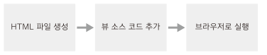

## Vue.js

[toc]

## #.개발환경

* 뷰로 웹 앱을 개발하기 위한 환경 구성

  * 크롬 브라우저

    * 크롬 개발자 도구 사용법
      https://developers.google.com/web/tools/chrome-devtools/?hl=ko

  * 아톰(Atom) 텍스트 에디터

    * UI Theme : 환경설정 Ctrl+, (Cmd+,) -> install -> Themes -> seti-ui 설치

    * Syntax Theme : atom-material-syntax-dark 설치

    * 환경설정 -> Themes -> UI Theme, Syntax Theme 변경

    * 아톰패키지 설치 : Settings -> Install -> Packages -> language-vue 검색 

      Vue component support in Atom : hedefalk 설치 (아톰 종류 후 재시작 자동적용)

  * 노드제이에스(Node.js)

    * 노드제이에스는 서버 사이드 자바스크립트로, 서버 측에서 실행되는 자바스크립트 실행 환경을 의미 한다.

      뷰 CLI로 생성한 프로젝트에서 프로토타이핑을 할 때도 노드제이에스 서버를 사용하기 때문에 필수적인 환경이다.

      (서버사이드 Server-side: 웹 화면과 관계된 서버 로직을 처리하는 영역)

    * 노드제이에스는 윈도우, 맥, 리눅스 등 다양한 플랫폼에서 서버 사이드 자바스크립트 코드를 실행할 수 있는 실행 환경이다.

    * nodejs.org에 접속 후 다운로드 Current 버전보다 안정적인 LTS(Long Term Support) 버전이 호환성에 좋다.

    * 설치 후 Cmd 창에서 "node -v" 명령어 로 설치된 버전 확인.

  * 뷰 개발자 도구(Vue.js devtools, 크롬 확장 플러그인)

    * vue.js devtools 로 검색 후 해당 브라우저에 맞는 플러그인 설치
    
    * 뷰 크롬 익스텐션을 다운로드 하라는 로그 처리 로컬에서는 추가 설정 필요 (file 프로토콜로 접근시)
    
      크롬 브라우저 설정 -> 도구 더 보기 -> 확장 프로그램 -> 세부정보 -> 파일 URL에 대한 액세스 허용
    
    * 사용 방법 : 개발자 도구 에서 Vue 탭을 선택
      
          
      
      

## #.Hello Vue.js 프로젝트 생성

 


* index.html

  ```html
  <html>
    <head>
      <title>Vue Sample</title>
    </head>
    <body>
      <div id="app">
        {{ message }}
      </div>
      <script src = "https://cdn.jsdelivr.net/npm/vue@2.5.2/dist/vue.js"></script>
      <script>
        new Vue({
          el:'#app',
          data : {
            message:'Hello Vue.js!'
          }
        });
      </script>
    </body>
  </html>
  ```


# 1.Vue.js 소개

## 1-1.Vue.js의 특징

### 1-1-1.UI 화면단 라이브러리

* 뷰(Vue.js)는 UI 화면 개발 방법 중 하나인 MVVM 패턴의 뷰 모델(ViewModel)에 해당하는 화면단 라이브러리 입니다.

   

* MVVM 패턴이란 화면을 모델(Model) - 뷰(View) - 뷰 모델(ViewModel)로 구조화하여 개발하는 방식을 의미한다.

  이러한 방식으로 개발하는 이유는 화면의 요소들을 제어하는 코드와 데이터 제어 로직을 분리하여 코드를 더 직관적으로

  이해할 수 있고, 추후 유지 보수가 편해지기 때문이다.


| 용어                        | 설명                                                         |
| --------------------------- | ------------------------------------------------------------ |
| 뷰(View)                    | 사용자에게 보이는 화면                                       |
| 돔(DOM)                     | HTML 문서에 들어가는 요소(태그, 클래스, 속성 등)의 정보를 담고 잇는 데이터 트리 |
| 돔(DOM Listener)            | 돔의 변경 내역에 대해 즉각적으로 반응하여 특정 로직을 수행하는 장치 |
| 모델(Model)                 | 데어터를 담는 용기. 보통은 서버에서 가져온 데이터를 자바스크립트 객체 형태로 저장 |
| 데이터 바인딩(Data Binding) | 뷰(View)에 표시되는 내용과 모델의 데이터를 동기화            |
| 뷰 모델(ViewModel)          | 뷰와 모델의 중간 영역. 돔 리스너와 데이터 바인딩을 제공하는 영역 |


* MVVM 패턴이란?

```
마크업 언어나 GUI 코드를 비지니스 로직 또는 백엔드 로직과 분리하여 개발하는 소프트웨어 디자인 패턴.
"화면 앞단(프런트엔드)의 화면 동작과 관련된 로직과 
 화면 뒷단(백엔드)의 데이터베이스 데이터 처리 로직을 분리하여 더 깔끔하게 코드를 구성한다."
```


### 1-1-2.컴포넌트 기반 프레임워크

* 뷰가 가지는 또 하나의 큰 특징은 바로 컴포넌트(Component)기반 프레임워크 라는 점.

* 화면을 컴포넌트로 구조화한 컴포넌트 간 관계도.

   

  위 그림의 왼쪽 화면은 각영역을 컴포넌트로 지정하여 구분한 것이고, 오른쪽 그림은 왼쪽 화면의 각 컴포넌트 간의 

  관계를 나타낸 것이다.

* 컴포넌트 기반 방식으로 개발하는 이유는 코드를 재사용하기가 쉽고, HTML 코드에서 화면의 구조를 직관적으로 파악할 수 있다.


### 1-1-3.리액트와 앵귤러의 장점을 가진 프레임워크

* 뷰는 앵귤러의 양방향 데이터 바인딩(Two-way Data Binding)과 

  리액트의 단방향 데이터 흐름(One-way Data Flow)의 장점을 모두 결합한 프레임워크 입니다. 

* 양방향 데이터 바인딩이란 화면에 표시되는 값과 프레임워크의 모델 데이터 값이 동기화되어 

  한쪽이 변경되면 다른 한쪽도 자동으로 변경되는 것을 말한다. 

* 단방향 데이터 흐름은 컴포넌트의 단향향 통신을 의미한다. 컴포넌트 간에 데이터를 전달할 때 

  항상 상위 컴포넌트에서 하위 컴포넌트 한 방향으로만 전달하게끔 프레임워크가 구조화되어 있는 게 바로 단방향 데이터 흐름이다.

* 빠른 화면 렌더링(Rendering)을 위해 리액트의 가상 돔(Virtual DOM)렌더링 방식을 적용하여 사용자 인터랙션(user interaction)

  이 많은 요즘의 웹 화면에 적합한 동작 구조를 갖추고 있다. 가상돔을 활용하면 특정 돔 요소를 추가하거나 삭제하는 변경이 일어날 때

  화면 전체를 다시 그리지 않고 프레임워크에서 정의한 방식에 따라 화면을 갱신한다. 따라서 브라우저 입장에서는 성능 부하가 줄어들어

  일반 렌더링 방식보다 더 빠르게 화면을 그릴 수 있다.
  


​	   
