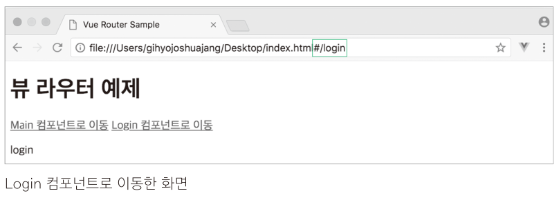
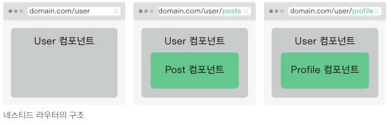
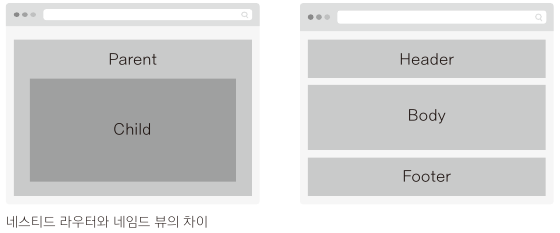
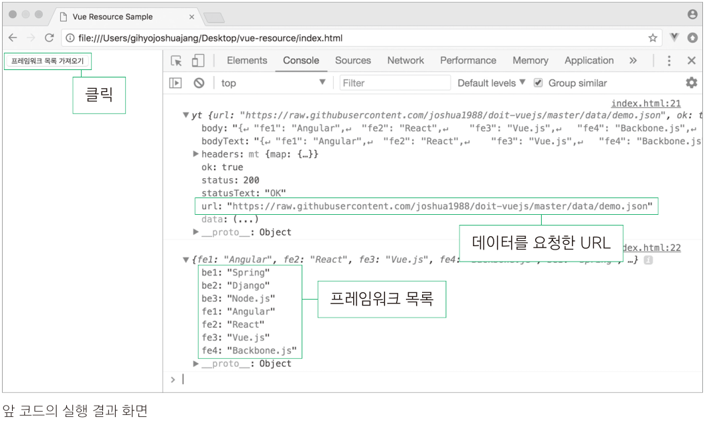
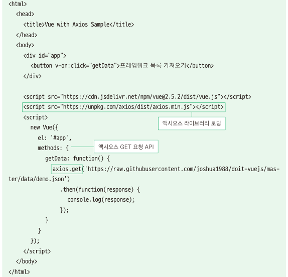

## Vue.js

[toc]


# 3.상용 웹 앱을 개발하기 위한 필수 기술들-라우터&HTTP 통신

## 3-1.뷰 라우터

### 3-1-1.라우팅이란?

* 라우터(Router)를 이해하기 위해서는 먼저 라우팅이 무엇인지 알아야 한다. 라우팅이란 웹 페이지 간의 이동방법을 말한다.

* 라우팅은 현대 웹 앱 형태 중 하나인 싱글 페이지 애플리케이션(SPA, Single Page Application)에서 주로 사용하고 있다.

  ```js
  싱글페이지 애플리케이션이란?
  페이지를 이동할 때 마다 서버에 웹 페이지를 요청하여 새로 갱신하는 것이 아니라 미리 해당 페이지들을 받아 놓고
  페이지 이동 시에 클라이언트의 라우팅을 이용하여 화면을 갱신하는 패턴을 적용한 애플리케이션
  ```

* 라우팅을 이용하면 화면 간의 전환이 매끄러울 뿐만 아니라 애플리케이션의 사용자 경험을 향상 시킬 수 있다.

  일반적으로 브라우저에서 웹 페이지를 요청하면 서버에서 응답을 받아 웹 페이지를 다시 사용자에게 돌려주는 시간 동안 화면상에 

  깜빡거림 현상이 나타난다. 이런 부분들을 라우팅으로 처리하면 깜빡거림 없이 화면을 매끄럽게 전환할 수 있을 뿐만 아니라 빠르게

  화면을 조작할 수 있어 사용자 경험이 향상된다.

* 뷰 뿐만 아니라 리액트와 앵귤러 모두 라우팅을 이용하여 화면을 전환하고 있으며, 프런트엔드 프레임워크를 사용하지 않고 

  일반 HTML 파일들로도 라우팅 자바스크립트 라이브러리를 이용하여 라우팅 방식의 페이지 이동을 구현할 수 있다.

  ```js
  참고:대표적인 라우팅 라이브러리에는 router.js, navigo.js 가 있다.
  router.js(http://github.com/tildeio/router.js/)
  navigo.js(http://github.com/krasimir/navigo) 
  ```


### 3-1-2. 뷰 라우터

* 뷰 라우터는 뷰에서 라우팅 기능을 구현할 수 있도록 지원하는 공식 라이브러리다. 

  뷰 라우터를 이용하여 뷰로 만든 페이지 간에 자유롭게 이동할 수 있다. 

  뷰 라우터를 구현할 때 필요한 특수 태그와 기능은 다음과 같다.

  | 태그                         | 설명                                                         |
  | ---------------------------- | ------------------------------------------------------------ |
  | &lt;router-link to="URL 값"> | 페이지 이동 태그. 화면에서는 &lt;a>로 표시되며 클릭하면 to에 지정한 URL로 이동한다. |
  | &lt;router-view>             | 페이지 표시 태그. 변경되는 URL에 따라 해당 컴포넌트를 뿌려주는 영역이다. |

  

* 뷰 라우터 실습

   

  1. 각&lt;router-link>는 화면 상에서[Main 컴포넌트로 이동], [Login 컴포넌트로 이동] 이라는 &lt;a> 버튼 태그로 변환되어
  
     표시 된다. 각 버튼을 클릭하면 to="" 에 정의된 텍스트 값이 브라우저 URL 끝에 추가된다. 여기서는 /main과 /login의
  
     2개의 URL이 끝에 추가된다.
  
  2. &lt;router-view>는 갱신된 URL에 해당하는 화면을 보여주는 영역이다. &lt;router-view>에 나타낼 화면은 &lt;script>에서 정의한다.
  
  3. Main과 Login 컴포넌트에는 template 속성으로 각 컴포넌트를 구분할 수 있는 정도의 간단한 HTMl 코드를 정의한다.
  
  4. routes 변수에는 URL 앖이 /main일 때 Main 컴포넌트를, /login일 때 Login 컴포넌트를 표시하도록 정의한다.
  
  5. router 변수에는 뷰 라우터를 하나 생성하고, routes를 삽입해 URL에 따라 화면이 전환될 수 있게 정의한다.
  
  6. 마지막 부분은 새 인스턴스를 생성하고 라우터의 정보가 담긴 router를 추가한다. 여기서 .$mount()는 el 속성과 같이 
  
     인스턴스를 화면에 붙여주는 역할을 한다.
  
     ```js
     $mount()API란?
     $mount()API는 el속성과 동일하게 인스턴스를 화면에 붙이는 역할을 한다. 인스턴스를 생성할 때 el속성을 넣지 않았더라도
     생성하고 나서 $mount()를 이용하면 강제로 인스턴스를 화면에 붙일 수 가 있다. 참고로, 뷰 라우터의 공식 문서는 모두 인스턴스
     안에 el을 지정하지 않고 라우터만 지정하여 생성한 다음 생성된 인스턴스를 $mount()를 이용해 붙이는 식으로 안내하고 있다.
     ```
  
     

* 10_뷰 라우터 실습.html

  ```html
  <!<!DOCTYPE html>
  <html>
    <head>
      <meta charset="utf-8">
      <meta name="viewport" content="width=device-width, initial-scale=1.0">
      <title>Vue Router Sample</title>
    </head>
    <body>
      <div id="app">
        <h1>뷰 라우터 예제</h1>
        <p>
          <router-link to="/main">Main 컴포넌트로 이동</router-link>
          <router-link to="/login">Login 컴포넌트로 이동</router-link>
        </p>
        <router-view></router-view>
      </div>
  
      <script src="https://cdn.jsdelivr.net/npm/vue@2.5.2/dist/vue.js"></script>
      <script src="https://unpkg.com/vue-router@3.0.1/dist/vue-router.js"></script>
      <script>
        var Main  = {template : '<div>main</div>'};
        var Login = {template : '<div>login</div>'};
  
        var routes = [
          {path : '/main', component:Main}
         ,{path : '/login',component:Login}
        ];
  
        var router = new VueRouter({
          routes
        });
  
        var app = new Vue({
          router
        }).$mount('#app');
  
      </script>
    </body>
  </html>
  ```

* 실행결과

   

  * 위 그림에서 'Main 컴포넌트로 이동'을 클릭하면 깜박거리 현상 없이 URL의 끝이 'main'으로 바뀌면서 아래와 같은 화면이 나타난다.

   

  * 마찬가리로 'Login 컴포넌트로 이동' 을 클릭하면 URL의 끝이 'login'으로 바뀌면서 아래와 같은 화면이 나타난다.

   

  * 라우터 URL의 해시 값(#)을 없애는 방법

    뷰 라우터의 기본 URL 형식은 해시 값을 사용한다. 만약 index.html/login과 같이 해시 값을 없애고 싶으면 

    히스토리 모드를 활용하면 된다.

    ```js
    var router = new VueRouter({
        mode : 'history',
        routes
    });
    ```

    

### 3-1-3. 네스티드 라우터

* 네스티드 라우터(Nested Router)는 라우터로 페이지를 이동할 때 최소 2개 이상의 컴포넌트를 화면에 나타낼 수 있다.

  네스티드라는 단어에서 추측할 수 있듯이 상위 컴포넌트 1개에 하위 컴포넌트 1개를 포함하는 구조로 아래와 같이 구성한다.

   

* 위 그림처럼 네스티드 라우터를 이용하면 URL에 따라서 컴포넌트의 하위 컴포넌트가 다르게 표시된다.

  예를 들어 맨 왼쪽의 그림에는 하위로 아무것도 지정하지 않았기 때문에 User컴포넌트만 표시되고, 오른쪽 2개의 그림에는 

  URL 값 posts, profile에 따라 각각 Post, Profile 컴포넌트가 표시된다.

  

* 네스티드 라우터 구현

    

  1. **&lt;div id="app">**에 &lt;router-view>를 등록하여 User 컴포넌트가 뿌려질 영역을 정의한다.

	2. User, UserPost, UserProfile 컴포넌트의 내용을 각 객체에 정의한다.		

	   컴포넌트가 전환된 것을 확인할 수 있게 template 속성을 컴포넌트 내용에 추가한다.

	   여기서 주목할 부분은 User 컴포넌트의 template에 하위 컴포넌트를 표시할&lt;router-view>가 하나 더 있다는 점 이다.

	3. routes에 라우터 정보를 정의한다. 

	   제일 먼저 path 속성에는 네스티드 라우터를 실행하는 기본 URL을 /user로 설정하고, 
	
	   상위 컴포넌트는 User 컴포넌트로 지정한다.
	
	   그런 다음 children 속성에는 URL 값 /user 다음에 올 URL에 따라 표시될 하위 컴포넌트를 정의 한다. 
	
	   /user/posts인 경우 UserPost를 표시하고, 
	
	   /user/profile인 경우 UserProfile를 표시하도록 설정한다.
	
	4. 이제 뷰 라우터를 새로 하나 생성하고 앞에서 정의한 라우터 정보를 담은 객체 routes를 정의 한다.
	
	5. 마지막으로 인스턴스를 하나 생성하고 라우터 정보 router를 포함한다.
	
	   그리고 app라는 id를 가지 요소에 인스턴스를 붙여 화면에 나타낸다.
	   
	   
	
	여기서 알 수 있는 네스티드 라우터와 기본 라우터의 차이점은 최상위(루트) 컴포넌트에도 &lt;router-view>
	
	가 있고, 최상위 컴포넌의 하위 컴포넌트(User)에도 &lt;router-view>가 있다는 것이다. 그렇기 때문에
	
	URL에 따라 하위 컴포넌트의 내용이 바뀌게 된다. 컴포넌트 간 관계를 그림으로 표현하면 아래와 같다.
	
	 


* 11.네스티드 라우터 구현.html

  ```html
  <!DOCTYPE html>
  <html>
    <head>
      <meta charset="utf-8">
      <meta name="viewport" content="width=device-width, initial-scale=1.0">
      <title>Vue Nested Router</title>
    <head>
    <body>
      <div id="app">
        <router-view></router-view>
      </div>
      <script src="https://cdn.jsdelivr.net/npm/vue@2.5.2/dist/vue.js"></script>
      <script src="https://unpkg.com/vue-router@3.0.1/dist/vue-router.js"></script>
      <script>
        var User = {
          template:`
            <div>
              User Component
              <router-view></router-view>
            </div>
          `
        };
  
        var UserProfile  = {template : '<p>User Profile Component</p>'};
        var UserPost     = {template : '<p>User Post Component</p>'};
  
        var routes = [
          {
            path : '/user',
            component: User,
            children : [
              {
                path : 'posts',
                component : UserPost
              },
              {
                path : 'profile',
                component : UserProfile
              }
            ]
          }
        ];
  
        var router = new VueRouter({
          routes
        });
  
        var app = new Vue({
          router
        }).$mount('#app');
  
      </script>
    </body>
  </html>
  ```

  

* 실행결과

  * 첫 화면에는 아무것도 보이지 않으므로 실행 후 URL 값의 끝에 user를 입력한다.

     

  * 이제 하위 컴포넌트 UserPost가 제대로 표시되는지 확인하기 위해 URL의 값의 끝에 '/posts'를 추가

     

   *  이번에는 URL 값의 끝을 'profile' 로 변경하고 UserProfile 컴포넌트가 정상적으로 나타나는지 확인

       

      

    *  네스티드 라우터는 화면을 구성하는 컴포넌트의 수가 적을 때는 유용하지만 한 번에 더 많은 컴포넌트를

       표시하는 데는 한계가 있다. 이 문제를 해결할 수 있는 방안으로 네임드 뷰가 있다.


### 3-1-4. 네임드 뷰

* 네임드 뷰(Named View)는 특정 페이지로 이동했을 때 여러 개의 컴포넌트를 동시에 표시하는 라우팅 방식이다.

* 네스티드 라우터는 아래의 왼쪽 그림처럼 상위 컴포넌트가 하위 컴포넌트를 포함하는 형식이지만 네임드 뷰는 

  오른쪽 그림처럼 같은 레벨에서 여러 개의 컴포넌트를 한 번에 표시한다.

   

  

* 네임드 뷰 구현하기

   

  파일을 실행하면 URL값 '/'에 의해 네임드 뷰가 바로 실행된다. 코드를 살펴보자.

  1. 먼저&lt;div> 태그 안에 &lt;router-view>를 3개 추가하고 name 속성을 추가한다.

     여기서 name 속성은 아래 components 속성에 정의하는 컴포넌트와 매칭하기 위한 속성이다.

     Header 컴포넌트는 header, Footer 컴포넌트는 footer를 각각 name 속성에 값으로 지정한다.

     그리고 name 속성이 없는 두 번째 &lt;router-view>는 default로 표시될 컴포넌트를 의미한다.

  2. 이제 &lt;script>로 넘어가서 Body, Header, Footer 컴포넌트의 내용이 담길 객체를 선언한다.

     각 컴포넌트 내용에는 컴포넌트 영역이 구분될 수 있게 간단한 template속성을 추가한다.

  3. 그리고 앞의 네스티드 라우터 예제 코드와는 다르게 이번에는 new VueRouter()로 라우터를 하나 

     생성하고 라우터 정보를 바로 그 안에 정의한다.

  4. path는 네임드 뷰가 실행될 URL을 정의하는 속성이다. 여기서는 애플리케이션을 실행하면 마주치는

     기본 URL 값 '/'을 지정한다.

  5. components는 앞에서 &lt;router-view>에 정의한 name 속성에 따라 표시될 컴포넌트를 정의하는 속성이다.
  6. 마지막으로 인스턴스를 생성하고 네임드 뷰 정보를 갖고 있는 라우터를 포함한다.

  

* 실행결과

   

  * 이렇게 네임드 뷰를 활용하면 특정 페이지로 이동했을 때 해당 URL에 맞춰 여러 개의 컴포넌트를 한 번에

    표시할 수 있다.

    ```js
    name 속성에 사용한 값이 예약어인가?
    <router-view>에서 사용한 name속성은 예약어가 아니라 사용자가 임의로 정의할 수 있는 값이다.
    위에서 사용한 header, footer 값 모두 appHeader, appFooter라고 이름을 변경해도 동일하게 동작
    한다. 예외적으로 name 속성을 지정하지 않았을 때의 기본 컴포넌트는 default로 접근한다.
    ```

    

## 3-2. 뷰 HTTP 통신

### 3-2-1. 웹 앱의 HTTP 통신 방법	

* 뷰에서는 ajax를 지원하기 위한 라이브러리를 제공한다.

  뷰 프레임워크의 필수 라이브러리로 관리하던 뷰 리소스와 요즘 가장 많이 사용하는 액시오스(axios)가 바로 그것이다.

### 3-2-2. 뷰 리소스

* 뷰 리소스(resource)는 초기에는 코어 팀에서 공식적으로 권하는 라이브러리 였으나 2016년 말에 에반이 공식적인 

  지원을 중단하기로 하면서 다시 기존에 관리했던 PageKit팀의 라이브러리로 돌아갔다. 그럼에도 불구 하고 뷰 리소스는 아직 

  계속 사용할 수 있는 라이브러리 이기 때문에 간단히 살펴보자.

* 뷰 리소스를 사용하는 방법은 CDN을 이용해서 라이브러리를 로딩하는 방시과 NPM으로 라이브러리를 설치하는 방법(ES6 기준)이 있다.

  ```js
  ES6 설치 방법은 https://github.com/pagekit/vue-resource#installation 을 참고하자.
  ```

  

* 뷰 리소스로 데이터 받아오기

   

  1. 먼저 버튼은 인스턴스 영역 안인 &lt;div>태그 안에&lt;button>태그로 추가한다. 그리고 v-on:click을 이용하여

     버튼을 클릭했을 때 getData()가 호출되도록 클릭 이벤트를 설정한다.

  2. getData()에는 뷰 리소스에서 제공하는 API인 this.$http.get()을 사용하여 해당 URL에서 제공하는 데이터를

     받아온다. API 이름에서 유추할 수 있듯이 this.$http.get()은 HTTP GET 요청을 서버에 보내고 특정 데이터를 받아온다.

  3. 그리고 버튼을 클릭하여 해당 URL로 HTTP GET 요청을 보내고 나면 .then() 안에서 응답을 받은 데이터 

     response를 콘솔에 출력한다. 

     

* 13_뷰 리소스로 데이터 받아오기.html

  ```html
  <html>
    <head>
      <title>Vue Resource Sample</title>
    </head>
    <body>
      <div id="app">
        <button v-on:click="getData">프레임워크 목록 가져오기</button>
      </div>
  
      <script src="https://cdn.jsdelivr.net/npm/vue@2.5.2/dist/vue.js"></script>
      <script src="https://cdn.jsdelivr.net/npm/vue-resource@1.3.4"></script>
      <script>
        new Vue({
          el: '#app',
          methods: {
            getData: function() {
              this.$http.get(`https://raw.githubusercontent.com/joshua1988/doit-vuejs/master/data/demo.json`)
                  .then(function(response) {
                    console.log(response);
                    console.log(JSON.parse(response.data));
                  });
            }
          }
        });
      </script>
    </body>
  </html>
  ```

* 실행결과

   

  * [프레임워크 목록 가져오기] 버튼을 클릭하면 개발자 도구의 'Console' 패널에 response 객체의 값과 프레임워크 목록을 객체에 담아 

    출력한다. 여기서 첫 번째 로그는 response의 내용이다. url 속성 값에는 HTTP GET 요청을 할 때 넣었던 사이트의 URL이 들어 있다.

    두 번째 로그는 응답 데이터의 body 값이 문자열이기 때문에 JSON.parse() 자바스크립트 API를 이용해서 자바스크립트 객체로 보기 

    쉽게 변환했다.


### 3-2-3. 액시오스

* 액시오스(Axios)는 현재 뷰 커뮤니티에서 가장 많이 사용되는 HTTP 통신 라이브러리이다. 

  에반도 뷰 리소스 라이브러리를 공식 라이브러리에서 제외하면서 액시오스를 언급했다. 

* 액시오스는 Promise 기반의 API형식이 다양하게 제공되어 별도의 로직을 구현할 필요 없이 주어진 API 만으로도 간편하게

  원하는 로직을 구현할 수 있다.

  ```js
  Promise 기반의 API 형식이란 무엇인가?
  Promise란 서버에 데이터를 요청하여 받아오는 동작과 같은 비동기 로직 처리에 유용한 자바스크립트 객체다.
  자바스크립트는 단일 스레드(thread)로 코드를 처리하기 때문에 특정 로직의 처리가 끝날 때 까지 기다려주지 않는다. 
  따라서 데이터를 요청하고 받아올 때까지 기다렸다가 화면에 나타내는 로직을 실행해야 할 때 주로 Promise를 활용한다. 
  그리고 데이터를 받아왔을 때 Promise로 데이터를 화면에 표시하거나 연산을 수행하는 등 특정 로직을 수행한다.
  데이터 통신과 관련한 여러 라이브러리 대부분에서 Promise를 활용하고 있으며, 액시오스에서도 Promise기반의 API를 지원한다.
  ```

* 액시오스 공식 깃허브 리포지토리(https://github.com/axios/axios) 에서 안내하는 문서 역시 뷰 리소스보다 더 상세하게 기술되어 있다.

  따라서 우너하는 기능에 대해 손쉽게 API 형식과 코드 예제를 참고할 수 있다.

* 액시오스 설치 및 사용하기

  * CDN을 이용해서 설치하는 방법과 NPM을 이용해서 설치하는 방버(ES6 기준)이 있다.

  * 액시오스 CDN 설치 방법

    ```html
    <script src="https://unpkg.com/axios/dist/axios.min.js"></script>
    ```

  * NPM을 이용한 설치 방법은 아래 링크 참조

    ```js
    https://github.com/axios/axios#installing
    ```

  * 액시오스는 뷰 리소스처럼 HTTP 통신에 대해 간단하고 직관적인 API를 제공한다. 

    그리고 API 형식이 다양해서 단순한 호출 이외에도 여러 설정값을 추가하여 함께 호출할 수 있다.

    ```js
    //HTTP GET 요청
    axios.get('URL 주소').then().catch();
    
    //HTTP POST 요청
    axios.post('URL 주소').then().catch();
    
    //HTTP 요청에 대한 옵션 속성 정의
    axios({
        method : 'get',
        url : 'URL 주소',
        ...
    });
    ```

    | API 유형                               | 처리결과                                                     |
    | -------------------------------------- | ------------------------------------------------------------ |
    | axios.get('URL 주소').then().catch();  | 해당 URL 주소에 대해 HTTP GET 요청을 보낸다. <br/>서버에서 보낸 데이터를 정삭으로 받아오면 then() 안에 정의한 로직이 <br/>실행되고,데이터를 받아올 때 오류가 발생하면 catch()에 정의한 로직이 수행된다. |
    | axios.post('URL 주소').then().catch(); | 해당 URL 주소에 대해 HTTP POST 요청을 보낸다.<br/>then()과 catch()의 동작은 위에서 살펴본 내용과 동일하다. |
    | axios({ 옵션 속성})                    | HTTP 요청에 대한 자세한 속성들을 직접 정의해서 보낼 수 있다<br />데이터 요청을 보낼 URL, HTTP 요청 방식, 보내는 데이터 유형, 기타 등등 |

    ```js
    더 많은 API 형식을 알고 싶다면 아래 링크를 참고.
    https://github.com/axios/axios#axios-api
    ```

* 액시오스로 데이터 받아오기

   

   *  뷰 리소스로 데이터 받아오기 예제와 비교하면 라이브러리를 로딩해 오는 CDN의 주소와 GET 요청을 보내는

      API 형식 부분만 다르다.

      코드를 실행해 보면 응답 데이터가 담긴 객체의 모양이 뷰 리소스 데이터 받아오기 예제와 다르다.

      

* 14_액시오스로 데이터 받아오기.html

  ```html
  <html>
  	<head>
  		<title>Vue with Axios Sample</title>
  	</head>
  	<body>
  		<div id="app">
  			<button v-on:click="getData">프레임워크 목록 가져오기</button>
  		</div>
  
  		<script src="https://cdn.jsdelivr.net/npm/vue@2.5.2/dist/vue.js"></script>
  		<script src="https://unpkg.com/axios/dist/axios.min.js"></script>
  		<script>
  			new Vue({
  				el: '#app',
  				methods: {
  					getData: function() {
  						axios.get('https://raw.githubusercontent.com/joshua1988/doit-vuejs/master/data/demo.json')
  							.then(function(response) {
  								console.log(response);
  							});
  					}
  				}
  			});
  		</script>
  	</body>
  </html>
  ```

* 실행결과

   

   *  response 객체를 확인해 보면 data 속성이 일반 문자열 형식이 아니라 객체 형태이기 때문에 별도로 JSON.parse()를 사용해서 객체로 변환할 필요가 없다. 이런 부분들이 뷰 액시오스가 뷰 리소스보다 사용성이 좋다는 것을 증명해 준다.

      


​	   
