## Vue.js

[toc]

# 4.화면을 개발하기 위한 기본 지식과 팁-템플릿&프로젝트 구성

## 4-1. 뷰 템플릿

### 4-1-1. 뷰 템플릿이란?

* 뷰의 템플릿(Template)은 HTML, CSS등의 마크업 속성과 뷰 인스턴스에서 정의한 데이터 및 로직들을 연결하여 사용자가

  브라우저에서 볼 수 있는 형태의 HTML로 변환해 주는 속성이다.

* 템플릿 속성을 사용하는 방법은 두 가지로, 첫 번째는 ES5에서 뷰 인스턴스의 template 속성을 활용하는 방법이다.

  ```html
  <script>
      new Vue({ template: '<p>Hello {{ message }}</p>' });
  </script>
  ```

  * 여기서 템플릿 속성에 대해 한 가지 알아둘 특징이 있다. 사용자가 볼 수는 없지만 라이브러리 내부적으로 template 속성에서 

    정의한 마크업 + 뷰 데이터를 가상 돔 기반의 render() 함수로 변환한다. 변환된 render() 함수는 최종적으로 사용자가 볼 수 있게

    화면을 그리는 역할을 한다. 그리고 변환 과정에서 뷰의 반응성(Reactivity)이 화면에 더해진다.

    ```js
    참고 : render() 함수에 익숙하다면 직접 구현해도 된다.
    JSX 기반의 render() 함수에 더 익숙한 리액트 개발자라면 template 속성을 이용하지 않고 render() 함수를 사용해 화면 요소를 
    동일하게 구현할 수 있다. 하지만 뷰 프레임워크 특징 자체가 JSX나 render() 함수를 모르는 사람들도 HTML 을 이용하여 개발할 수 
    있게 하는 것을 목표로 하기 때문에 template 속성을 사용하도록 권하고 있다. 추후에 뷰의 반응성과 가상 돔에 충분히 이해하고 나면
    render() 함수를 직접 구현할 수 있다. 그러면 화면 요소의 동작 하나 하나에 직접 관여할 수 있기 때문에 더 빠르게 화면을 렌더링할
    수 있을 것이다.
    ```

  * template 속성을 사용한 경우 vs 사용하지 않은 경우

    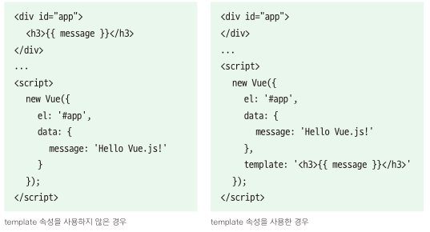 

    왼쪽 코드는 먼저 &lt;h3>{{ message}}&lt;/h3>를 화면에 표시하고, 인스턴스가 생성되면 message의 값을 Hello vue.js 로 치환한다.

    오른쪽 코드는 &lt;div id="app">에 아무런 내용이 없다가 인스턴스가 생성되면&lt;h3>Hello Vue.js!&lt;/h3>가 화면에 달라붙어 표시된다.

    

* 두 번째는 싱글 파일 컴포넌트 체계의 &lt;template> 코드를 활용하는 방법이다.

  ```html
  <-- ES6 : 싱글 파일 컴포넌트 체계 -->
  <template>
      <p>Hello {{ message }}</p>
  </template>
  ```

  

* 템플릿에서 사용하는 뷰의 속성과 문법은 다음과 같다. 

  * 데이터 바인딩
  * 자바스크립트 표현식
  * 디렉티브
  * 이벤트 처리
  * 고급 템플릿 기법

### 4-1-2. 데이터 바인딩

* 데이터 바인딩(Data Binding)은 HTML화면 요소를 뷰 인스턴스의 데이터와 연결하는 것을 의미한다.

* 주요 문법으로는 {{}} 문법과 v-bind 속성이 있다.

  *  ##### {{}} - 콧수염 괄호

    {{}}는 뷰 인스턴스의 데이터를 HTML 태그에 연결하는 가장 기본적인 텍스트 삽입 방식이다.

    뷰 뿐만 아니라 다른 언어나 프레임워크에서도 자주 사용되는 템플릿 문법(template syntax) 이다.

    간단히 형식을 정리하면 다음과 같다.

    ```html
    <div id="app">
        {{ message }}
    </div>
    
    <script>
        new Vue({
         el: '#app',
         data:{
             message:'Hello Vue.js!'
         }
    	});
    </script>
    ```
    위 코드는 data 속성의 message 속성 값인 Hello Vue.js!를 &lt;div> 태그 안의 {{ message  }}에 연결하여

    화면에 나타내는 코드다.여기서 만약 data 속성의 message 값이 바뀌면 뷰 반응성에 의해 화면이 자동으로 갱신된다.

    만약 뷰 데이터가 변경되어도 값을 바꾸고 싶지 않다면 아래와 같이 v-once 속성을 사용한다.

    ```html
    <div id="app" v-once>
        {{ message }}
    </div>
    ```

    
    
  *  ##### v-bind

    v-bind는 아이디, 클래스, 스타일 등의 HTML속성(attributes)값에 뷰 데이터 값을 연결할 때 사용하는 데이터 연결 방식이다.

    형식은 v-bind 속성으로 지정할 HTML 속성이나 props 속성 앞에 접두사로 붙여준다.

  

  * v-bind 예제
  
     
  
    위 코드는 HTML의 기본 속성인 id, class, style의 앞에 v-bind:를 붙여서 뷰 인스턴스에 정의한 데이터 속성과 연결하여
  
    화면에 나타내는 예제이다. 코드를 실행하면 데이터의 값이 각 &lt;p>태그에 연결되어 화면에 나타난다.
  
  * 15_v-bind 예제.html
  
    ```html
      <html>
        <head>
          <title>Vue Template - Data Binding</title>
        </head>
        <body>
          <div id="app">
            <p v-bind:id="idA">아이디 바인딩</p>
            <p v-bind:class="classA">클래스 바인딩</p>
            <p v-bind:style="styleA">스타일 바인딩</p>
          </div>
          <script src="https://cdn.jsdelivr.net/npm/vue@2.5.2/dist/vue.js"></script>
          <script>
            new Vue({
              el: '#app',
              data: {
                idA: 10,
                classA: 'container',
                styleA: 'color: blue'
              }
            });
          </script>
        </body>
      </html>
    ```
  
  * 실행결과
  
     
  
    실행 결과 화면을 보면 데이터 속성의 idA, classA, styleA 값이 화면의 요소에 각각 연결되어 나타난 것을 확인할 수 있다.
  
    특히 styleA 속성은 스타일 값이 적용되면서 바로 화면에 반영되어 나타난다.
  
    추가로  "v-bind:" 문법을 ":" 로 간소화할 수 있다. 예를 들어, "v-bind:id" 와 ":id"는 같은 동작을 한다.
  
    이처럼 약식 문법을 사용할 때는 기본 문법과 약식 문법을 혼용해서 사용하지 않는 것이 좋다. 또한 뷰 코드가 전반적으로
  
    "v-" 접두사를 붙이는 형태이기 때문에 가급적 "v-bind" 속성을 이용하는 것이 기존 HTML 문법과 구분도 되고 다른 사람이 코드를
  
    파악하기도 쉽다.   


### 4-1-3. 자바스크립트 표현식

* 뷰의 템플릿에서도 자바스크립트 표현식을 쓸 수 있다. 

  데이터 바인딩 방법 중 하나인 {{}} 안에 자바스크립트 표현식을 넣은면 된다.

* 자바스크립트 표현식 예제

   

  첫 번째&lt;p> 태그는 message의 값 Hello Vue.js!를 그대로 출력한다.

  두 번째&lt;p> 태그는 message값에 문자열 !!! 를 추가하여 출력하기 때문에 Hello Vue.js!!!!가 출력된다.

  세 번째&lt;p> 태그는 문자열 Hello Vue.js!의 순서를 바꿔 !sj.euV olleH로 출력한다.

  

* 16_자바스크립트 표현식 예제.html

  ```html
  <html>
    <head>
      <title>Vue Template - Javascript Expression</title>
    </head>
    <body>
      <div id="app">
        <p>{{ message }}</p>
        <p>{{ message + "!!!" }}</p>
        <p>{{ message.split('').reverse().join('') }}</p>
      </div>
  
      <script src="https://cdn.jsdelivr.net/npm/vue@2.5.2/dist/vue.js"></script>
      <script>
        new Vue({
          el: '#app',
          data: {
            message: 'Hello Vue.js!'
          }
        });
      </script>
    </body>
  </html>
  ```

* 실행결과

   

  
  
* 자바스크립트 표현식에서 주의할 점

  첫째, 자바스크립트의 선언문과 분기 구문은 사용할 수 없다.

  둘째, 복잡한 연산은 인스턴스 안에서 처리하고 화면에는 간단한 연산 결과만 표시해야 한다.
  
   
  
  {{ var a = 10; }} 은 자바스크립트 선언문이고, {{ if(true){return 100} }}은 분기 구문이므로
  
  브라우저로 실행하면 오류가 발생한다. 동일한 로직 처리를 하고 싶으면 삼항연산자로 대체 {{ true ? 100 : 0 }} 한다.
  
  그리고 message 의 텍스트 값을 역순으로 변환하는 연산은 HTML 단에서 수행하지 않고, 
  
  자바스크립트 단에서 computed 속성을 이용하여 계산한 후 최종 결과 값만 표시한다. 
  
  뷰에서 이런한 방식을 권하는 이유는 HTML에 최종적으로 표현될 값만 나타내고,데이터의 기본 연산은 
  
  자바스크립트 단에서 함으로써 화면단 코드의 가독성을 높일 수 있고 UI 구조를 쉽게 파악할 수 있기 때문이다.
  
  또한 반복적인 연산에 대해서는 미리 계산해 저장해 놓고, 필요할 때 바로 불러오는 computed 속성의 캐싱(caching) 효과를 얻을 수 있다.
  
  ```js
  캐싱 : 데이터나 값을 임시 장소에 미리 복사해 놓는 동작. 
  일반적으로 데이터에 접근하는 시간이나 값을 다시 계산하는 시간이 오래 걸릴 때 해당 값을 
  미리 임시 장소에 저장해 놓고 필요할 때 바로 불러올 수 있기 때문에 수행 시간이 훨씬 빠름
  ```

* 17_자바스크립트 표현식에서 주의할 점.html

  ```html
  <html>
    <head>
      <title>Vue Template - Javascript Expression</title>
    </head>
    <body>
      <div id="app">
        <!-- 1. -->
        {{ var a = 10; }} <!-- X, 선언문은 사용 불가능 -->
        {{ if (true) {return 100} }} <!-- X, 분기 구문은 사용 불가능 -->
        {{ true ? 100 : 0 }} <!-- O, 삼항 연산자로 표현 가능 -->
  
        <!-- 2. -->
        {{ message.split('').reverse().join('') }} <!-- X, 복잡한 연산은 인스턴스 안에서 수행 -->
        {{ reversedMessage }} <!-- O, 스크립트에서 computed 속성으로 계산 후 최종 값만 표현 -->
      </div>
  
      <script src="https://cdn.jsdelivr.net/npm/vue@2.5.2/dist/vue.js"></script>
      <script>
        new Vue({
          el: '#app',
          data: {
            message: 'Hello Vue.js!'
          },
          computed: {
            reversedMessage: function() {
              return this.message.split('').reverse().join('');
            }
          }
        });
      </script>
    </body>
  </html>
  ```

  

### 4-1-4. 디렉티브

* 뷰 디렉티브(Directive)란 HTML 태그 안에 "v-" 접두사를 가지는 모든 속성들을 의미한다. 형식은 다음과 같다.

  ```html
  <a v-if="flag">두잇 Vue.js</a>
  ```

  위 &lt;a> 태그는 뷰 인스턴스 데이터 속성에 정의된 flag 값에 따라 보이기도 하고 안 보이기도 한다. 

  flag 값이 참(true)이면 '두잇 Vue.js' 텍스트가 화면에 보이고, 값이 거짓(false)면 &lt;a> 전체가 표시되지

  않아 텍스트가 화면에서 보이지 않는다.

  디렉티브는 화면의 요소를 더 쉽게 조작하기 위해 사용하는 기능이다. 뷰의 데이터 값이 변경되었을 때 화면의 요소들이

  리액티브(Reactive)하게 반응하여 변경된 데이터 값에 따라 갱신된다. 이런 식으로 화면의 요소를 직접 제어할 필요 없이

  뷰의 디렉티브를 활용하여 화면 요소들을 조작할 수 있다.

  | 디렉티브 이름 | 역할                                                         |
  | ------------- | ------------------------------------------------------------ |
  | v-if          | 지정한 뷰 데이터 값의 참, 거짓 여부에 따라 해당 HTML 태그를 화면에 표시하거나 표시 하지 않는다. |
  | v-for         | 지정한 뷰 데이터의 개수만큼 해당 HTML 태그를 반복 출력한다.  |
  | v-show        | v-if와 유사하게 데이터의 진위 여부에 따라 해당 HTMl 태그를 화면에 표시하거나 표시하지 않는다.<br />다만, v-if는 해당 태그를 완전히 삭제하지만 v-show는 css 효과만 display:none;으로 주어 <br />실제 태그는 남아 있고 화면 상으로만 보이지 않는다. |
  | v-bind        | HTML 태그의 기본 속성과 뷰 데이터 속성을 연결한다.           |
  | v-on          | 화면 요소의 이벤트를 감지하여 처리할 때 사용한다. <br />예를 들어, v-on:click은 해당 태그의 클릭 이벤트를 감지하여 특정 메서드를 실행할 수 있다. |
  | v-model       | 폼(form)에서 주로 사용되는 속성이다. 폼에 입력한  값을 뷰 인스턴스의 데이터와 즉시 동기화 한다.<br />화면에 입력된 값을 저장하여 서버에 보내거나 watch 와 같은 고급 속성을 이용하여 추가 로직을 수행할 수 있다<br />&lt;input>, &lt;select>, &lt;textarea> 태그에만 사용할 수 있다. |

  

* 많이 사용되는 디렉티브 다루기

  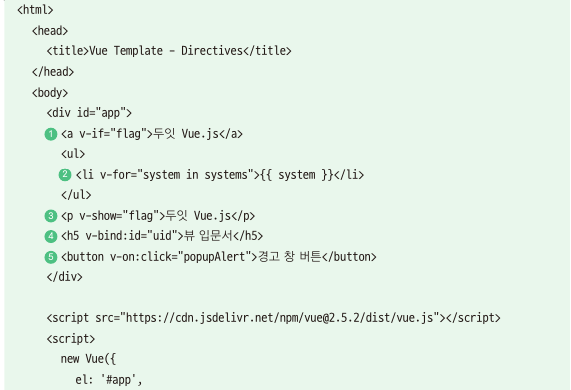  

  1. v-if : 분기 처리의 조건 값인 flag 값이 true이므로 '두잇 Vue.js' 텍스트를 화면에 표시한다.

  2. v-for : 뷰 데이터 systems는 android, ios, window의 총 3개의 값을 가지는 배열 이다.

     이 배열의 요소 개수만큼 &lt;li> 태그가 반복되어 {{ system }} 으로 각 요소의 값을 화면에 표시한다.

  3. v-show : v-if 와 마찬가지로 flag 값이 true 이므로 '두잇 Vue.js'를 화면에 표시한다.

  4. v-bind : HTML 태그의 id 속성을 뷰 데이터에 선언한 uid 값과 연결하여 화면에 표시한다.

  5. v-on : [경고 창 버튼]을 클릭했을 때 해당 이벤트를 감지하여 methods 속성에 선언한 popupAlert() 메서드를 

     수행한다. 결과적으로 브라우저 기본 경고 창을 연다.

     

* 18_많이 사용되는 디렉티브 다루기.html

  ```html
  <html>
    <head>
      <title>Vue Template - Directives</title>
    </head>
    <body>
      <div id="app">
        <a v-if="flag">두잇 Vue.js</a>
        <ul>
          <li v-for="system in systems">{{ system }}</li>
        </ul>
        <p v-show="flag">두잇 Vue.js</p>
        <h5 v-bind:id="uid">뷰 입문서</h5>
        <button v-on:click="popupAlert">경고 창 버튼</button>
      </div>
  
      <script src="https://cdn.jsdelivr.net/npm/vue@2.5.2/dist/vue.js"></script>
      <script>
        new Vue({
          el: '#app',
          data: {
            flag: true,
            systems: ['android', 'ios', 'window'],
            uid: 10
          },
          methods: {
            popupAlert: function() {
              return alert('경고 창 표시');
            }
          }
        });
      </script>
    </body>
  </html>
  ```

  

* 실행결과

  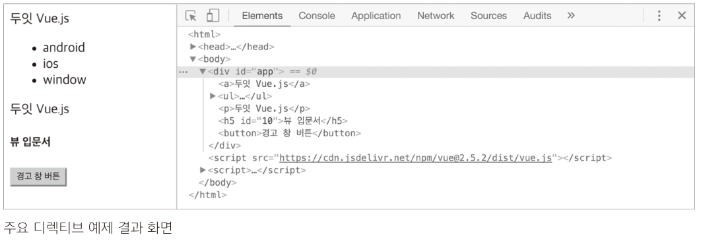 

  [경고 창 버튼] 을 클릭해서 실제로 경고 창이 열리는지 확인하고 

  flag 값을 변경하고 개발자 도구로 화면 요소 검사를 했을 때 &lt;p>두잇 Vue.js&lt;/p>에 어떤 변화가 있는지 확인해 보자.

  "&lt;p>두잇 Vue.js&lt;/p> 와 &lt;a>요소로 생성된 두잇 Vue.js" 와 처리되는 방법을 비교해 보자. 

  ```js
  참고 : 앵귤러 디렉티브와 뷰 디렉티브
  앵귤어에서 사용하는 디렉티브 역시 뷰의 디렉티브와 비슷한 역할을 한다. 개발자가 돔 요소를 직접 제어하지 않고
  프레임워크에 돔 요소 제어 권한을 위임하는 것이다. 물론 필요에 따라 앵귤러나 뷰 모두 개발자가 직접 돔 요소에
  접근할 수 있지만 프레임워크에서 권하지는 않는다. 또한 앵귤러와 뷰 모두 형식과 기능을 직접 제작해서 사용할 수 있다.
  ```


### 4-1-5. 이벤트 처리

* 웹 앱에서 사용자의 클릭이나 키보드 입력과 같은 이벤트를 처리하는 것은 당연하다.

  뷰 역시 화면에서 발생한 이벤트를 처리하기 위해 v-on 디렉티브와 methods 속성을 활용한다.

  

* v-on 디렉티브 이용해 이벤트 처리하기

   

  

  위 코드는 &lt;button> 태그에 v-on:click 디렉티브를 추가하여[클릭] 버튼을 클릭하면 clickBtn()메서드가 실행되도록

  지정했다. 따라서 [클릭] 버튼을 클릭하면 methods 속성의 clickBtn() 메서드에 정의한 alert() 내장 API가 실행된다.

  

* 19_v-on 디렉티브 이용해 이벤트 처리하기.html

  ```html
  <html>
    <head>
      <title>Vue Template - Event Handling</title>
    </head>
    <body>
      <div id="app">
        <button v-on:click="clickBtn">클릭</button>
  		</div>
  
      <script src="https://cdn.jsdelivr.net/npm/vue@2.5.2/dist/vue.js"></script>
      <script>
        new Vue({
          el: '#app',
          methods: {
            clickBtn: function() {
              alert('clicked');
            }
          }
        });
      </script>
    </body>
  </html>
  
  ```

  

* 실행화면

  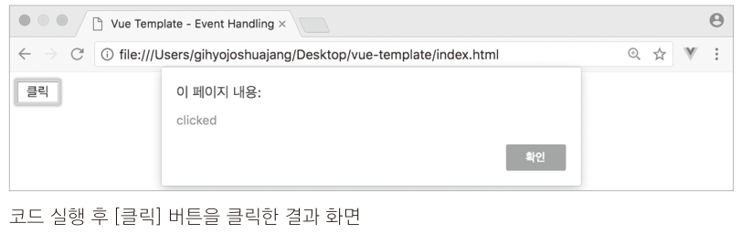 

  

* v-on 디렉티브로 메서드 호출할 때 인자 값 넘기기

  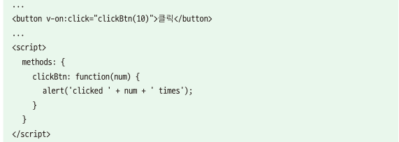 

  이벤트가 발생할 때 호출될 메서드 이름인 clickBtn만 적지 않고, clickBtn(10)으로 적었다.

  메서드에서도 마찬가지로 clickBtn: function(num){}로 num 인자를 받을수 있게 구현했다.

  

* 20_v-on 디렉티브로 메서드 호출할 때 인자 값 넘기기.html

  ```html
  <html>
    <head>
      <title>Vue Template - Event Handling</title>
    </head>
    <body>
      <div id="app">
        <button v-on:click="clickBtn(10)">클릭</button>
  		</div>
  
      <script src="https://cdn.jsdelivr.net/npm/vue@2.5.2/dist/vue.js"></script>
      <script>
        new Vue({
          el: '#app',
          methods: {
            clickBtn: function(num) {
              alert('clicked ' + num + ' times');
            }
          }
        });
      </script>
    </body>
  </html>
  
  ```

  

* 실행화면

  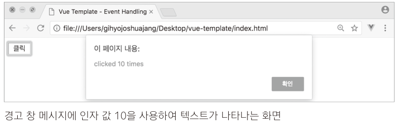 

  

* event 인자를 이용해 돔 이벤트에 접근하기

   

  HTML 태그에서 v-on:click으로 호출하는 메서드에 인자를 전달하지 않아도 clickBtn:function(event){} 와 같이

  event 인자를 정의하면 해당 돔 요소의 이벤트 객체에 접근할 수 있다.

  

* 21_event 인자를 이용해 돔 이벤트에 접근하기.html

  ```html
  <html>
    <head>
      <title>Vue Template - Event Handling</title>
    </head>
    <body>
      <div id="app">
        <button v-on:click="clickBtn">클릭</button>
      </div>
  
      <script src="https://cdn.jsdelivr.net/npm/vue@2.5.2/dist/vue.js"></script>
      <script>
        new Vue({
          el: '#app',
          methods: {
            clickBtn: function(event) {
              console.log(event);
            }
          }
        });
      </script>
    </body>
  </html>
  
  ```

* 실행화면

   


### 4-1-6. 고급 템플릿 기법

* 고급 템플릿 기법은 실제 애플리케이션을 개발할 때 유용한 속성으로 데이터 바인딩 디렉티브와 

  같은 기본적인 문법과 함께 사용한다.

  

* computed 속성

  computed 속성은 데이터 연산들을 정의하는 영역이다.

  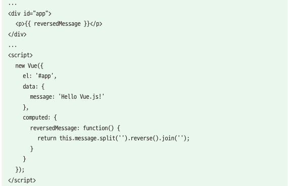 

  HTML에 바로 {{ message.split('').reverse().join('') }}를 정의할 수도 있지만 

  computed 속성을 활용하면 HTMl 표현단의 코드가 깔끔해 지고 더 쉽게 코드를 파악할 수 있다. computed 속성의 

  첫 번째 장점은 data 속성 값의 변화에 따라 자동으로 다시 연산한다는 점이다.

  예를 들어, computed 속성에서 사용하고 있는 data 속성 값이 변경되면 전체 값을 다시 한번 계산한다.

  두 번째 장점은 캐싱이다. 캐싱은 동일한 연산을 반복해서 하지 않기 위해 연산의 결과 값을 미리 저장하고 있다가

  필요할 때 불러오는 동작이다. 여기서는 reversedMessage 값을 한 번만 표현했지만 만약 화면의 여러 곳에 값을 표시해야

  한다면 computed 속성의 reversedMessage()가 미리 연산한 결과를 가지고 있다가 화면에 결과만 표시한다.

  

* computed 속성과 methods 속성의 차이점

  methods 속성과 computed 속성의 가장 큰 차이점은 methods 속성은 호출할 때만 해당 로직이 수행되고,

  computed 속성은 대상 데이터의 값이 변경되면 자동적으로 수행된다는 것이다.

    

  위 코드는 앞에서 살펴본 computed 속성으로 문자열 순서를 바꾼 코드와 동일한 결과를 낸다

  다만 차이점이 있다면 [문자열 역순]버튼을 클릭했을 때만 문자열 순서를 역으로 변환한다는 것이다.

   

  위의 차이점을 인지한 상태에서 다시 캐싱 면에서 두 속성을 보면 methods 속성은 수행할 때마다

  연산을 하기 때문에 별도로 캐싱을 하지 않지만, computed 속성은 데이터가 변경되지 않는 한 이전의

  계산 값을 가지고 있다가(캐싱하고 있다가) 필요할 때 바로 반환해 준다. 따라서 복잡한 연산을 반복 수행해서

  화면에 나타내야 한다면 computed 속성을 이용하는 것이 methods 속성을 이용하는 것보다 성능면에서 효율적이다.

  

* 22_computed 속성과 methods 속성의 차이점.html

  ```html
  <html>
    <head>
      <title>Vue Template - Computed vs Methods</title>
    </head>
    <body>
      <div id="app">
        <p>{{ message }}</p>
        <button v-on:click="reverseMsg">문자열 역순</button>
      </div>
  
      <script src="https://cdn.jsdelivr.net/npm/vue@2.5.2/dist/vue.js"></script>
      <script>
        new Vue({
          el: '#app',
          data: {
            message: 'Hello Vue.js!'
          },
          methods: {
            reverseMsg: function() {
              this.message = this.message.split('').reverse().join('');
              return this.message;
            }
          }
        });
      </script>
    </body>
  </html>
  ```

* watch 속성

  watch 속성은 데이터 변화를 감지하여 자동으로 특정 로직을 수행한다.

  computed 속성과 유사하지만 computed 속성은 내장 API를 활용한 간단한 연산 정도로 적합한 반면에,

  watch 속성은 데이터 호출과 같이 시간이 상대적으로 더 많이 소모되는 비동기 처리에 적합하다.

  ```js
  비동기 처리란?
  웹 앱에서 데이터를 호출할 때 일반적으로는 서버에 http 요청을 보낸다. 그런데 자바스크립트 코드가 실행되는
  시점에서는 서버에 보낸 요청이 언제 응답이 올지 알 수 없다. 따라서 다른 자바스크립트 연산에 영향을 주지
  못하도록 별도의 영역(실행 컨텍스트)에서 해당 데이터를 요청하고 응답을 기다린다. 
  이를 자바스크립트 비동기 처리 로직이라고 한다.
  ```

  

* watch 속성 예제

  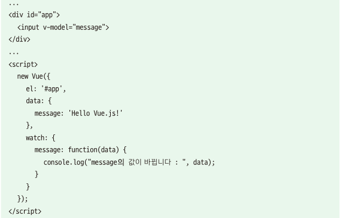 

  위 코드는 간단한 인풋 박스(input box)의 입력 값을 v-model 디렉티브로 연결하여 입력 값에

  변화가 있을 때 마다 watch 속성에서 변화된 값을 로그로 출력한다.

  ```js
  참고 : v-model 디렉티브는 앵귤러의 양방향 데이터 바인딩을 본따 만든 뷰의 기능이다.
  앵귤러와 동일한 방식으로 화면단의 데이터를 스크립트단의 특정 데이터와 일치시켜 준다.
  ```

  

* 23_watch 속성 예제.html

  ```html
  <html>
    <head>
      <title>Vue Template - Watch</title>
    </head>
    <body>
      <div id="app">
        <input v-model="message">
      </div>
  
      <script src="https://cdn.jsdelivr.net/npm/vue@2.5.2/dist/vue.js"></script>
      <script>
        new Vue({
          el: '#app',
          data: {
            message: 'Hello Vue.js!'
          },
          watch: {
            message: function(data) {
              console.log("message의 값이 바뀝니다 : ", data);
            }
          }
        });
      </script>
    </body>
  </html>
  
  ```

  

* 실행결과

   
  
* watch 다른 예

  ```js
        new Vue({
          el: '#app',
          data: {
            formValue:{
  		    closedList : []
  		  }
          },
  	    watch :
      	{
  		  "formValue.closedList" :{
  		     handler(val, oldVal){
  	    	   vmMaster.formValue.totalCloseCnt = 0;	    	
  	           var arr = vmMaster.formValue.closedList;
  	           for(var row in arr)
  	           {
  			     vmMaster.formValue.totalCloseCnt += arr[row].HOILDAY_CNT*1;
  			   }
  		     },
  		     deep: true
  	 	   }
  	     }
        });
  ```

  

## 4-2.뷰 프로젝트 구성 방법

### 4-2-1.HTML 파일에서 뷰 코드 작성 시의 한계점

* 뷰 애플리케이션은 여러 개의 컴포넌트로 화면을 구성하고, 페이지 사이를 이동할 때는 라우터를 사용해야 한다고 설명 했다. 

  앞쪽에서 다뤘던 예제나 실습은 모두 HTML 파일에서 자바스크립트와 마크업을 이용하여 예시를 들었는데, 실제로 애플리케이션을 

  제작하다 보면 다음과 같은 상황에서 파일 구조에 한계점을 느끼게 된다.

   

  위 코드는 HTML 파일에 뷰 컴포넌트를 2개 등록하고, &lt;script> 태그 안에 컴포넌트의 template 속성을 추가한 코드다.

  화면에 표시될 모양을 미리 예측 할 수 있나? 마크업에 많이 익숙하지 않다면 두 컴포넌트의 template 속성에 작성된 

  HTML 코드를 바로 분석해서 미리 예상하기는 쉽지 않다.

  

### 4-2-2.싱글 파일 컴포넌트 체계

* HTML 파일에서 뷰 코드 작성 시의 문제점을 해결하는 방법이 바로 싱글 파일 컴포넌트 체계다.

* 싱글 파일 컴포넌트 체계란 .vue 파일로 프로젝트 구조를 구성하는 방식을 말한다.

* 확장자 .vue 파일 1개는 뷰 애플리케이션을 구성하는 1개의 컴포넌트와 동일하다.

* .vue 파일은 아래와 같은 기본 구조를 가진다.

   

  ```js
  참고 : <script>의 export default{} 코드는 ES6의 자바스크립트 모듈화와 관련된 문법이다. 
  여기서는 쉽게 export default{} 안에는 해당 컴포넌트 동작을 정의하는 코드를 추가한다는 것만 알고 있으면 된다. 
  ```

  "**8-1.HTML 파일에서 뷰 코드 작성 시의 한계점**" 에서 살펴본 예제의 &lt;your-component>를 

  싱글 파일 컴포넌트 체계로 변환하면 아래와 같다.

  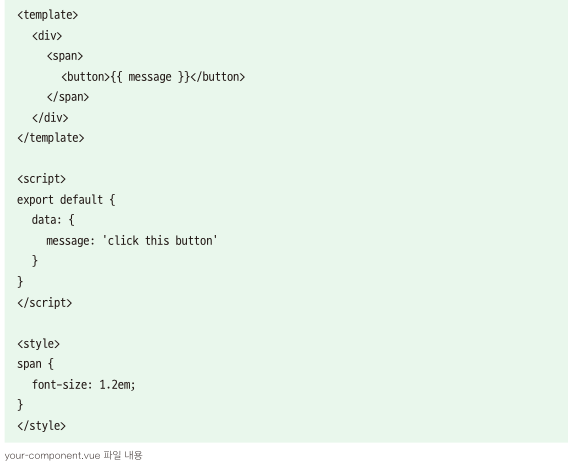 

  이러한 방식으로 &lt;template> 태그 안에는 HTML 태그와 뷰 데이터 바인딩 값들을 넣고, &lt;script> 태그에는

  뷰 컴포넌트에서 사용할 속성들을 정의한다. 마지막으로 &lt;style> 태그에는 HTML 태그의 스타일 속성들을 정의한다.

  


### 4-2-3.뷰 CLI

* 싱글 파일 컴포넌트 체계를 사용하기 위해서는 .vue 파일을 웹 브라우저가 인식할 수 있는 형태의 파일로 변환해 주는

  웹팩(Webpack)이나 브라우저파이(Browserify)와 같은 도구가 필요하다. 

  웹팩은 웹 앱의 자원(HTML, CSS, 이미지)들을 자바스크립트 모듈로 변환해 하나로 묶어 웹 성능을 향상시켜 주는 

  자바스크립트 모듈 번들러(module bundler)다.

  브라우저파이도 웹팩과 유사한 성격의 모듈 번들러지만 웹팩과 다르게 웹 자원 압축이나 빌드 자동화 같은 기능은 없다.

  >##### 웹팩과 브라우저리파이에 대해 더 궁금하다면?
  >
  >웹팩 공식 사이트 : https://webpack.js.org/
  >웹팩 한글 강의   : https://www.inflearn.com/course/webpack-웹팩-강좌/
  >
  >브라우저리파이 공식 사이트 : http://browserify.org/
  >모듈번들러 : 서로 의존 관계가 있는 모듈을 하나의 파일로 묶어 주는 도구

  뷰 개발자들이 편하게 프로젝트를 구성할 수 있도록 뷰 코어 팀에서 CLI(Command Line Interface) 도구를 제공한다.

  CLI에서 제공하는 명령어를 이용하면 뷰 애플리케이션을 개발하기 위한 초기 프로젝트 구조를 쉽게 구성할 수 있다. 

  (뷰 CLI를 설치하려면 노드제이에스 설치 필수)

  

* 뷰 CLI 설치

  커맨드 창에서 "npm install vue-cli -global" 을 입력하면 뷰 CLI가 시스템 레벨에 설치된다.

  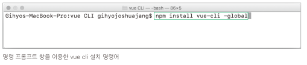 

  시스템 레벨에 설치되었다는 말은 커맨드 창에서 vue를 입력하면 다음처럼 명령어를 인식한다는 의미 이다.

   

  

* 뷰 CLI 명령어

  뷰 개발을 시작 할 때 초기 프로젝트를 쉽게 구성해 주는 명령어는 vue init 이다. 

  vue init 명령어를 입력할 때 사용하는 프로젝트 템플릿 종류는 다음과 같이 6가지가 있다.

  | 템플릿 종류                | 설명                                                         |
  | -------------------------- | ------------------------------------------------------------ |
  | vue init webpack           | 고급 웹팩 기능을 활용한 프로젝트 구성 방식. 테스팅, 문법 검사 등을 지원 |
  | vue init webpack-simple    | 웹팩 최소 기능을 활용한 프로젝트 구성 방식. 빠른 화면 프로토타이핑용 |
  | vue init browserify        | 고급 브라우저리파이 기능을 활용한 프로젝트 구성 방식. 테스팅, 문법 검사등을 지원 |
  | vue init borwserify-simple | 브라우저리파이 최소 기능을 활용한 프로젝트 구성 방식. 빠른 화면 프로토타이피요용 |
  | vue init simple            | 최소 뷰 기능만 들어간 HTML 파일 1개 생성                     |
  | vue init pwa               | 웹팩 기반의 프로그래시브 웹 앱(PWA, Progressive Web App) 기능을 지원하는 뷰 프로젝트 |

  템플릿의 내용은 각기 다르지만 전체적인 맥락에서 볼 때 크게 2가지는 비슷하다.

  첫째, 웹팩이나 브라우저리파이 같은 모듈 번들러를 프로젝트 자체에 포함하여 바로 사용할 수 있다.

  둘재, vue 파일을 HTML, CSS, 자바스크립트 파일로 변환해 주기 위한 뷰 로더(Vue Loader)를 포함하고 있다.

  결론적으로 .vue 파일 방식으로 애플리케이션을 개발하려면 뷰 로더와 이를 지원하는 웹팩, 브라우저리파이 같은 

  모듈 번들러가 필요하다는 것을 알 수 있다.

  앞에서 언급한 템플릿 중 웹팩과 기타 기능에 신경 쓰지 않고 뷰 프레임워크 자체에 가장 집중할 수 있는 템플릿은 webpack-simple 이다.

  webpack 템플릿은 웹팩의 여러 가지 기능과 함께 테스팅 라이브러리, 문법 검사 라이브러리를 모두 포함하고 있기 때문에 프로젝트 구성 방식을

  파악하는 데 상당한 시간이 소요된다. 그리고 까다로운 문법 검사로 인해 화면을 빠르게 구현하기 어렵다. 반면에 webpack-simple 템플릿은

  뷰로 개발하기 위한 웹팩의 최소 기능들만 있어 프로젝트 구성 자체가 간단하다.

  

### 4-2-4.뷰 CLI로 프로젝트 생성하기

1. 뷰 프로젝트를 생성할 빈 폴더를 하나 생성하고, 빈 폴더에서 명령 프롬프트 창을 열어 "vue init webpack-simple"을 입력한다.

   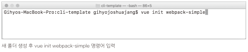 

    

   새 폴더를 만들고 그 안에서 명령어를 수행했기 때문에 현재 디렉터리에 프로젝트를 생성한다.

   그리고 프로젝트 이름, 설명, 제작자는 기본적으로 설정된 값을 사용해도 되고 다른 값을 입력해도 된다.

   Sass라는 확장된 CSS 언어를 설치할지의 여부를 묻는데, CSS로도 충분히 화면의 요소를 스타일링 할 수 있기 

   때문에 '사용하지 않음(No)' 로 설정한다.

   

2. 그리고 뷰 CLI 안내문에 따라 "npm install"을 입력하여 뷰 애플리케이션을 구동하기 위한 관련 라이브러리를

   모두 다운로드 한다. 다운로드가 완료되면 다음과 같은 폴더 구조가 생성된다.

    

   

   여기서 package.json 의 내용을 살펴보자.

    

   vue init 명령어로 프로젝트를 생성할 때 package.json 파일도 함께 생성된다.

   package.json 파일은 프로젝트 정보를 담고 있는 설정 파일임과 동시에 npm 명령어 및 뷰로 애플리케이션을 

   제작하는 데 필요한 라이브러리 정보들을 포함하고 있다.

   

   npm install 명령어를 실행하면 package.json의 라이브러리 목록이 전부 프로젝트의 node_modules 폴더 밑에

   설치된다. 웹팩을 빌드하기 위한 바벨(Babel) 및 여러가지 로더, 웹팩 데브 서버등의 라이브러리와 뷰를 구현하기

   위한 뷰 코어 라이브러리(2.4.4)등이 설치된다.

   

3. 마지막으로 "npm run dev"를 실행하면 브라우저가 실행되면서 아래와 같은 화면이 나타난다.

   이 화면은 웹팩에서 로컬 서버를 하나 띄우고 localhost:8080 으로 접근하여 애플리케이션을 실행한 모습이다.

   프로젝트 폴더의 index.html 파일이 실행된 것이다.

   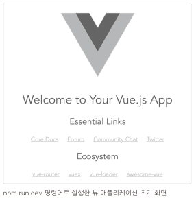 

   그리고 명령어를 실행한 명령 프롬프트 창에는 다음과 같은 내용이 표시된다.

   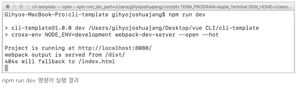 

   맨 아래 3줄은 뷰 프로젝트가 http://localhost:8080/에 구동되고 있음을 알려주면서 

   웹팩 결과값(output)이 /dist/ 에서 제공되고 있다는 의미다.

   ```js
   참고 : 로컬서버는 갑자기 어디서 생긴 것이고, 웹팩 결과 값이 /dist/에서 제공되고 있다는 것은 무슨 말일까?
   두 가지 모두 웹팩 데브 서버와 연관이 있다.
   ```

   

### 4-2-5.뷰 로더

* 뷰 로더(Vue Loader)는 웹팩에서 지원하는 라이브러리 다. 

  뷰 로더는 싱글 파일 컴포넌트 체계에서 사용하는 .vue 파일의 내용을 브라우저에서 실행 가능한 웹 페이지의 형태로 변환해 준다.

  

  예를 들어, 앞에서 뷰 CLI로 webpack-simple 프로젝트를 생성하고 실행했을 때 App.vue 파일의 내용이 웹 페이지에

  표시되는 것을 확인할 수 있었다. App.vue 파일에서 &lt;template>, &lt;script>, &lt;style>의 내용이 각각 HTML, 

  자바스크립트, CSS 코드로 인식될 수 있도록 뷰 로더가 변환 작업을 수행한 것이다.

  

  이 변환 기능은 웹팩에서 맡고 있다. 그중에서도 웹팩에 설정된 뷰 로더가 변환 기능을 수행한다. 앞에서 설명했듯이

  웹팩은 자바스크립트 모듈만 인식할 수 있기 때문에 뷰 로더가 .vue 파일을 일단 자바 스크립트 모듈로 변환한다.

  하지만 필요에 따라 웹팩의 추가 플러그인을 이용하면 웹팩으로 변환된 자바스크립트 모듈을 CSS나 HTML 파일로 분리할 수 있다.


* 웹팩 설정 파일의 뷰 로더 속성 확인

  뷰 로더가 웹팩에서 어떻게 설정되어 있는지 확인하기 위해 웹팩 설정 파일의 뷰 로더 속성을 확인해 보자.

  앞에서 생성한 webpack-simple 프로젝트의 webpack.config.js 파일을 보면 다음과 같이 뷰 로더가 적용되어 있다.

  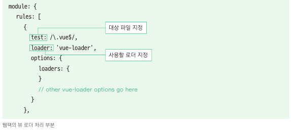 

  module과 rules는 웹팩의 로더(Loader)를 설정하는 속성이다. 

  여기서 주목해야 하는 부분은 test, loader 속성이다. test는 로더가 적용될 대상 파일을 지정하는 속성이고, 

  loader는 적용할 로더의 종류를 지정하는 속성이다. 위 코드는 프로젝트 폴더 내에서 .vue 확장자를 가진 파일을 모두 선택하여

  뷰 로더를 적용하는 코드이다. 그리고 .vue 파일을 선택하기 위해 자바스크립트 정규 표현식을 사용했다.

  

  위 설명을 더 쉽게 이해하기 위해 프로젝트에 App.vue, Login.vue, Main.vue, Table.vue 컴포넌트가 있다고 

  가정하고 뷰 로더를 적용한 모습을 그림으로 나타내 보자.

   

   

  위와 같이 뷰 CLI로 생성된 프로젝트 폴더의 모든 .vue 파일에 뷰 로더가 적용된다.

  

  이렇게 뷰 CLI로 생성한 프로젝트에 웹팩과 뷰 로더가 기본적으로 설정되어 있기 때문에 웹팩을 몰라도 

  어느 정도의 가벼운 화면 프로토타이핑은 가능하다.

   


​	   
