## Vue.js

[toc]

## #.개발환경

* 뷰로 웹 앱을 개발하기 위한 환경 구성

  * 크롬 브라우저

    * 크롬 개발자 도구 사용법
      https://developers.google.com/web/tools/chrome-devtools/?hl=ko

  * 아톰(Atom) 텍스트 에디터

    * UI Theme : 환경설정 Ctrl+, (Cmd+,) -> install -> Themes -> seti-ui 설치

    * Syntax Theme : atom-material-syntax-dark 설치

    * 환경설정 -> Themes -> UI Theme, Syntax Theme 변경

    * 아톰패키지 설치 : Settings -> Install -> Packages -> language-vue 검색 

      Vue component support in Atom : hedefalk 설치 (아톰 종류 후 재시작 자동적용)

  * 노드제이에스(Node.js)

    * 노드제이에스는 서버 사이드 자바스크립트로, 서버 측에서 실행되는 자바스크립트 실행 환경을 의미 한다.

      뷰 CLI로 생성한 프로젝트에서 프로토타이핑을 할 때도 노드제이에스 서버를 사용하기 때문에 필수적인 환경이다.

      (서버사이드 Server-side: 웹 화면과 관계된 서버 로직을 처리하는 영역)

    * 노드제이에스는 윈도우, 맥, 리눅스 등 다양한 플랫폼에서 서버 사이드 자바스크립트 코드를 실행할 수 있는 실행 환경이다.

    * nodejs.org에 접속 후 다운로드 Current 버전보다 안정적인 LTS(Long Term Support) 버전이 호환성에 좋다.

    * 설치 후 Cmd 창에서 "node -v" 명령어 로 설치된 버전 확인.

  * 뷰 개발자 도구(Vue.js devtools, 크롬 확장 플러그인)

    * vue.js devtools 로 검색 후 해당 브라우저에 맞는 플러그인 설치
    
    * 뷰 크롬 익스텐션을 다운로드 하라는 로그 처리 로컬에서는 추가 설정 필요 (file 프로토콜로 접근시)
    
      크롬 브라우저 설정 -> 도구 더 보기 -> 확장 프로그램 -> 세부정보 -> 파일 URL에 대한 액세스 허용 
    
    * 사용 방법 : 개발자 도구 에서 Vue 탭을 선택
      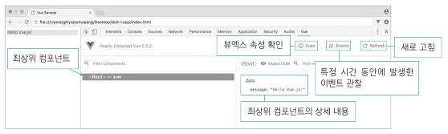


## #.Hello Vue.js 프로젝트 생성


* index.html

  ```html
  <html>
    <head>
      <title>Vue Sample</title>
    </head>
    <body>
      <div id="app">
        {{ message }}
      </div>
      <script src = "https://cdn.jsdelivr.net/npm/vue@2.5.2/dist/vue.js"></script>
      <script>
        new Vue({
          el:'#app',
          data : {
            message:'Hello Vue.js!'
          }
        });
      </script>
    </body>
  </html>
  ```

  

## 1.Vue.js의 특징

### 1-1.UI 화면단 라이브러리

* 뷰(Vue.js)는 UI 화면 개발 방법 중 하나인 MVVM 패턴의 뷰 모델(ViewModel)에 해당하는 화면단 라이브러리 입니다.


* MVVM 패턴이란 화면을 모델(Model) - 뷰(View) - 뷰 모델(ViewModel)로 구조화하여 개발하는 방식을 의미한다.

  이러한 방식으로 개발하는 이유는 화면의 요소들을 제어하는 코드와 데이터 제어 로직을 분리하여 코드를 더 직관적으로

  이해할 수 있고, 추후 유지 보수가 편해지기 때문이다.


| 용어                        | 설명                                                         |
| --------------------------- | ------------------------------------------------------------ |
| 뷰(View)                    | 사용자에게 보이는 화면                                       |
| 돔(DOM)                     | HTML 문서에 들어가는 요소(태그, 클래스, 속성 등)의 정보를 담고 잇는 데이터 트리 |
| 돔(DOM Listener)            | 돔의 변경 내역에 대해 즉각적으로 반응하여 특정 로직을 수행하는 장치 |
| 모델(Model)                 | 데어터를 담는 용기. 보통은 서버에서 가져온 데이터를 자바스크립트 객체 형태로 저장 |
| 데이터 바인딩(Data Binding) | 뷰(View)에 표시되는 내용과 모델의 데이터를 동기화            |
| 뷰 모델(ViewModel)          | 뷰와 모델의 중간 영역. 돔 리스너와 데이터 바인딩을 제공하는 영역 |


* MVVM 패턴이란?

```
마크업 언어나 GUI 코드를 비지니스 로직 또는 백엔드 로직과 분리하여 개발하는 소프트웨어 디자인 패턴.
"화면 앞단(프런트엔드)의 화면 동작과 관련된 로직과 
 화면 뒷단(백엔드)의 데이터베이스 데이터 처리 로직을 분리하여 더 깔끔하게 코드를 구성한다."
```


### 1-2.컴포넌트 기반 프레임워크

* 뷰가 가지는 또 하나의 큰 특징은 바로 컴포넌트(Component)기반 프레임워크 라는 점.

* 화면을 컴포넌트로 구조화한 컴포넌트 간 관계도.

  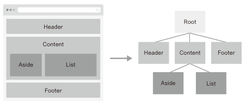

  위 그림의 왼쪽 화면은 각영역을 컴포넌트로 지정하여 구분한 것이고, 오른쪽 그림은 왼쪽 화면의 각 컴포넌트 간의 

  관계를 나타낸 것이다.

* 컴포넌트 기반 방식으로 개발하는 이유는 코드를 재사용하기가 쉽고, HTML 코드에서 화면의 구조를 직관적으로 파악할 수 있다.


### 1-3.리액트와 앵귤러의 장점을 가진 프레임워크

* 뷰는 앵귤러의 양방향 데이터 바인딩(Two-way Data Binding)과 

  리액트의 단방향 데이터 흐름(One-way Data Flow)의 장점을 모두 결합한 프레임워크 입니다. 

* 양방향 데이터 바인딩이란 화면에 표시되는 값과 프레임워크의 모델 데이터 값이 동기화되어 

  한쪽이 변경되면 다른 한쪽도 자동으로 변경되는 것을 말한다. 

* 단방향 데이터 흐름은 컴포넌트의 단향향 통신을 의미한다. 컴포넌트 간에 데이터를 전달할 때 

  항상 상위 컴포넌트에서 하위 컴포넌트 한 방향으로만 전달하게끔 프레임워크가 구조화되어 있는 게 바로 단방향 데이터 흐름이다.

* 빠른 화면 렌더링(Rendering)을 위해 리액트의 가상 돔(Virtual DOM)렌더링 방식을 적용하여 사용자 인터랙션(user interaction)

  이 많은 요즘의 웹 화면에 적합한 동작 구조를 갖추고 있다. 가상돔을 활용하면 특정 돔 요소를 추가하거나 삭제하는 변경이 일어날 때

  화면 전체를 다시 그리지 않고 프레임워크에서 정의한 방식에 따라 화면을 갱신한다. 따라서 브라우저 입장에서는 성능 부하가 줄어들어

  일반 렌더링 방식보다 더 빠르게 화면을 그릴 수 있다.


## 2.뷰 인스턴스

### 2-1.뷰 인스턴스의 정의와 속성

* 뷰 인스턴스는 뷰로 화면을 개발하기 위해 필수적으로 생성해야 하는 기본 단위다.

* 뷰 인스턴스 형식.

  ```js
  new Vue({
    ...
  });
  ```

* 뷰 인스턴스 생성.

  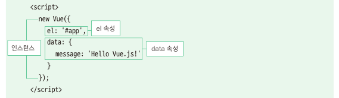

  * 예제) Hello Vue 

  ```js
  <html>
    <head>
      <title>Vue Sample</title>
    </head>
    <body>
      <div id="app">
        {{ message }}
      </div>
      <script src ="https://cdn.jsdelivr.net/npm/vue@2.5.2/dist/vue.js"></script>
      <script>
        new Vue({
          el:'#app',
          data:{
            message:'Hello Vue.js!'
          }
        });
      </script>
    </body>
  </html>
  ```

* 뷰 인스턴스 생성자 

  Vue 생성자는 뷰 라이브러리를 로딩하고 나면 접근 할 수 있다.


### 2-2.뷰 인스턴스 옵션 속성

* 뷰 인스턴스 옵션 속성은 인스턴스를 생성할 때 재정의할 data, el, template 등의 속성을 의미 한다.

  예를 들어, Hello Vue 예제에서는 data라는 미리 정의되어 있는 속성을 사용했다. 그 안에 message라는 새로운

  속성을 추가하고 Hello Vue.js! 라는 값을 주었을 뿐. el 속성 역시 미리 정의되어 있으며 뷰로 만든 화면이 그려지는 

  시작점을 의미한다. 뷰 인스턴스로 화면을 렌더링 할 때 화면이 그려질 위치의 돔 요소를 지정해 주어야 한다.

  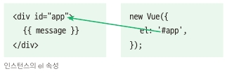

  여기서 #app 값은 화면의 돔 요소 중 app 라는 아이디를 가진 요소를 의미한다. 여기서 사용한 # 선택자는 CSS 선택자 규칙과 같다.

  (참고:CSS선택자 중 # 선택자는 해당 아이디를 가진 돔 요소를 검색할 때 사용한다. 

  ​     그리고 선택자는 해당 클래스를 가진 돔 요소를 검색할 때 사용한다.)

  이 외에도 template, methods, created 등 미리 정의되어 있는 속성을 사용할 수 있다.

  | 속성     | 설명                                                         |
  | -------- | ------------------------------------------------------------ |
  | template | 화면에 표시할 HTML, CSS 등의 마크업 요소를 정의하는 속성, 뷰의 데이터 및 기타 속성<br />들도 함께 화면에 그릴 수 있다. |
  | methods  | 화면 로직 제어와 관계된 메서드를 정의하는 속성, 마우스 클릭 이벤트 처리와 같이 화면의<br />전반적인 이벤트와 화면 동작과 관련된 로직을 추가할 수 있다. |
  | created  | 뷰 인스턴스가 생성되자마자 실행할 로직을 정의할 수 있는 속성 |


### 2-3.뷰 인스턴스의 유효 범위

* 뷰 인스턴스를 생성하면 HTML의 특정 범위 안에서만 옵션 속성들이 적용되어 나타난다. 

  이를 인스턴스의 유효범위 라고 한다. 인스턴스의 유효 범위는 el속성과 밀접한 관계가 있다.

  화면에 인스턴스 옵션 속성을 적용하는 과정은 다음과 같다.

  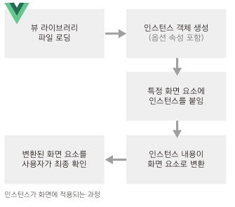

  ```js
new Vue({
    el : '#app',
  data : {
      message : 'Hello Vue.js!'
    }
  });
  ```
  
  인스턴스 옵션 속성 el과 data를 인스턴스에 정의하고 new Vue()로 인스턴스를 생성한다.
  
  그리고 브라우저에서 위 샘플코드를 실행하면 아래와 같이 el 속성에 지정한 화면요소(돔)에 인스턴스가 부착된다.

  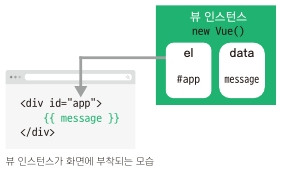

  el 속성에 인스턴스가 부착되고 나면 인스턴스에 정의한 옵션 객체의 내용(data속성)이 el 속성에 지정한 화면요소와

  그 이하 레벨의 화면 요소에 적용되어 값이 치환된다.

  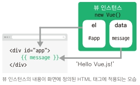

  data 속성의 message 값 Hello Vue.js! 가 {{ message }}와 치환된다.

  

* 인스턴스의 유효 범위 확인

  ```js
  <div id="app">
    
  </div>
  {{ message }}
  ```

  위 코드를 실행하면 결과는 아래 와 같다.

  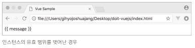

  message 속성의 값이 Hello Vue.js! 로 바뀌지 않고 그대로 출력되는 이유는 인스턴스의 유효 범위 때문이다.

  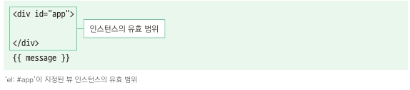

  

  현재 코드에서 인스턴스의 유효 범위는 el 속성으로 지정한 <div =id="app"> 태그 아래에 오는 요소들로 제한된다.

  '<div>'태그 바깥에 있는 {{ message }} 는 뷰에서 인식하지 못하기 때문에 Hello Vue.js!로 바뀌지 않고 {{ message }}

  그대로 출력된다.


### 2-4.뷰 인스턴스 라이프 사이클

* 인스턴스의 상태에 따라 호출할 수 있는 속성들을 라이프 사이클(life cycle) 속성이라고 한다.

* 각 라이프 사이클 속성에서 실행되는 커스텀 로직을 라이프 사이클 훅(hook) 이라고 한다.

* 라이프 사이클 속성에는 created, beforeCreate, beforeMount, mounted 등 인스턴스의 생성, 변경, 소멸과 

  관련되어 총 8개가 있다.

  

  

  위 그림은 인스턴스가 생성되고 나서 화면에 부착된 후 소멸되기 까지의 전체적인 흐름을 나타낸 뷰 인스턴스 라이프 사이클 

  다이어 그램 이다. 뷰 인스턴스 라이프 사이클은 크게 4단계 로 이루어 진다.

    1.단계 : 인스턴스의 생성

    2.단계 : 생성된 인스턴스를 화면에 부착

    3.단계 : 화면에 부착된 인스턴스의 내용이 갱신

    4.단계 : 인스턴스가 제거되는 소멸

  2단계 부착 -> 3단계 갱신 구간은 데이터가 변경되는 경우에만 거치게 된다. 

  그리고 각 단계 사이에 라이프 사이클 속성 created, mounted, updated 등이 실행된다.

  

* beforeCreate

  인스턴스가 생성되고 나서 가장 처음으로 실행되는 라이프 사이클 단계다.

  data 속성과 methods 속성이 아직 인스턴스에 정의되어 있지 않고, 돔과 같은 화면 요소에도 

  접근할 수 없다.

  

* created

  beforeCreate 라이프 사이클 단계 다음에 실행되는 단계다.

  data 속성과 methods 속성이 정의 되었기 때문에 this.data 또는 this.fetchData()와 같은 로직들을 이용하여

  Data 속성과 methods 속성에 정의된 값에 접근하여 로직을 실행 할 수 있다. 다만, 아직 인스턴스가 화면 요소에

  부착되기 전이기 때문에 template 속성에 정의된 돔 요소로 접근할 수 없다.

  그리고 data 속성과 methods 속성에 접근할 수 있는 가장 첫 라이프 사이클 단계이자 컴포넌트가 생성되고 나서 

  실행되는 단계이기 때문에 서버에 데이터를 요청해서 받아오는 로직을 수행하기 좋다.

  

* beforeMount

  created 단계 이후 template 속성에 지정한 마크업 속성을 render() 함수로 변환한 후 el 속성에 지정한 화면

  화면 요소(돔)에 인스턴스를 부착하기 전에 호출되는 단계. render() 함수가 호출되기 직전의 로직을 추가하기 좋다. 

  ```
참고:render()는 자바스크립트로 화면의 돔을 그리는 함수.
  ```
  
  

* mounted

  el 속성에서 지정한 화면 요소에 인스턴스가 부착되고 나면 호출되는 단계로, template 속성에 정의한 화면 요소

  (돔)에 접근할 수 있어 화면 요소를 제어하는 로직을 수행하기 좋은 단계다. 다만, 돔에 인스턴스가 부착되자마자

  바로 호출되기 때문에 하위 컴포넌트나 외부 라이브러리에 의해 추가된 화면 요소들이 최종 HTML 코드로 변환

  되는 시점과 다를 수 있다. 

  ```
  참고:변환되는 시점이 다를 경우 $nextTick() API를 활용하여 HTML 코드로 최종 파싱(변환) 될 때까지 
  기다린 후 돔 제어 로직을 추가하자.
  ```

  

* beforeUpdate

  el 속성에서 지정한 화면 요소에 인스턴스가 부착되고 나면 인스턴스에 정의한 속성들이 화면에 치환된다.

  치환된 값은 뷰의 반응성(Reactivity)을 제공하기 위해 $watch속성으로 감사한다. 이를 데이터 관찰이라 한다.

  ```
  뷰의 반응성
  => 뷰의 특징 중 하나로, 코드의 변화에 따라 화면이 반사적으로 반응하여 빠르게 화면을 갱신하는 것을 의미
  ```

  또한 beforeUpdate는 관찰하고 있는 데이터가 변경되면 가상 돔으로 화면을 다시 그리기 전에 호출되는 단계이

  며, 변경 예정인 새 데이터에 접근할 수 있어 변경 예정 데이터의 값과 관련된 로직을 미리 넣을 수 있다.

  여기에 변경하는 로직을 넣더라도 화면이 다시 그려지지는 않는다.

  

* update

  데이터가 변경되고 나서 가상 돔으로 다시 화면을 그리고 나면 실행되는 단계.

  이 단계에서 데이터 값을 변경하면 무한 루프에 빠질 수 있기 때문에 값을 변경하려면 computed, watch와 

  같은 속성을 사용해야 한다. 따라서 데이터 값을 갱신하는 로직은 가급적이면 beforeUpdate에 추가하고,

  updated에서는 변경 데이터의 화면 요서(돔)와 관련된 로직을 추가하는 것이 좋다.

  ```
  mounted 단계와 마찬가지로 주입된 요소의 최종 변환 시점이 다를 수 있다 
  $nextTick()을 사용하여 변환이 완료될 때까지 기다렸다가 로직을 추가하자.
  ```

  

* beforeDestroy

  뷰 인스턴스가 파괴되기 직전에 호출되는 단계. 아직 인스턴스에 접근할 수 있으며, 

  뷰 인스턴스의 데이터를 삭제하기 좋은 단계.

  

* destroyed

  뷰 인스턴스가 파괴되고 나서 호출되는 단계. 

  뷰 인스턴스에 정의한 모든 속성이 제거되고 하위에 선언한 인스턴스들 또한 모두 파괴된다.

  

* 01_라이프 사이클 실습 예제.html

  ```html
  <html>
    <head>
      <title>Vue Instance Lifecycle</title>
    </head>
    <body>
      <div id="app">
        {{ message }}
      </div>
  
      <script src="https://cdn.jsdelivr.net/npm/vue@2.5.2/dist/vue.js"></script>
      <script>
        new Vue({
          el: '#app',
          data:{
            message:'Hello Vue.js!'
          },
          beforeCreate:function(){
            console.log("beforeCreate");
          },
          created:function(){
            console.log("created");
          },
          mounted:function(){
          	console.log("mounted");
          },
          updated:function(){
          	console.log("updated");
          }
        });
      </script>
    </body>
  </html>
  ```

* 실행결과

  

  도해의 흐름대로 beforeCreate, created, mounted가 표시되는 것을 확인할 수 있다.

  

* 02_message값을 변경한 라이프 사이클 실습 예제.html

  ```html
  <html>
    <head>
      <title>Vue Instance Lifecycle</title>
    </head>
    <body>
      <div id="app">
        {{ message }}
      </div>
  
      <script src="https://cdn.jsdelivr.net/npm/vue@2.5.2/dist/vue.js"></script>
      <script>
        new Vue({
          el: '#app',
          data:{
            message:'Hello Vue.js!'
          },
          beforeCreate:function(){
            console.log("beforeCreate");
          },
          created:function(){
            console.log("created");
          },
          mounted:function(){
          	console.log("mounted");
            this.message = '헬로우 뷰!';
          },
          updated:function(){
          	console.log("updated");
          }
        });
      </script>
    </body>
  </html>
  ```

* 실행결과

  

* mounted 단계에서 화면에 표시되는 message값이 갱신 되었고, 이에 따라 updated 로그가 출력 되었다.

  여기서 중요한 것은 인스턴스의 데이터가 갱신되면서 라이프 사이클 단계가 beforeUpdate, updated 단계로 

  진입했다는 점 이다. 이처럼 각 인스턴스 라이프 사이클에 맞춰 원하는 로직을 추가하여 원하는 시점에 실행할 수 있다.


## 3.뷰 컴포넌트

### 3-1.컴포넌트란 ?

* 컴포넌트(Component)란 조합하여 화면을 구성할 수 있는 블록(화면의 특정 영역)을 의미 한다.

  컴포넌트를 활용하면 화면을 빠르게 구조화하여 일괄적인 패턴으로 개발 할 수 있다.

  화면 영역을 컴포넌트로 쪼개서 재활용할 수 있는 형태로 관리하면 나중에 코드를 다시 사용하기가 훨씬 편리하다.

  또한 모든 사람들이 정해진 방식대로 컴포넌트를 등록하거나 사용하게 되므로 남이 작성한 코드를 직관적으로 이해할 수 있다. 

  뷰에서는 웹 화면을 구성할 때 흔히 사용하는 내비게이션 바(navigation bar), 테이블(table), 리스트(list), 인풋 

  박스(input box) 등과 같은 화면 구성 요소들을 잘게 쪼개어 컴포넌트로 관리 한다.

  

  위의 왼쪽 그림은 화면 전체를 Header, Content, Footer로 분할했고, Content 영역을 Aside, List 영역으로 분할했다.

  이는 화면 전체를 3개의 컴포넌트로 분할한 후 분할된 1개의 컴포넌트에서 다시 2개의 하위 컴포넌트로 분할한 것이다.

  오른쪽 그림은 각 컴포넌트 간의 관계를 나타낸다. 이러한 컴포넌트 간의 관계는 뷰에서 화면을 구성하는 데 매우 중요한 역할을

  하며 웹 페이지 화면을 설계할 때도 이와 같은 골격을 유지하면서 설계를 해야 한다. 

  컴포넌트 간의 관계는 자료구조의 트리 모양과 유사하다.

  

### 3-2.컴포넌트 등록하기

* 컴포넌트를 등록하는 방법은 전역과 지역 두 가지가 있다. 

  지역 컴포넌트는 특정 인스턴스에서만 유효한 범위를 갖고, 전역 컴포넌트는 여러 인스턴스에서 공통으로 사용할 수 있다.

* 전역 컴포넌트 등록

  전역 컴포넌트는 뷰 라이브러리를 로딩하고 나면 접근 가능한 Vue 변수를 이용해서 등록한다.

  전역 컴포넌트를 모든 인스턴스에 등록하려면 Vue 생성자에서 .component()를 호출하여 수행하면 된다.

  ```js
  Vue.component('컴포넌트 이름',{
    // 컴포넌트 내용
  });
  ```

  컴포넌트 이름은 template 속성에서 사용할 HTML 사용자 정의 태그(custom tag) 이름을 의미 한다.

  태그 이름의 명명 규칙은 HTML 사용자 정의 태그 스펙에서 강제하는 '모두 소문자'와 '케밥 기법'을 따르지 않아도 된다.

  그리고 컴포넌트 태그가 실제 화면의 HTML 요소로 변환될 때 표시될 속성들을 컴포넌트 내용에 작성한다.

  컴포넌트 내용에는 template, data, methods 등 인스턴스 옵션 속성을 정의할 수 있다.

  

* 03_전역 컴포넌트 등록 예제.html

  ```html
  <html>
    <head>
    	<title>Vue Component Registration</title>
  	</head>
  	<body>
      <div id="app">
        <button>컴포넌트 등록</button>
  	    <my-component></my-component> <!--전역컴포넌트 표시-->
  	  </div>
  
      <script src="https://cdn.jsdelivr.net/npm/vue@2.5.2/dist/vue.js"></script>
      <script>
        Vue.component('my-component',{
          template:'<div>전역 컴포넌트가 등록되었습니다!</div>'		<!--전역 컴포넌트 등록-->
  	  });
          
        new Vue({
          el:'#app'
        });
      </script>
    </body>
  </html>
  ```

* 실행결과

  

  이 코드가 실행되어 화면에 나타나기까지의 과정을 살펴보면 다음과 같다.

  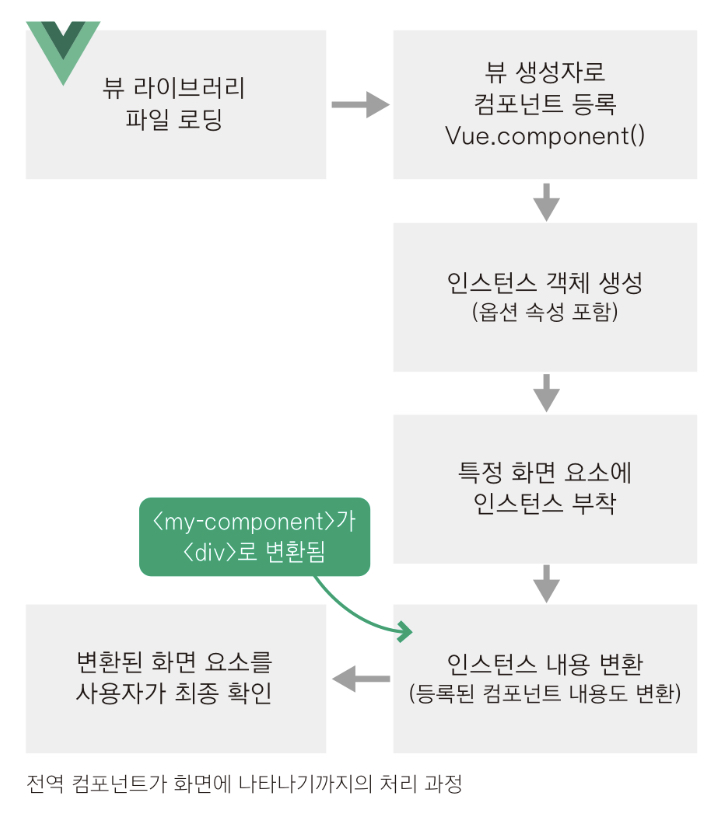

  이 그림을 보면 인스턴스가 생성되고, 인스턴스 내용이 화면요소로 변환될 때 컴포넌트 태그도 함께 변환된다.

  따라서 컴포넌트 태그에 정의한 컴포넌트 내용은 사용자가 볼 수 있는 형태의 화면요소로 최종 변환 된다.

  전역 컴포넌트를 등록하려면 HTML에서 사용할 태그 이름을 컴포넌트 이름으로 작성하고, 중괄호{} 안에는

  HTML 태그가 실제로 화면에서 그려질 때 표시될 내용(컴포넌트 내용)을 작성해야 한다. 

  위 예제에서는 컴포넌트의 이름을 my-component로 지정했고, 컴포넌트 내용으로는 template 속성을 정의하고

  '전역 컴포넌트가 등록되었습니다!' 라는 <div> 태그를 작성했다.

  

  따라서 이 컴포넌트를 아래와 같이 HTML에 추가하면 최종적으로 컴포넌트가 등록된다.

  ```html
  <my-component></my-component>
  ```

  그리고 등록된 my-component 컴포넌트는 실제로 화면에 아래와 같이 그려진다.

  ```html
  <div>전역 컴포넌트가 등록되었습니다!</div>
  ```

  결론적으로 인스턴스가 생성된 후 화면에 그려질 때 실제 HTML 코드 모양은 다음과 같다.

  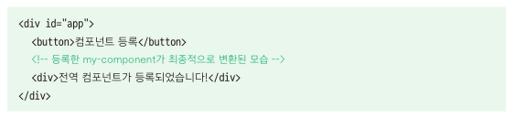

  

* 지역 컴포넌트 등록

  지역 컴포넌트 등록은 전역 컴포넌트 등록과는 다르게 인스턴스에 components 속성을 추가하고 

  등록 할 컴포넌트 이름과 내용을 정의한다.

  ```js
  new Vue({
    components:{
      '컴포넌트 이름':컴포넌트 내용
    }
  });
  ```

  컴포넌트 이름은 전역 컴포넌트와 마찬가지로 HTML에 등록할 사용자 정의 태그를 의미하고, 

  컴포넌트 내용은 컴포넌트 태그가 실제 화면 요소로 변환될 때의 내용을 의미한다.

  

* 04_지역 컴포넌트 등록 예제.html

  ```html
  <html>
    <head>
      <title>Vue Component Registration</title>
    </head>
    <body>
      <div id="app">
        <button>컴포넌트 등록</button>
        <my-local-component></my-local-component>
      </div>
  
      <script src="https://cdn.jsdelivr.net/npm/vue@2.5.2/dist/vue.js"></script>
      <script>
        var cmp = {
          // 컴포넌트 내용
          template: '<div>지역 컴포넌트가 등록되었습니다!</div>'
        };
  
        new Vue({
          el: '#app',
          components: {
            'my-local-component': cmp
          }
        });
      </script>
    </body>
  </html>
  ```

  변수 cmp에는 화면에 나타낼 컴포넌트의 내용을 정의하고, 뷰 인스턴스에 components 속성을 추가하고 

  컴포넌트 이름에는 my-local-component를, 컴포넌트 내용에는 미리 정의한 cmp변수를 지정한다.

  그리고 HTML에 <my-local-component>태그를 추가하여 컴포넌트를 화면에 나타낸다.

  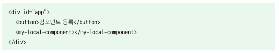

* 실행결과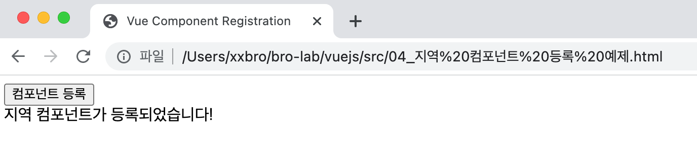


### 3-2.지역 컴포넌트와 전역 컴포넌의 차이

* 인트턴스의 유효범위

  전역 컴포넌트는 인스턴스를 새로 생성할 때마다 인스턴스에 components속성으로 등록할 필요 없이 한 번 등록하면 

  어느 인스턴스에서든지 사용할 수 있다. 반대로 지역 컴포넌트는 새 인스턴스를 생성할 때 마다 등록해 줘야 한다.

  

* 05_인스턴스 유효 범위와 지역 전역 컴포넌트 관계 확인 예제.html

  ```html
  <html>
    <head>
    <title>Vue Local and Global Components</title>
    </head>
  <body>
      <div id="app">
      <h3>첫 번째 인스턴스 영역</h3>
        <my-global-component></my-global-component>
        <my-local-component></my-local-component>
      </div>
      <hr>
      <div id="app2">
        <h3>두 번째 인스턴스 영역</h3>
        <my-global-component></my-global-component>
        <my-local-component></my-local-component>
      </div>
  
      <script src="https://cdn.jsdelivr.net/npm/vue@2.5.2/dist/vue.js"></script>
      <script>
        // 전역 컴포넌트 등록
        Vue.component('my-global-component', {
          template: '<div>전역 컴포넌트 입니다.</div>'
        });
  
        // 지역 컴포넌트 내용
        var cmp = {
          template: '<div>지역 컴포넌트 입니다.</div>'
        };
  	  
        // 첫 번째 인스턴스
        new Vue({
          el: '#app',
          // 지역 컴포넌트 등록
          components: {
          'my-local-component': cmp
          }
        });
  
        // 두 번째 인스턴스
        new Vue({
          el: '#app2'
        });
    </script>
    </body>
  </html>
  ```

*  실행결과

  

  전역 컴포넌트와 지역 컴포넌트의 유효 범위가 다르기 때문에  첫 번째 인스턴스 영역에는 전역/지역 컴포넌트가 

  모두 정상적으로 나타났지만 두 번째 인스턴스 영역에는 전역 컴포넌트만 나타났다. 

  전역 컴포넌트는 인스턴스를 새로 생성할 때마다 인스턴스에 components 속성으로 등록할 필요없이 한번 등록하면

  어느 인스턴스에서든지 사용할 수 있다. 반대로 지역 컴포넌트는 새 인스턴스를 생성할 때 마다 등록해 줘야 한다.

  

  첫 번째 인스턴스의 유효 범위는 첫 번째 인스턴스 영역으로 제한되기 때문에 <div id='app'> 에 지역 컴포넌트를 

  등록했어도 두 번째 인스턴스 영역인 <div id='app2'>의 범위 안에서는 지역 컴포넌트가 인식되지 않아 아래와 같은 결과를 나타낸다.
  
  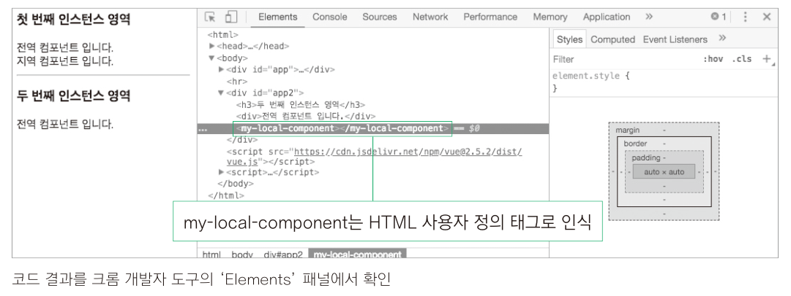
  
  <my-local-component> 태그는 두 번째 인스턴스의 유효 범위 안에 있더라도 이 컴포넌트가 등록된 첫 번째 유효범위를 벗어나기 때문에 
  
  브라우저에서는 HTML 사용자 정의 태그로 인식하고, 뷰에서는 해당 컴포넌트를 제대로 등록했는지 물어보는 오류를 표시한다.
  
  두 번째 인스턴스 영역에도 지역 컴포넌트를 나타나게 하려면 인스턴스를 생성할 때 등록해 주면 된다. 
  
  두 번째 인스턴스 생성 부분을 아래처럼 수정.
  
  ```js
  // 두 번째 인스턴스
  new Vue({
    el: '#app2',
    // 지역 컴포넌트 등록
    components: {
      'my-local-component': cmp
    }
  });


* 수정 후 실행결과

  

  

## 4.뷰 컴포넌트 통신

### 4-1.컴포넌트 간 통신과 유효 범위

* 앵귤러 1이나 백본(Backbone.js)과 같은 초창기 자바스크립트 프레임워크에서는 한 화면을 1개의 뷰(View)로 간주 했다.

  따라서 한 화면의 데이터를 해당 화면 영역 어디서든지 호출할 수 있었다. 하지만 뷰(Vue.js)의 경우 컴포넌트로 화면을 구성

  하므로 같은 웹 페이지라도 데이터를 공유할 수 없다. 그 이유는 컴포넌트 마다 자체적으로 고유한 유효범위(Scope)를 갖기

  때문이다. 이는 뷰 프레임워크 내부적으로 정의된 특징이다. 따라서 각 컴포넌트의 유효 범위가 독립적이기 때문에 다른 컴포

  넌트의 값을 직접적으로 참조할 수가 없다.

  

* 06_컴포넌트 유효 범위 증명 예제.html

  ```html
  <html>
    <head>
      <title>Vue Component Scope</title>
    </head>
    <body>
      <div id="app">
        <my-component1></my-component1>
        <my-component2></my-component2>
      </div>
  
      <script src="https://cdn.jsdelivr.net/npm/vue@2.5.2/dist/vue.js"></script>
      <script>
        // 첫 번째 컴포넌트 내용
        var cmp1 = {
          template: '<div>첫 번째 지역 컴포넌트 : {{ cmp1Data }}</div>',
          data: function() {
            return {
              cmp1Data : 100
            }
          }
        };
  
        // 두 번째 컴포넌트 내용
        var cmp2 = {
          template: '<div>두 번째 지역 컴포넌트 : {{ cmp2Data }}</div>',
          data: function() {
            return {
              cmp2Data : cmp1.data.cmp1Data
            }
          }
        };
  
        new Vue({
          el: '#app',
          // 지역 컴포넌트 등록
          components: {
            'my-component1': cmp1,
            'my-component2': cmp2
          }
        });
      </script>
    </body>
  </html>
  ```

  위 예제는 2개의 지역 컴포넌트를 등록하고, 한 컴포넌트에서 다른 컴포넌트의 값을 직접 참조하는 예제다.

  my-component2 컴포넌트 내용에서 {{ cmp2Data }}는 my-component1 컴포넌트의 data.cmp1Data를 참조

  하고 있다. 자바스크립트의 객체 참조 방식을 생각해 보면 참조 값 100이 화면에 표시되어야 한다. 

  하지만 {{ cpm2Data }}는 아무것도 표시하지 않는다. 

  

* 실행결과

  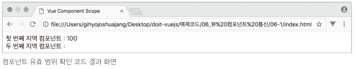

  이유는 my-component2에서 my-component1의 값을 컴포넌트의 유효 범위로 인해 다른 컴포넌트의 값을 직접 참조할 수 없기 때문.

  컴포넌트의 유효 범위로 인해 다른 컴포넌트의 값을 직접 접근하지 못하기 때문에 나타난 결과다.

  

### 4-2.상 하위 컴포넌트 관계

* 컴포넌트는 각각 고유한 유효 범위를 갖고 있기 때문에 직접 다른 컴포넌트의 값을 참조할 수 없다. 따라서 뷰 프레임워크 

  자체에서 정의한 컴포넌트 데이터 전달 방법을 따라야 한다. 

  가장 기본적인 데이터 전달 방법은 상위(부모) - 하위(자식) 컴포넌트 간의 데이터 전달 방법이다.

  상위 - 하위 컴포넌트란 트리 구조에서 부모 노드, 자식 노드처럼 컴포넌트 간의 관계가 부모, 자식으로 이루어진 컴포넌트를 

  의미한다. 

  

* 상위 - 하위 컴포넌트 간에 데이터를 전달하는 기본적인 구조

  

  먼저 상위에서 하위로는 props라는 특별한 속성을 전달한다. 그리고 하위에서 상위로는 기본적으로 이벤트만 전달 할 수 있다.

  ```
  참고:이벤트와 함께 데이터를 전달하고 싶은 경우에는 이벤트의 두 번째 인자 값으로 전달하거나 
  이벤트 버스(Event Bus)를 활용하는 방법이 있다.
  ```

  

### 4-3.상위에서 하위 컴포넌트로 데이터 전달하기

* props 속성

  props는 상위 컴포넌트에서 하위 컴포넌트로 데이터를 전달할 때 사용하는 속성이다. 

  props 속성을 사용하려면 먼저 아래 처럼 하위 컴포넌트의 속성에 정의해야 한다.

  ```js
  Vue.component('child-component', {
    props: ['props 속성 이름'],
  });
  ```

  그런 다음 상위 컴포넌트의 HTML 코드에 등록된 child-component 컴포넌트 태그에 v-bind 속성을 추가한다.

  ```html
  <child-component v-bind:props속성이름="상위컴포넌트의data속성"></child-component>
  ```

  v-bind 속성의 왼쪽 값으로 하위 컴포넌트에서 정의한 props 속성을 넣고, 오른쪽 값으로 하위 컴포넌트에 전달할 상위

  컴포넌트의 data속성을 지정한다.

  

* props 속성을 사용해서 데이터를 전달하는 예제

  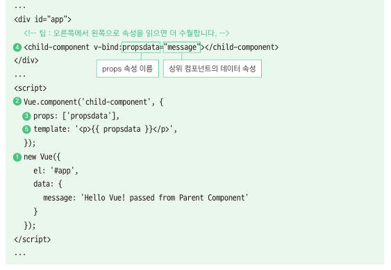

  이 코드는 상위 컴포넌트의 message속성을 하위 컴포넌트에 props로 전달하여 메시지를 출력하는 예제다.

  props속성을 이해하기 위해 코드를 작성한 순서대로 살펴보자.

  

   1. new Vue()로 인스턴스를 하나 생성한다.

   2. Vue.component()를 이용하여 하위 컴포넌트인 child-component를 등록한다.

   3. child-component의 내용에 props 속성으로 propsdata를 정의 한다.

   4. HTML 에 컴포넌트 태그를 추가한다. <child-component> 태그의 v-bind 속성을 보면, 

      v-bind:propsdata="message"는 상위 컴포넌트의 message속성 값인 Hello Vue! passed from Parent 

      Component 텍스트를 하위 컴포넌트의 propsdata로 전달 했다.

   5. child-component의 template 속성에 정의된 <p>{{ propsdata }}</p> 는 Hello Vue! passed from Parent Component 가 된다.

      

  간단히 정리하면 뷰 인스턴스의 data 속성에 정의된 message 속성을 하위 컴포넌트에 props로 전달하여 화면에 나타낸다.

  

* 07_props 속성을 사용한 데이터 전달 예제.html

  ```html
  <!DOCTYPE html>
  <html>
    <head>
      <meta charset="utf-8">
      <meta name="viewport" content="width=device-width, initial-scale=1.0">
      <title>Vue Props Sample</title>
    </head>
    <body>
      <div id="app">
        <!-- 팁 : 오른쪽에서 왼쪽으로 속성을 읽으면 더 수월합니다. -->
        <child-component v-bind:propsdata="message"></child-component>
      </div>
  
      <script src="https://cdn.jsdelivr.net/npm/vue@2.5.2/dist/vue.js"></script>
      <script>
        Vue.component('child-component', {
          props: ['propsdata'],
          template: '<p>{{ propsdata }}</p>',
        });
  
        new Vue({
          el: '#app',
          data: {
            message: 'Hello Vue! passed from Parent Component'
          }
        });
      </script>
    </body>
  </html>
  ```

  

* 실행 결과

  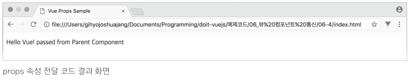

  

  예제 코드에서는 child-component를 전역으로 등록한 것 이외에 딱히 상위 컴포넌트를 지정하지 않았다.

  그럼에도 뷰 인스턴스 안에 마치 상위 컴포넌트가 존재하는 것처럼 하위 컴포넌트로 props를 내려 보냈다.

  그 이유는 컴포넌트를 등록함과 동시에 뷰 인스턴스 자체가 상위 컴포넌트가 되기 때문이다.

  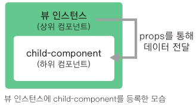

  이렇게 인스턴스에 새로운 컴포넌트를 등록하면 기존에 있는 컴포넌트는 상위 컴포넌트(부모)가 되고, 새로 등록된

  컴포넌트는 하위(자식) 컴포넌트가 된다. 그리고 이렇게 새 컴포넌트를 등록한 인스턴스를 최상위 컴포넌트(Root 

  Component)라고도 부른다.


### 4-4.하위에서 상위 컴포넌트로 이벤트 전달하기

* 이벤트 발생과 수신

  이벤트를 발생시켜(event emit) 상위 컴포넌트에 신호를 보낸다. 상위 컴포넌트에서 하위 컴포넌트의 특정 이벤트가

  발생하기를 기다리고 있다가 하위 컴포넌트에서 특정 이벤트가 발생하면 상위 컴포넌트에서 해당 이벤트를 수신하여

  상위 컴포넌트의 메서드를 호출하는 것이다.

* 이벤트 발생과 수신 형식

  이벤트 발생과 수신은 $emit()과 v-on: 속성을 사용하여 구현한다. 각각의 형식은 아래와 같다.

  ```js
  // $emit()을 이용한 이벤트 발생
  this.$emit('이벤트명');
  ```

  ```html
  // v-on: 속성을 이용한 이벤트 수신
  <child-component v-on:이벤트명="상위 컴포넌트의 메서드명"></child-component>
  ```

  $emit()을 호출하면 괄호 안에 정의된 이벤트가 발생한다. 그리고 일반적으로 $emit()을 호출하는 위치는 하위 컴포넌

  트의 특정 메서드 내부이기 때문에 $emit()을 호출할 때 사용하는 this는 하위 컴포넌트를 가리킨다.

  

  호출한 이벤트는 하위 컴포넌트를 등록하는 태그(상위 컴포넌트의 template 속성에 위치)에서 v-on:으로 받는다.

  하위 컴포넌트에서 발생한 이벤트명을 v-on:속성에 지정하고, 속성의 값에 이벤트가 발생했을 때 호출될 상위 컴포넌트

  의 메서드를 지정한다.

  

* 이벤트를 발생시키고 수신하기

  

  이 코드는 child-component의 [show] 버튼을 클릭하여 이벤트를 발생 시키고, 발생한 이벤트로 상위 컴포넌트(여기서 루트 컴포넌트)의 printText() 메서드를 실행시키는 예제다. [show] 버튼을 클릭했을 때 처리되는 과정은 다음과 같다.

  

  1. [show] 버튼을 클릭하면 클릭 이벤트 v-on:click="showLog"에 따라 showLog() 메서드가 실행된다.

  2. showLog() 메서드 안에  this.$emit('show-log')가 실행되면서 show-log 이벤트가 발생한다.

  3. show-log 이벤트는 <child-component>에 정의한 v-on:show-log에 전달되고, v-on:show-log의 대상 

     메서드인 최상위 컴포넌트의 메서드 printText()가 실행된다.

  4. printText()는 received an event라는 로그를 출력하는 메서드이므로 마지막으로 콘솔에 로그가 출력된다.

     

* 08_이벤트를 발생시키고 수신하기 예제.html

  ```html
  <!DOCTYPE html>
  <html>
    <head>
      <meta charset="utf-8">
      <meta name="viewport" content="width=device-width, initial-scale=1.0">
      <title>Vue Event Emit Sample</title>
    </head>
    <body>
      <div id="app">
        <child-component v-on:show-log="printText"></child-component>
      </div>
  
      <script src="https://cdn.jsdelivr.net/npm/vue@2.5.2/dist/vue.js"></script>
      <script>
        Vue.component('child-component', {
          template: '<button v-on:click="showLog">show</button>',
          methods: {
            showLog: function() {
              this.$emit('show-log');
            }
          }
        });
  
        new Vue({
          el: '#app',
          data: {
            message: 'Hello Vue! passed from Parent Component'
          },
          methods: {
            printText: function() {
              console.log("received an event");
            }
          }
        });
      </script>
    </body>
  </html>
  ```


* 실행결과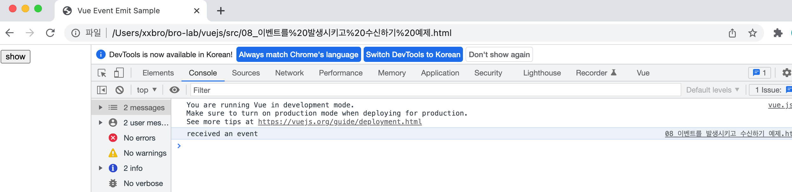

​	

​	이와 같은 방식으로 하위 컴포넌트에서 상위 컴포넌트로 신호를 올려보내면 상위 컴포넌트의 메서드를 실행할 수도 있고, 

​	하위 컴포넌트로 내려보내는 props의 값을 조정할 수도 있다.


### 4-5.같은 레벨의 컴포넌트 간 통신


* 그림은 같은 상위 컴포넌트를 가지는 2개의 하위 컴포넌트를 나타낸다. 뷰는 상위에서 하위로만 데이터를 전달해야 하는

  기본적인 통신 규칙을 따르기 때문에 바로 옆 컴포넌트에 값을 전달하려면 하위에서 공통 상위 컴포넌트로 이벤트를 전달한

  후 공통 상위 컴포넌트에서 2개의 하위 컴포넌트에 props를 내려 보내야 한다.

  이런 방식으로 통신해야 하는 이유는 컴포넌트 고유의 유효 범위 때문이다. 다른 컴포넌트의 값을 직접 참조하지 못하므로 

  기본적인 데이터 전달 방식을 활용하여 같은 레벨 간에 통신이 가능하도록 구조를 갖춰야 한다.

  하지만 이런 통신 구조를 유지하다 보면 상위 컴포넌트가 필요 없음에도 불구하고 같은 레벨 같에 통신하기 위해 강제로 상위

  컴포넌트를 둬야 한다. 이를 해결할 수 있는 방법이 바로 이벤트 버스다.


### 4-6.관계 없는 컴포넌트 간 통신-이벤트 버스

* 이벤트 버스(Event Bus)는 개발자가 지정한 2개의 컴포넌트 간에 데이터를 주고받을 수 있는 방법이다.

  

  그림 왼쪽은 뷰에서 제시하는 기본적인 컴포넌트 통신 방식이며 하위 컴포넌트 B 에서 상위 컴포넌트 A로 데이터를 전달하려면

  하위 컴포넌트 B, 상위 컴포넌트 B, 최상위 컴포넌트를 거쳐서 상위 컴포넌트 A까지 가야 한다. 하지만 웹 앱이 커져 컴포넌트가

  많아지면 이런 식의 데이터 전달 방식은 매우 번거롭다. 이럴경우 이벤트 버스를 활용하면 중간 컴포넌트들을 거치지 않고 

  하위 컴포넌트 B 에서 상위 컴포넌트 A로 바로 데이터를 전달할 수 있어 편리하다.

  오른쪽은 이벤트 버스(Event Bus) 방식으로 중간 컴포넌트들을 거치지 않고 바로 데이터를 전달할 수 있다.

  

* 이벤트 버스 형식

  ```js
  // 이벤트 버스를 위한 추가 인스턴스 1개 생성
  var eventBus = new Vue();
  ```

  이벤트 버스를 구현하려면 애플리케이션 로직을 담는 인스턴스와는 별개로 새로운 인스턴스를 1개 더 생성하고, 

  새 인스턴스를 이용하여 이벤트를 보내고 받는다. 

  보내는 컴포넌트에서는 .$emit()을, 받는 컴포넌트에서는 .$on()을 구현한다.

  ```js
  // 이벤트를 보내는 컴포넌트
  methods : {
    메서드명 : function(){
      eventBus.$emit('이벤트명', 데이터);
    }
  }
  ```

  ```js
  // 이벤트를 받는 컴포넌트
  methods : {
    created : function(){
      eventBus.$on('이벤트명', function(데이터){
        ...
      });
    }
  }
  ```

  

* 이벤트 버스 구현하기

  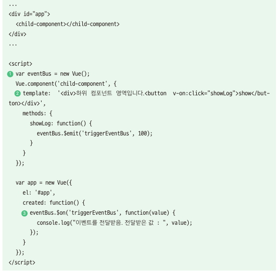

  위 코드는 등록한 하위 컴포넌트의 [show] 버튼을 클릭했을 때 이벤트 버스를 이용하여 상위 컴포넌트로 데이터를 전달

  하는 코드다.

  

  1. 먼저 이벤트 버스로 활용할 새 인스턴스를 1개 생성하고  eventBus라는 변수에 참조한다. 이제 eventBus변수로

     새 인스턴스의 속성과 메서드에 접근할 수 있다.

  2. 하위 컴포넌트에는 template속성과 methods 속성을 정의한다. template 속성에는 '하위 컴포넌트 영역입니

     다.' 라는 텍스트와 [show] 버튼을 추가한다. methods 속성에는  showLog() 메서드를 정의하고, 메서드안에

     eventBus.$emit()을 선언하여 triggerEventBus라는 이벤트를 발생하는 로직을 추가한다.

     이 이벤트는 발생할 때 수신하는 쪽에 인자 값으로 100이라는 숫자를 함께 전달한다.

  3. 상위 컴포넌트의 created 라이프 사이클 훅에 eventBus.$on()으로 이벤트를 받는 로직을 선언한다. 

     발생한 이벤트 triggerEventBus를 수신할 때 앞에서 전달된 인자 값 100이 콘솔에 출력된다.
     
     

  간단히 정리해 보면 [show] 버튼을 클릭하여 showLog()가 실행되었을 때 eventBus의 이벤트가 발생한다.

  그리고 발생한 이벤트는 상위 컴포넌트의 created()에 있는 eventBus.$on()에서 전달 받는다. 이벤트와 함께

  전달된 인자 값 100이 콘솔 로그에 함께 출력된다.

  

* 09_이벤트 버스 구현하기 예제.html

  ```html
  <!DOCTYPE html>
  <html>
    <head>
      <meta charset="utf-8">
      <meta name="viewport" content="width=device-width, initial-scale=1.0">
      <title>Vue Event Bus Sample</title>
    </head>
    <body>
      <div id="app">
        <child-component></child-component>
      </div>
  
      <script src="https://cdn.jsdelivr.net/npm/vue@2.5.2/dist/vue.js"></script>
      <script>
        var eventBus = new Vue();
  
        Vue.component('child-component', {
          template: '<div>하위 컴포넌트 영역입니다.<button v-on:click="showLog">show</button></div>',
          methods: {
            showLog: function() {
              eventBus.$emit('triggerEventBus', 100);
            }
          }
        });
  
        var app = new Vue({
          el: '#app',
          created: function() {
            eventBus.$on('triggerEventBus', function(value){
              console.log("이벤트를 전달 받음. 전달 받은 값 : ", value);
            });
          }
        });
      </script>
    </body>
  </html>
  ```

  

* 실행 결과

  

  

  이벤트 버스를 활용하면 props 속성을 이용하지 않고도 원하는 컴포넌트 간에 직접적으로 데이터를 전달할 수 있어 

  편리하지만 컴포넌트가 많아지면 어디서 어디로 보냈는지 관리가 되지 않는 문제가 발생한다. 이 문제를 해결하려면 

  뷰엑스(Vuex)라는 상태 관리 도구가 필요하다. 뷰엑스는 중, 대형 애플리케이션에서 컴포넌트 간의 데이터 관리를 

  효율적으로 하는 라이브러리 이다. 구글에서  'vuex 시작하기', 'vuex 튜토리얼' 로 검색해 보자.

  


## 5.뷰 라우터

### 5-1.라우팅이란?

* 라우터(Router)를 이해하기 위해서는 먼저 라우팅이 무엇인지 알아야 한다. 라우팅이란 웹 페이지 간의 이동방법을 말한다.

* 라우팅은 현대 웹 앱 형태 중 하나인 싱글 페이지 애플리케이션(SPA, Single Page Application)에서 주로 사용하고 있다.

  ```
  싱글페이지 애플리케이션이란?
  페이지를 이동할 때 마다 서버에 웹 페이지를 요청하여 새로 갱신하는 것이 아니라 미리 해당 페이지들을 받아 놓고
  페이지 이동 시에 클라이언트의 라우팅을 이용하여 화면을 갱신하는 패턴을 적용한 애플리케이션
  ```

* 라우팅을 이용하면 화면 간의 전환이 매끄러울 뿐만 아니라 애플리케이션의 사용자 경험을 향상 시킬 수 있다.

  일반적으로 브라우저에서 웹 페이지를 요청하면 서버에서 응답을 받아 웹 페이지를 다시 사용자에게 돌려주는 시간 동안 화면상에 

  깜빡거림 현상이 나타난다. 이런 부분들을 라우팅으로 처리하면 깜빡거림 없이 화면을 매끄럽게 전환할 수 있을 뿐만 아니라 빠르게

  화면을 조작할 수 있어 사용자 경험이 향상된다.

* 뷰 뿐만 아니라 리액트와 앵귤러 모두 라우팅을 이용하여 화면을 전환하고 있으며, 프런트엔드 프레임워크를 사용하지 않고 

  일반 HTML 파일들로도 라우팅 자바스크립트 라이브러리를 이용하여 라우팅 방식의 페이지 이동을 구현할 수 있다.

  ```
  참고:대표적인 라우팅 라이브러리에는 router.js, navigo.js 가 있다.
  router.js(http://github.com/tildeio/router.js/)
  navigo.js(http://github.com/krasimir/navigo) 
  ```


### 5-2. 뷰 라우터

* 뷰 라우터는 뷰에서 라우팅 기능을 구현할 수 있도록 지원하는 공식 라이브러리다. 

  뷰 라우터를 이용하여 뷰로 만든 페이지 간에 자유롭게 이동할 수 있다. 

  뷰 라우터를 구현할 때 필요한 특수 태그와 기능은 다음과 같다.

  | 태그                      | 설명                                                         |
  | ------------------------- | ------------------------------------------------------------ |
  | <router-link to="URL 값"> | 페이지 이동 태그. 화면에서는 <a>로 표시되며 클릭하면 to에 지정한 URL로 이동한다. |
  | <router-view>             | 페이지 표시 태그. 변경되는 URL에 따라 해당 컴포넌트를 뿌려주는 영역이다. |

  

* 뷰 라우터 실습

  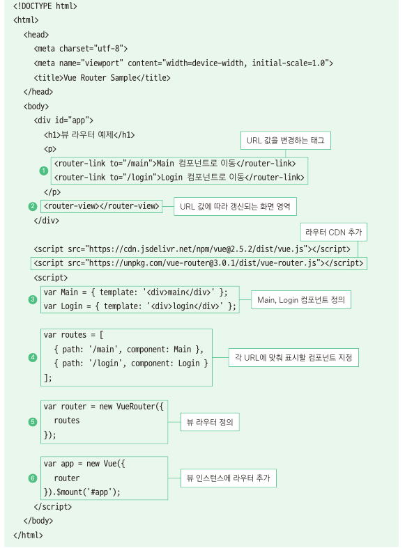

  	1. 각<router-link>는 화면 상에서[Main 컴포넌트로 이동], [Login 컴포넌트로 이동] 이라는 <a> 버튼 태그로 변환되어
  	
  	표시 된다. 각 버튼을 클릭하면 to="" 에 정의된 텍스트 값이 브라우저 URL 끝에 추가된다. 여기서는 /main과 /login의
  	
  	2개의 URL이 끝에 추가된다.
  	
  	2. <router-view>는 갱신된 URL에 해당하는 화면을 보여주는 영역이다. <router-view>에 나타낼 화면은 <script>에서 정의한다.
  	
  	3. Main과 Login 컴포넌트에는 template 속성으로 각 컴포넌트를 구분할 수 있는 정도의 간단한 HTMl 코드를 정의한다.
  	
  	4. routes 변수에는 URL 앖이 /main일 때 Main 컴포넌트를, /login일 때 Login 컴포넌트를 표시하도록 정의한다.
  	
  	5. router 변수에는 뷰 라우터를 하나 생성하고, routes를 삽입해 URL에 따라 화면이 전환될 수 있게 정의한다.
  	
  	6. 마지막 부분은 새 인스턴스를 생성하고 라우터의 정보가 담긴 router를 추가한다. 여기서 .$mount()는 el 속성과 같이 
  	
  	인스턴스를 화면에 붙여주는 역할을 한다.
  	
  	```
  	$mount()API란?
  	$mount()API는 el속성과 동일하게 인스턴스를 화면에 붙이는 역할을 한다. 인스턴스를 생성할 때 el속성을 넣지 않았더라도
  	생성하고 나서 $mount()를 이용하면 강제로 인스턴스를 화면에 붙일 수 가 있다. 참고로, 뷰 라우터의 공식 문서는 모두 인스턴스
  	안에 el을 지정하지 않고 라우터만 지정하여 생성한 다음 생성된 인스턴스를 $mount()를 이용해 붙이는 식으로 안내하고 있다.
  	```


  ​    

* 10_뷰 라우터 실습.html

  ```html
  <!<!DOCTYPE html>
  <html>
    <head>
      <meta charset="utf-8">
      <meta name="viewport" content="width=device-width, initial-scale=1.0">
      <title>Vue Router Sample</title>
    </head>
    <body>
      <div id="app">
        <h1>뷰 라우터 예제</h1>
        <p>
          <router-link to="/main">Main 컴포넌트로 이동</router-link>
          <router-link to="/login">Login 컴포넌트로 이동</router-link>
        </p>
        <router-view></router-view>
      </div>
  
      <script src="https://cdn.jsdelivr.net/npm/vue@2.5.2/dist/vue.js"></script>
      <script src="https://unpkg.com/vue-router@3.0.1/dist/vue-router.js"></script>
      <script>
        var Main  = {template : '<div>main</div>'};
        var Login = {template : '<div>login</div>'};
  
        var routes = [
          {path : '/main', component:Main}
         ,{path : '/login',component:Login}
        ];
  
        var router = new VueRouter({
          routes
        });
  
        var app = new Vue({
          router
        }).$mount('#app');
  
      </script>
    </body>
  </html>
  ```

* 실행결과

  

  * 위 그림에서 'Main 컴포넌트로 이동'을 클릭하면 깜박거리 현상 없이 URL의 끝이 'main'으로 바뀌면서 아래와 같은 화면이 나타난다.

  

  * 마찬가리로 'Login 컴포넌트로 이동' 을 클릭하면 URL의 끝이 'login'으로 바뀌면서 아래와 같은 화면이 나타난다.

  

  * 라우터 URL의 해시 값(#)을 없애는 방법

    뷰 라우터의 기본 URL 형식은 해시 값을 사용한다. 만약 index.html/login과 같이 해시 값을 없애고 싶으면 

    히스토리 모드를 활용하면 된다.

    ```javascript
    var router = new VueRouter({
        mode : 'history',
        routes
    });
    ```

    

### 5-2. 네스티드 라우터

* 네스티드 라우터(Nested Router)는 라우터로 페이지를 이동할 때 최소 2개 이상의 컴포넌트를 화면에 나타낼 수 있다.

  네스티드라는 단어에서 추측할 수 있듯이 상위 컴포넌트 1개에 하위 컴포넌트 1개를 포함하는 구조로 아래와 같이 구성한다.

  

* 위 그림처럼 네스티드 라우터를 이용하면 URL에 따라서 컴포넌트의 하위 컴포넌트가 다르게 표시된다.

  예를 들어 맨 왼쪽의 그림에는 하위로 아무것도 지정하지 않았기 때문에 User컴포넌트만 표시되고, 오른쪽 2개의 그림에는 

  URL 값 posts, profile에 따라 각각 Post, Profile 컴포넌트가 표시된다.

  

* 네스티드 라우터 구현

  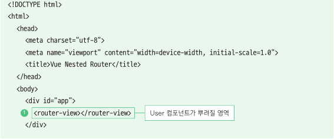

  

	1. **<div id="app">**에 <router-view>를 등록하여 User 컴포넌트가 뿌려질 영역을 정의한다.

	2. User, UserPost, UserProfile 컴포넌트의 내용을 각 객체에 정의한다.		

	   컴포넌트가 전환된 것을 확인할 수 있게 template 속성을 컴포넌트 내용에 추가한다.

	   여기서 주목할 부분은 User 컴포넌트의 template에 하위 컴포넌트를 표시할<router-view>가 하나 더 있다는 점 이다.

	3. routes에 라우터 정보를 정의한다. 
	
	   제일 먼저 path 속성에는 네스티드 라우터를 실행하는 기본 URL을 /user로 설정하고, 
	
	   상위 컴포넌트는 User 컴포넌트로 지정한다.
	
	   그런 다음 children 속성에는 URL 값 /user 다음에 올 URL에 따라 표시될 하위 컴포넌트를 정의 한다. 
	
	   /user/posts인 경우 UserPost를 표시하고, 
	
	   /user/profile인 경우 UserProfile를 표시하도록 설정한다.
	
	4. 이제 뷰 라우터를 새로 하나 생성하고 앞에서 정의한 라우터 정보를 담은 객체 routes를 정의 한다.
	
	5. 마지막으로 인스턴스를 하나 생성하고 라우터 정보 router를 포함한다.
	
	   그리고 app라는 id를 가지 요소에 인스턴스를 붙여 화면에 나타낸다.
	   
	   
	
	여기서 알 수 있는 네스티드 라우터와 기본 라우터의 차이점은 최상위(루트) 컴포넌트에도 <router-view>
	
	가 있고, 최상위 컴포넌의 하위 컴포넌트(User)에도 <router-view>가 있다는 것이다. 그렇기 때문에
	
	URL에 따라 하위 컴포넌트의 내용이 바뀌게 된다. 컴포넌트 간 관계를 그림으로 표현하면 아래와 같다.
	
	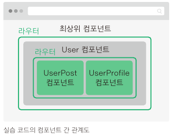


* 11.네스티드 라우터 구현.html

  ```html
  <!DOCTYPE html>
  <html>
    <head>
      <meta charset="utf-8">
      <meta name="viewport" content="width=device-width, initial-scale=1.0">
      <title>Vue Nested Router</title>
    <head>
    <body>
      <div id="app">
        <router-view></router-view>
      </div>
      <script src="https://cdn.jsdelivr.net/npm/vue@2.5.2/dist/vue.js"></script>
      <script src="https://unpkg.com/vue-router@3.0.1/dist/vue-router.js"></script>
      <script>
        var User = {
          template:`
            <div>
              User Component
              <router-view></router-view>
            </div>
          `
        };
  
        var UserProfile  = {template : '<p>User Profile Component</p>'};
        var UserPost     = {template : '<p>User Post Component</p>'};
  
        var routes = [
          {
            path : '/user',
            component: User,
            children : [
              {
                path : 'posts',
                component : UserPost
              },
              {
                path : 'profile',
                component : UserProfile
              }
            ]
          }
        ];
  
        var router = new VueRouter({
          routes
        });
  
        var app = new Vue({
          router
        }).$mount('#app');
  
      </script>
    </body>
  </html>
  ```

  

* 실행결과

  * 첫 화면에는 아무것도 보이지 않으므로 실행 후 URL 값의 끝에 user를 입력한다.

    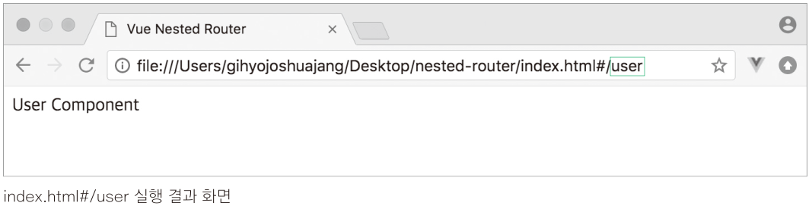

  * 이제 하위 컴포넌트 UserPost가 제대로 표시되는지 확인하기 위해 URL의 값의 끝에 '/posts'를 추가

    

   *  이번에는 URL 값의 끝을 'profile' 로 변경하고 UserProfile 컴포넌트가 정상적으로 나타나는지 확인

      

      

    *  네스티드 라우터는 화면을 구성하는 컴포넌트의 수가 적을 때는 유용하지만 한 번에 더 많은 컴포넌트를

       표시하는 데는 한계가 있다. 이 문제를 해결할 수 있는 방안으로 네임드 뷰가 있다.


### 5-3. 네임드 뷰

* 네임드 뷰(Named View)는 특정 페이지로 이동했을 때 여러 개의 컴포넌트를 동시에 표시하는 라우팅 방식이다.

* 네스티드 라우터는 아래의 왼쪽 그림처럼 상위 컴포넌트가 하위 컴포넌트를 포함하는 형식이지만 네임드 뷰는 

  오른쪽 그림처럼 같은 레벨에서 여러 개의 컴포넌트를 한 번에 표시한다.

  

  

* 네임드 뷰 구현하기

  

  파일을 실행하면 URL값 '/'에 의해 네임드 뷰가 바로 실행된다. 코드를 살펴보자.

  1. 먼저<div> 태그 안에 <router-view>를 3개 추가하고 name 속성을 추가한다.

     여기서 name 속성은 아래 components 속성에 정의하는 컴포넌트와 매칭하기 위한 속성이다.

     Header 컴포넌트는 header, Footer 컴포넌트는 footer를 각각 name 속성에 값으로 지정한다.

     그리고 name 속성이 없는 두 번째 <router-view>는 default로 표시될 컴포넌트를 의미한다.

  2. 이제 <script>로 넘어가서 Body, Header, Footer 컴포넌트의 내용이 담길 객체를 선언한다.

     각 컴포넌트 내용에는 컴포넌트 영역이 구분될 수 있게 간단한 template속성을 추가한다.

  3. 그리고 앞의 네스티드 라우터 예제 코드와는 다르게 이번에는 new VueRouter()로 라우터를 하나 

     생성하고 라우터 정보를 바로 그 안에 정의한다.

  4. path는 네임드 뷰가 실행될 URL을 정의하는 속성이다. 여기서는 애플리케이션을 실행하면 마주치는

     기본 URL 값 '/'을 지정한다.

  5. components는 앞에서 <router-view>에 정의한 name 속성에 따라 표시될 컴포넌트를 정의하는 속성이다.
  6. 마지막으로 인스턴스를 생성하고 네임드 뷰 정보를 갖고 있는 라우터를 포함한다.

  

* 실행결과

  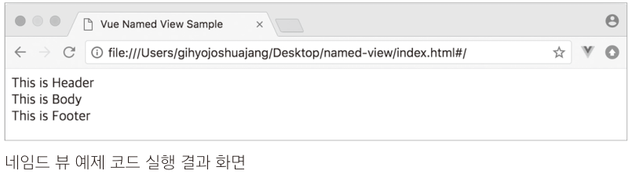

  * 이렇게 네임드 뷰를 활용하면 특정 페이지로 이동했을 때 해당 URL에 맞춰 여러 개의 컴포넌트를 한 번에

    표시할 수 있다.

    ```
    name 속성에 사용한 값이 예약어인가?
    <router-view>에서 사용한 name속성은 예약어가 아니라 사용자가 임의로 정의할 수 있는 값이다.
    위에서 사용한 header, footer 값 모두 appHeader, appFooter라고 이름을 변경해도 동일하게 동작
    한다. 예외적으로 name 속성을 지정하지 않았을 때의 기본 컴포넌트는 default로 접근한다.
    ```

    


## 6. 뷰 HTTP 통신

### 6-1. 웹 앱의 HTTP 통신 방법	

* 뷰에서는 ajax를 지원하기 위한 라이브러리를 제공한다.

  뷰 프레임워크의 필수 라이브러리로 관리하던 뷰 리소스와 요즘 가장 많이 사용하는 액시오스(axios)가 바로 그것이다.

### 6-2. 뷰 리소스

* 뷰 리소스(resource)는 초기에는 코어 팀에서 공식적으로 권하는 라이브러리 였으나 2016년 말에 에반이 공식적인 

  지원을 중단하기로 하면서 다시 기존에 관리했던 PageKit팀의 라이브러리로 돌아갔다. 그럼에도 불구 하고 뷰 리소스는 아직 

  계속 사용할 수 있는 라이브러리 이기 때문에 간단히 살펴보자.

* 뷰 리소스를 사용하는 방법은 CDN을 이용해서 라이브러리를 로딩하는 방시과 NPM으로 라이브러리를 설치하는 방법(ES6 기준)이 있다.

  ```
  ES6 설치 방법은 https://github.com/pagekit/vue-resource#installation 을 참고하자.
  ```

  

* 뷰 리소스로 데이터 받아오기

  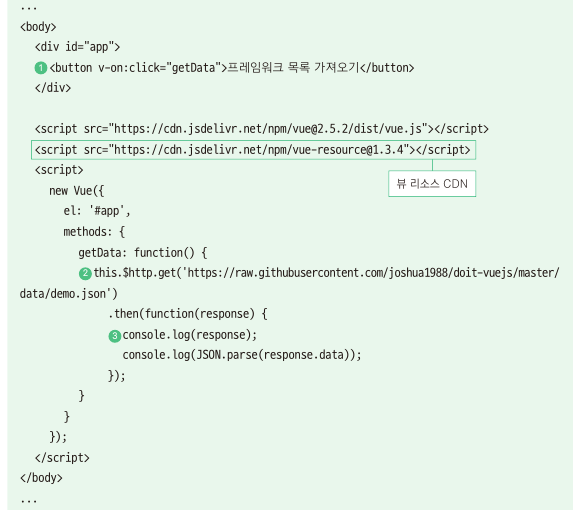

  1. 먼저 버튼은 인스턴스 영역 안인 <div>태그 안에<button>태그로 추가한다. 그리고 v-on:click을 이용하여

     버튼을 클릭했을 때 getData()가 호출되도록 클릭 이벤트를 설정한다.

  2. getData()에는 뷰 리소스에서 제공하는 API인 this.$http.get()을 사용하여 해당 URL에서 제공하는 데이터를

     받아온다. API 이름에서 유추할 수 있듯이 this.$http.get()은 HTTP GET 요청을 서버에 보내고 특정 데이터를 받아온다.

  3. 그리고 버튼을 클릭하여 해당 URL로 HTTP GET 요청을 보내고 나면 .then() 안에서 응답을 받은 데이터 

     response를 콘솔에 출력한다. 

     

* 13_뷰 리소스로 데이터 받아오기.html

  ```html
  <html>
    <head>
      <title>Vue Resource Sample</title>
    </head>
    <body>
      <div id="app">
        <button v-on:click="getData">프레임워크 목록 가져오기</button>
      </div>
  
      <script src="https://cdn.jsdelivr.net/npm/vue@2.5.2/dist/vue.js"></script>
      <script src="https://cdn.jsdelivr.net/npm/vue-resource@1.3.4"></script>
      <script>
        new Vue({
          el: '#app',
          methods: {
            getData: function() {
              this.$http.get(`https://raw.githubusercontent.com/joshua1988/doit-vuejs/master/data/demo.json`)
                  .then(function(response) {
                    console.log(response);
                    console.log(JSON.parse(response.data));
                  });
            }
          }
        });
      </script>
    </body>
  </html>
  ```

* 실행결과

  

  * [프레임워크 목록 가져오기] 버튼을 클릭하면 개발자 도구의 'Console' 패널에 response 객체의 값과 프레임워크 목록을 객체에 담아 

    출력한다. 여기서 첫 번째 로그는 response의 내용이다. url 속성 값에는 HTTP GET 요청을 할 때 넣었던 사이트의 URL이 들어 있다.

    두 번째 로그는 응답 데이터의 body 값이 문자열이기 때문에 JSON.parse() 자바스크립트 API를 이용해서 자바스크립트 객체로 보기 

    쉽게 변환했다.


### 6-3. 액시오스

* 액시오스(Axios)는 현재 뷰 커뮤니티에서 가장 많이 사용되는 HTTP 통신 라이브러리이다. 

  에반도 뷰 리소스 라이브러리를 공식 라이브러리에서 제외하면서 액시오스를 언급했다. 

* 액시오스는 Promise 기반의 API형식이 다양하게 제공되어 별도의 로직을 구현할 필요 없이 주어진 API 만으로도 간편하게

  원하는 로직을 구현할 수 있다.

  ```
  Promise 기반의 API 형식이란 무엇인가?
  Promise란 서버에 데이터를 요청하여 받아오는 동작과 같은 비동기 로직 처리에 유용한 자바스크립트 객체다.
  자바스크립트는 단일 스레드(thread)로 코드를 처리하기 때문에 특정 로직의 처리가 끝날 때 까지 기다려주지 않는다. 
  따라서 데이터를 요청하고 받아올 때까지 기다렸다가 화면에 나타내는 로직을 실행해야 할 때 주로 Promise를 활용한다. 
  그리고 데이터를 받아왔을 때 Promise로 데이터를 화면에 표시하거나 연산을 수행하는 등 특정 로직을 수행한다.
  데이터 통신과 관련한 여러 라이브러리 대부분에서 Promise를 활용하고 있으며, 액시오스에서도 Promise기반의 API를 지원한다.
  ```

* 액시오스 공식 깃허브 리포지토리(https://github.com/axios/axios) 에서 안내하는 문서 역시 뷰 리소스보다 더 상세하게 기술되어 있다.

  따라서 우너하는 기능에 대해 손쉽게 API 형식과 코드 예제를 참고할 수 있다.

* 액시오스 설치 및 사용하기

  * CDN을 이용해서 설치하는 방법과 NPM을 이용해서 설치하는 방버(ES6 기준)이 있다.

  * 액시오스 CDN 설치 방법

    ```javascript
    <script src="https://unpkg.com/axios/dist/axios.min.js"></script>
    ```

  * NPM을 이용한 설치 방법은 아래 링크 참조

    ```
    https://github.com/axios/axios#installing
    ```

  * 액시오스는 뷰 리소스처럼 HTTP 통신에 대해 간단하고 직관적인 API를 제공한다. 

    그리고 API 형식이 다양해서 단순한 호출 이외에도 여러 설정값을 추가하여 함께 호출할 수 있다.

    ```javascript
    //HTTP GET 요청
    axios.get('URL 주소').then().catch();
    
    //HTTP POST 요청
    axios.post('URL 주소').then().catch();
    
    //HTTP 요청에 대한 옵션 속성 정의
    axios({
        method : 'get',
        url : 'URL 주소',
        ...
    });
    ```

    | API 유형                               | 처리결과                                                     |
    | -------------------------------------- | ------------------------------------------------------------ |
    | axios.get('URL 주소').then().catch();  | 해당 URL 주소에 대해 HTTP GET 요청을 보낸다. <br/>서버에서 보낸 데이터를 정삭으로 받아오면 then() 안에 정의한 로직이 <br/>실행되고,데이터를 받아올 때 오류가 발생하면 catch()에 정의한 로직이 수행된다. |
    | axios.post('URL 주소').then().catch(); | 해당 URL 주소에 대해 HTTP POST 요청을 보낸다.<br/>then()과 catch()의 동작은 위에서 살펴본 내용과 동일하다. |
    | axios({ 옵션 속성})                    | HTTP 요청에 대한 자세한 속성들을 직접 정의해서 보낼 수 있다<br />데이터 요청을 보낼 URL, HTTP 요청 방식, 보내는 데이터 유형, 기타 등등 |

    ```
    더 많은 API 형식을 알고 싶다면 아래 링크를 참고.
    https://github.com/axios/axios#axios-api
    ```

* 액시오스로 데이터 받아오기

  

   *  뷰 리소스로 데이터 받아오기 예제와 비교하면 라이브러리를 로딩해 오는 CDN의 주소와 GET 요청을 보내는

      API 형식 부분만 다르다.

      코드를 실행해 보면 응답 데이터가 담긴 객체의 모양이 뷰 리소스 데이터 받아오기 예제와 다르다.

      

* 14_액시오스로 데이터 받아오기.html

  ```html
  <html>
  	<head>
  		<title>Vue with Axios Sample</title>
  	</head>
  	<body>
  		<div id="app">
  			<button v-on:click="getData">프레임워크 목록 가져오기</button>
  		</div>
  
  		<script src="https://cdn.jsdelivr.net/npm/vue@2.5.2/dist/vue.js"></script>
  		<script src="https://unpkg.com/axios/dist/axios.min.js"></script>
  		<script>
  			new Vue({
  				el: '#app',
  				methods: {
  					getData: function() {
  						axios.get('https://raw.githubusercontent.com/joshua1988/doit-vuejs/master/data/demo.json')
  							.then(function(response) {
  								console.log(response);
  							});
  					}
  				}
  			});
  		</script>
  	</body>
  </html>
  ```

* 실행결과

  

   *  response 객체를 확인해 보면 data 속성이 일반 문자열 형식이 아니라 객체 형태이기 때문에 별도로 JSON.parse()를 사용해서 

      객체로 변환할 필요가 없다. 이런 부분들이 뷰 액시오스가 뷰 리소스보다 사용성이 좋다는 것을 증명해 준다.

      

## 7. 화면을 개발하기 위한 기본지식과 팁-템플릿 & 프로젝트 구성

### 7-1. 뷰 템플릿

### 7-2. 뷰 프로젝트 구성 방법


​	   
